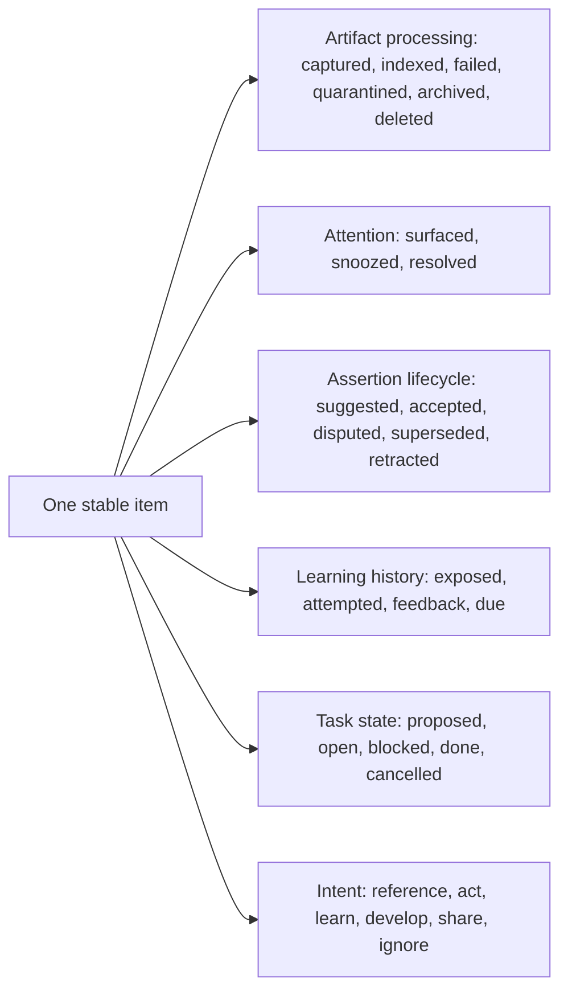
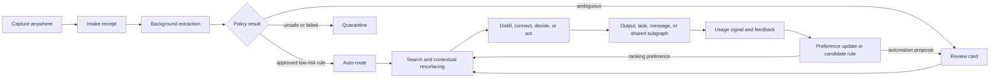
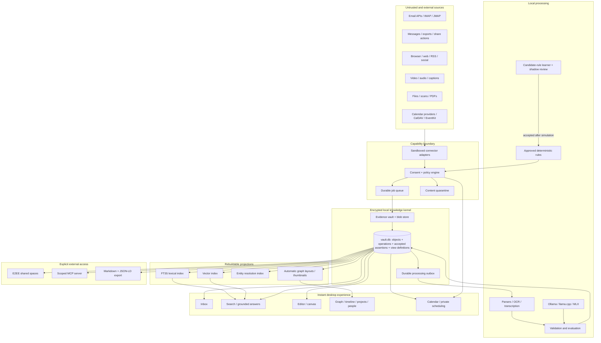
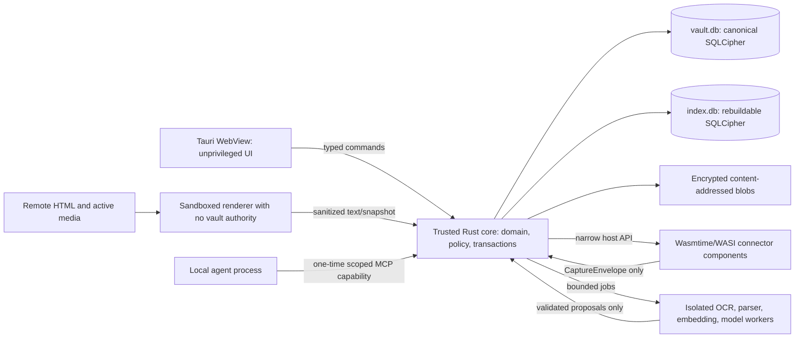
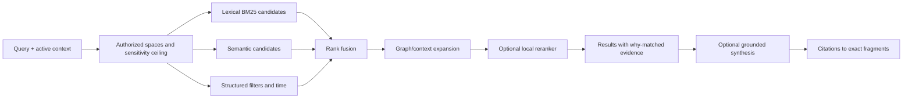
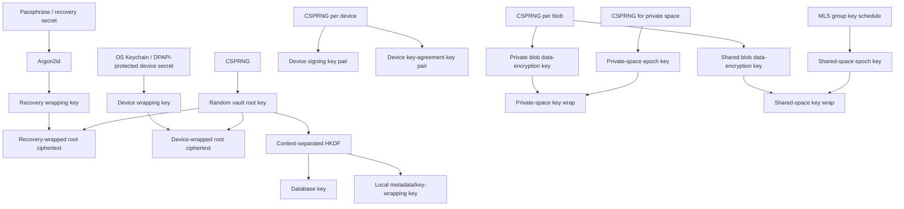
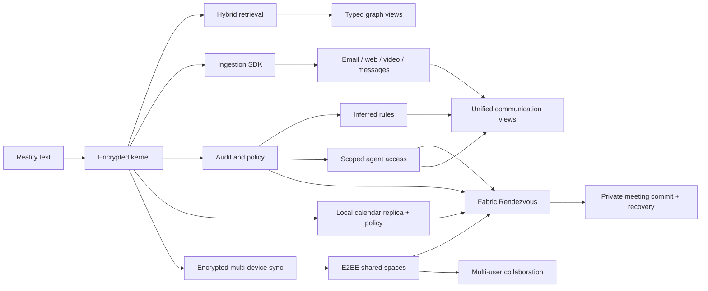
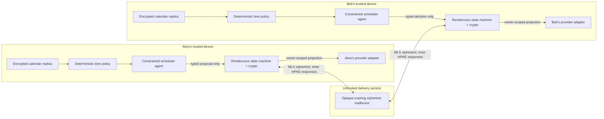
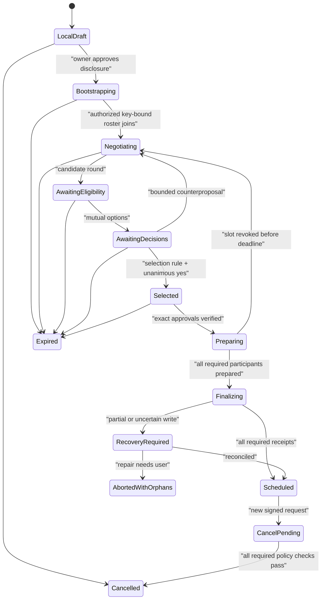

# Personal Knowledge Fabric

## Research report, product specification, and practical starting setup

**Status:** decision-ready baseline specification, version 1.2  
**Prepared:** 2026-08-16  
**Research horizon:** products, standards, and documentation checked through 2026-08-16  
**Intended reader:** product owner, architect, designer, and implementation team

---

## Reading map

- Decision and boundaries: [executive decision](#1-executive-decision), [requirements](#2-confirmed-requirements-and-unresolved-decisions)
- Human system: [panel synthesis](#3-panel-synthesis-what-kind-of-system-this-is), [cognitive principles](#4-cognitive-design-principles)
- Comparative analysis: [product landscape and build/buy](#5-market-and-system-comparison)
- Product specification: [experience](#6-product-vision-and-ux), [functional requirements](#7-functional-specification), [non-functional requirements](#8-non-functional-specification)
- Technical specification: [architecture](#9-architecture), [information model](#10-canonical-information-model), [retrieval/graph](#11-retrieval-linking-and-knowledge-graph-generation)
- Trust and intelligence: [local AI/agents](#12-local-ai-and-agent-design), [inferred rules](#13-inferred-rules-and-automation), [security/sync/sharing](#14-security-encryption-synchronization-and-sharing)
- Action: [practical setup](#15-practical-setup-to-start-now), [roadmap](#16-delivery-roadmap), [evaluation](#17-verification-and-evaluation-plan)
- Governance: [risks](#18-major-risks-and-mitigations), [ADRs](#19-architecture-decision-records-to-create-first), [next decisions](#20-recommended-next-decision-session), [references](#21-selected-primary-and-official-references)
- First executable vertical: [private agentic calendar synchronization](#23-first-fabric-application-private-agentic-calendar-synchronization)

---

## 1. Executive decision

The target should not be built as a larger note-taking application. It should be built as a **local-first personal knowledge fabric**: a fast, encrypted desktop system that captures heterogeneous source material, preserves the original evidence, derives structured knowledge locally, exposes several useful projections of that knowledge, and grants narrowly scoped access to people and agents.

The design has four distinct layers:

1. **Evidence vault** — immutable or versioned source material with full provenance.
2. **Knowledge kernel** — typed items, claims, relationships, tasks, people, projects, and temporal history.
3. **Cognitive workspace** — inbox, editor, search, graph, timelines, project views, and review/resurfacing.
4. **Capability boundary** — connectors, automations, sharing, and permissioned agent access.

No current product satisfies the complete requirement. The closest products each solve a different slice:

- **DEVONthink 4** is the closest immediately usable integrated document inbox on macOS: local databases, capture, search, smart rules, optional database/sync encryption, local-model integration, graph inspection, and MCP support. Its decisive limitation is the Apple-only client ecosystem. [DEVONthink product and security documentation](https://www.devontechnologies.com/apps/devonthink), [DEVONthink AI](https://www.devontechnologies.com/apps/devonthink/ai)
- **Obsidian** is the strongest portable, open-format synthesis surface and plugin ecosystem, but it is not an encrypted ingestion fabric and its Markdown link graph is much less expressive than the proposed typed, temporal, provenance-bearing graph. Obsidian Sync provides end-to-end encrypted synchronization, not automatic encryption of the local Markdown files. [Obsidian](https://obsidian.md/), [Obsidian Sync](https://obsidian.md/sync)
- **Joplin** is the strongest open, secure Evernote-replacement path: offline/local notebooks, E2EE synchronization and shared notebooks, a mature web clipper/API/plugin surface, and increasingly capable local semantic search. Its graph and multidimensional sensemaking are comparatively weak. [Joplin](https://github.com/laurent22/joplin), [Joplin E2EE](https://joplinapp.org/help/apps/sync/e2ee/), [Joplin semantic search](https://joplinapp.org/help/apps/ai_semantic_search/)
- **Anytype** is the closest privacy-and-sharing foundation: local-first, on-device encryption, CRDT-based synchronization, graph objects, an API, a headless CLI, and E2EE collaboration. Its capture and processing ecosystem is not yet a replacement for email, messaging, web archival, and task applications. [Anytype](https://anytype.io/), [Any-Sync protocol](https://tech.anytype.io/any-sync/overview), [Anytype API](https://developers.anytype.io/)
- **Karakeep** is an excellent self-hosted universal capture inbox for web pages, PDFs, images, RSS, and videos. It supports full-page archival, local Ollama models, AI tagging/summarization, a rules engine, clients, and a REST API. It is an intake component, not a durable knowledge model or complete encrypted PIM. [Karakeep documentation](https://docs.karakeep.app/)
- **Zotero** remains the strongest local research-source and citation subsystem. It saves local snapshots and attachments and exposes APIs, but its normal library sync is not end-to-end encrypted. [Zotero quick start](https://www.zotero.org/support/quick_start_guide), [Zotero security](https://www.zotero.org/support/security)
- **Khoj** is a useful local/self-hosted retrieval and conversational sidecar for an Obsidian or file corpus. It is not the canonical knowledge store. [Khoj features](https://docs.khoj.dev/features/all-features/)

The practical recommendation is therefore a staged strategy:

- **Start now with a composable stack** and make its boundaries explicit: a capture/archive application, a durable synthesis surface, a local AI runtime, and encrypted backups.
- **Build the product kernel separately** around stable IDs, immutable evidence, typed relationship assertions, hybrid retrieval, a permission engine, and event history.
- **Do not begin by replacing email and messaging clients.** Begin by importing selected information and extracting actionable objects. Add sending, deletion, and account-wide automation only after the trust and permission model is proven.
- **Do not begin with a graph database, an autonomous agent, or a giant ontology.** A single encrypted SQLite kernel, derived indexes, a small type system, and auditable suggestions are sufficient for the personal scale and offer a much faster path to an instant-feeling product.
- **Make the calendar the first Fabric application after the kernel.** Private scheduling is bounded enough to test local replicas, deterministic policy, consent, encrypted peer exchange, constrained agents, external writes, and recovery without first replacing mail or messaging. The protocol shares a handful of proposed intervals and signed decisions—not a calendar or free/busy map.

### 1.1 What success means

The system succeeds when the user can:

1. Send any supported source to one capture point in seconds and know that it is durably stored.
2. See *why* the source relates to existing knowledge across semantic, temporal, social, epistemic, project, and task dimensions.
3. Retrieve the source or a grounded synthesis without remembering where it was filed.
4. Share a selected subgraph without exposing the rest of the vault.
5. Allow an agent to use a precisely scoped portion of the system, with citations and a complete audit trail.
6. Ask another contact-listed Fabric user for a meeting, disclose only a bounded candidate set, approve exact options, and have both agents safely create the agreed event without exposing either calendar.

Capture volume, note count, link count, and graph density are not success metrics. Reuse, retrieval success, informed decisions, completed work, and trustworthy sharing are.

---

## 2. Confirmed requirements and unresolved decisions

This specification uses only the requirements confirmed in the discovery answers. Recommendations that still need a choice are labeled **proposed**, not silently treated as settled.

### 2.1 Confirmed

| Area | Confirmed direction |
|---|---|
| Users | Single-user first; later sharing and multi-user capability |
| Platforms | macOS first; cross-platform later |
| Privacy | Local-first, encrypted at rest, and end-to-end encrypted between Fabric endpoints |
| Models | Local models preferred |
| Existing ecosystem | Evernote, Obsidian, Notion, email, calendars, task managers, storage, messages, and browsers are all in use |
| Initial connectors | Email, messages, web pages, videos, and the first selected calendar provider/standard adapter |
| Automation | Automatic where safe, preferably using learned/inferred rules |
| Knowledge practice | Hybrid human-and-AI workflow |
| Product horizon | Eventually absorb major note, calendar, mail, message, and task workflows |
| Sharing | Notes and graph-based sharing; encryption required |
| Performance | Extremely responsive UI, startup, and processing; interaction should feel immediate |
| Initial artifact | Markdown report with Mermaid diagrams |
| Strategy | Long-term vision plus an immediately usable setup |
| Outcome | Universal capture, multidimensional relationships, and selective sharing |
| Market review | Commercial, open-source, self-hosted, and SaaS products may all be evaluated |
| First calendar adapter | Google Calendar on macOS; direct Google API is the provider synchronization boundary, with EventKit an optional later macOS integration |
| Scheduling contacts | Any entry in the user-selected Fabric contact list is authorized to initiate a bounded scheduling request; first-seen keys use TOFU and later key changes cannot be silent |
| First Fabric application | A private agentic calendar and synchronization subsystem: two or more contact-listed users exchange only bounded candidate times and decisions over an E2EE channel, then commit the exact approved meeting |

### 2.2 Decisions still required before installation or implementation

1. Exact Mac hardware, especially Apple Silicon generation and RAM.
2. Email providers and number of accounts.
3. Exact message platforms: iMessage, SMS/RCS, WhatsApp, Signal, Telegram, Slack, Teams, Matrix, or others.
4. Whether Docker or a small always-on home server is acceptable.
5. Whether a paid E2EE sync service is acceptable, or all relays must be self-hosted.
6. Recovery preference: memorized passphrase, printed recovery key, trusted contact recovery, or some combination.
7. Content-retention rules for email, conversations, web archives, and downloaded video/audio.
8. Whether the eventual product is personal software, an open-source project, or a commercial product.
9. The acceptable scope of automated actions: organize only, create tasks, draft replies, or send/modify external systems.
10. Google account type and initial calendar scope: personal versus Workspace, number of accounts, calendars that affect availability, and destination calendar for Fabric-created events.
11. Default Google representation after agreement: no Google event, an opaque private `Busy` block, selected local details without attendees, or a native Google invitation that discloses attendees.
12. Source of the authorized contact list—Fabric-native import, macOS Contacts, Google Contacts, or a combination—and duplicate/removed-contact behavior.
13. Relay deployment and metadata posture: local development relay, self-hosted internet relay, or operated ciphertext relay; retention and push-delivery requirements remain open.

The immediate setup in section 15 now treats macOS plus Google Calendar as primary. Other providers remain portability targets rather than hidden MVP dependencies.

---

## 3. Panel synthesis: what kind of system this is

### 3.1 Cognition theorist

The system is part of a coupled human-tool cognitive process, not a passive warehouse. The design goal is to preserve the user’s ability to orient, evaluate, and generate—not merely to outsource memory. Distributed-cognition research shows that representations and action can be distributed across people and artifacts, while cognitive-offloading research shows both improved task performance and weaker memory for some offloaded material. The implication is to make reference capture effortless, but to add deliberate generation and retrieval when the user intends to learn. The extended-mind thesis is a philosophical framework, not proof that every external store improves thinking. [Hollan, Hutchins, and Kirsh, 2000](https://doi.org/10.1145/353485.353487), [Clark and Chalmers, “The Extended Mind”](https://doi.org/10.1093/analys/58.1.7), [Risko and Gilbert, “Cognitive Offloading”](https://doi.org/10.1016/j.tics.2016.07.002)

### 3.2 Learning scientist and lifelong learner

Saved information is not learned information. Retrieval practice, distributed practice, generation, and self-explanation have substantially stronger empirical support than repeatedly rereading or decorating notes. The application should therefore turn selected knowledge into questions, explanations, comparisons, and resurfacing opportunities—but only for material the user elects to learn. [Roediger and Karpicke, 2006](https://doi.org/10.1111/j.1467-9280.2006.01693.x), [Rowland, 2014](https://doi.org/10.1037/a0037559), [Cepeda et al., 2006](https://doi.org/10.1037/0033-2909.132.3.354), [Chi et al., 1994](https://doi.org/10.1207/s15516709cog1803_3)

### 3.3 Mathematician

This is a queueing and ranking system operating over a temporal, attributed multigraph.

- Let exceptions that genuinely require attention arrive *after* automatic preservation/routing at rate \(\lambda_e\), and let useful review complete at rate \(\mu\). A sustainable attention queue requires \(\lambda_e < \mu\). A growing passive archive is principally a storage/retrieval issue; it becomes attention debt only when the product repeatedly asks the user to process it.
- A graph with \(n\) nodes has \(O(n^2)\) possible pairwise links. Exhaustive AI linking will become expensive and noisy. Candidate generation must be local: lexical blocking, nearest-neighbor search, shared entities, active-project context, and time windows.
- One hierarchy cannot preserve every useful relation. The canonical model must support several projections without duplicating the underlying item.

### 3.4 Physicist

The useful analogy is an open system with continuous inflow. Ingestion increases disorder; processing compresses and organizes it. Lossy summaries reduce volume but can destroy important information. The design must therefore preserve a reversible chain from synthesis to claim to source span to captured artifact. Stable identity, provenance, and checksums act like conservation constraints across transformations. This is an engineering analogy, not a cognitive-science claim.

### 3.5 Computer scientist

The core abstraction is not a file or page. It is a stable object with revisions and a set of independently sourced relationship assertions. Search indexes, embeddings, graph layouts, summaries, and recommendations are derived projections that can be deleted and rebuilt. Originals and human-authored content are canonical.

### 3.6 Software engineer

Perceived speed depends more on architecture than on model size. Capture must issue an immediate intake receipt and stream preservation progress; complete durability is signaled only when all source bytes are committed. Startup must never wait for connectors, indexing, synchronization, or a local model. A single local database should serve the interactive path; heavy work belongs in bounded background workers. The app needs performance budgets, migration tests, backup/restore tests, and fault isolation from the first prototype.

### 3.7 PIM practitioner

The workflow should practice **progressive commitment**:

- capture with almost no structure;
- classify only enough to route and retrieve;
- distill only material worth understanding or reusing;
- form explicit claims and relationships when they affect a project, decision, or durable model;
- archive or let low-value material decay.

“Atomic notes,” permanent notes, evergreen notes, and progressive summarization are useful practitioner techniques, not universal laws. The product should support them without forcing every email, message, or article through the same ritual.

The evidence is deliberately tiered: retrieval practice, spacing, generation, cognitive offloading, external representations, and small learner-constructed concept maps have empirical support; Zettelkasten, evergreen notes, atomic notes, and progressive summarization are historically grounded practitioner heuristics whose *whole-system* effectiveness has not been established by comparable controlled research. This system should test workflows against outcomes rather than encode a note-taking school as doctrine.

---

## 4. Cognitive design principles

| Principle | Product consequence | Failure it prevents |
|---|---|---|
| Capture and learning are different states | Store a source immediately; mark whether it has been read, distilled, connected, or used | Mistaking accumulation for knowledge |
| Preserve origin and provenance | Every derived object names its origin and processing run; claims link to exact evidence when such evidence exists | Fluent but ungrounded synthesis |
| Learning uses retrieval from memory; information retrieval stays effortless | For elected learning material, offer recall, comparison, application, corrective feedback, and spacing; keep corpus search fast | Passive rereading or confusing search friction with learning effort |
| Use cues in context | Rank by current project, people, time, task, and source—not semantic similarity alone | Cue overload and generic “related notes” |
| Attempt before revealing, when appropriate | After initial exposure, default to a brief recall/prediction attempt with skip and corrective feedback | Recognition mistaken for recall or premature testing of novices |
| Relationships need meaning | Every visible edge has a type, author, evidence, confidence/status, and “why shown” explanation | Decorative graph hairballs |
| AI proposes; policy decides | Models emit structured candidates; deterministic rules and user policy determine actions | Unpredictable automation |
| Friction must be placed deliberately | Near-zero friction for capture; more friction for destructive, external, or epistemically important actions | Either abandonment or unsafe automation |
| Forgetting can be functional | Expire reminders and suppress low-value attention demands; delete canonical sources only under explicit retention/privacy policy | Infinite exception queue without accidental evidence loss |
| The user’s synthesis is first-class | Distinguish source summaries from the user’s own interpretation and decisions | AI voice replacing personal understanding |

Every capture also has a user intent, independent of its format or workflow state:

| Intent | Default treatment |
|---|---|
| `reference` | Preserve and make retrievable; no learning ritual |
| `act` | Extract or create a reviewable task/decision; keep the source attached |
| `learn` | After adequate exposure, default to a skippable attempt before reveal, then corrective feedback, retrieval/spacing, and application where useful |
| `develop` | Support claims, hypotheses, counterevidence, and synthesis over time |
| `share` | Prepare a bounded, provenance-complete share manifest |
| `ignore` | Suppress, expire, or discard according to retention policy |

Intent may be inferred as a suggestion, but the user can change it at any time. This prevents one heavyweight “process everything” ritual from consuming the system.

### 4.1 Orthogonal state model



These axes are independently queryable facts, not one lifecycle or folder pipeline. A source may be archived while a derived claim remains current and disputed; a task may be complete while its evidence remains reference material.

### 4.2 Epistemic status

Do not mix source type, verification, lifecycle, and action commitment in one status field:

- **epistemic kind:** quotation/source-attested statement, report, identified person/instrument observation, inference, hypothesis, prediction, preference, or decision;
- **verification:** unverified, corroborated, refuted, or disputed;
- **lifecycle:** current, superseded, or retracted;
- **belief and timing:** human confidence, evidence strength, recorded time, valid time, and freshness remain separate.

A captured passage establishes that a source stated something; it does not make the statement an observation or verified fact. A decision is an action commitment, not a degree of knowledge. The system should never turn model confidence into truth. A numeric probability is meaningful only when calibrated against labeled outcomes. Before calibration, use action-policy labels such as `suggestion`, `review_required`, and `auto_eligible`, never probabilistic-sounding labels such as “likely.”

---

## 5. Market and system comparison

### 5.1 Comparison criteria

Products were assessed against the confirmed target, not against generic note-taking needs:

1. local operation and offline availability;
2. encryption at rest, in synchronization, and during sharing;
3. open export and resistance to lock-in;
4. capture breadth and connector/API quality;
5. expressive typed knowledge model and graph;
6. local-model and agent integration;
7. collaboration/sharing;
8. responsiveness and operational complexity;
9. licensing, platform scope, and maturity.

“Local-first,” “self-hosted,” “E2EE sync,” and “encrypted at rest” are different properties and are kept separate. Self-hosting gives operational control, but it does not automatically make data end-to-end encrypted or safe.

### 5.2 Product landscape

Legend: **Strong** = useful fit now; **Partial** = material limitations; **No/weak** = not a design center. Ratings describe fit for this project, not overall product quality.

| Product | Local/offline and encryption | Capture/connectors | Graph/AI | Sharing | Fit and principal gap |
|---|---|---|---|---|---|
| **Obsidian** | Strong local Markdown; E2EE optional Sync; local files remain plaintext unless OS/app-layer storage encrypts them | Strong plugin ecosystem and clipper; connectors vary in trust/quality | Link graph, Canvas, plugins, local-AI integrations | Shared vaults/Publish, but not fine-grained graph-native E2EE sharing | Best portable synthesis surface; weak as canonical typed ingestion kernel |
| **Joplin** | Strong offline/local notebooks; E2EE sync and encrypted shared notebooks | Mature web clipper, REST API, plugins, imports, self-hosted server | Local embeddings/semantic search and local OpenAI-compatible provider; weak graph | Shared notebooks with view/edit permissions | Strongest open secure Evernote replacement; weaker typed graph and visual sensemaking |
| **Anytype** | Strong local-first, on-device encryption, E2EE/CRDT protocol, self-host option; its terms note that some local retrieval/performance data may remain unencrypted, so disk encryption still matters | API, CLI, import/export; fewer mature ingestion connectors | Object graph and sets; MCP/API available; local AI remains experimental | Strong encrypted spaces and collaboration | Best privacy/sharing foundation; capture and processing breadth remains partial |
| **Logseq** | Local-first heritage; DB edition remains a transition with beta/alpha sync and mobile areas that require backups and current-build testing | Plugins and local files/DB; less universal capture | Excellent outlining/backlinks/queries; local AI possible | Evolving RTC/self-host story | Strong thinking tool; transition/maturity risk and not an ingestion fabric |
| **AFFiNE** | Local/offline workspaces and self-hosting; no current official, comprehensive E2EE threat-model guarantee was verified | API/imports less extensive than Obsidian/Karakeep | Docs, databases, whiteboard, AI | Stronger team collaboration than many PKM tools | Promising open workspace; treat a server as able to read content unless deployment evidence proves otherwise |
| **SiYuan** | Local-first, open source, self-host/sync options; supports E2EE sync | Web clipping and API/plugin ecosystem | Block references, graph, databases, AI integrations | Sharing/collaboration less mature than team suites | Capable all-in-one personal KB; smaller ecosystem and operational complexity |
| **TriliumNext** | Offline desktop, local DB, self-hosted sync; protected-note content is encrypted but structure, timestamps, and attributes can remain visible | Web clipper, scripting, ETAPI | Deep hierarchy, attributes, links, scripts; AI was removed from the core project | Primarily personal sync; limited collaborative model | Excellent hacker-oriented personal tree/graph; weaker whole-vault secrecy, multi-user model, and portable canonical format |
| **DEVONthink 4** | Strong local Mac DB; optional local DB and sync encryption | Excellent documents, web, feeds, mail archiving, OCR, automation | Local similarity/classification, graph, local LLMs, MCP | Server/web access and sync; Apple clients only | Closest immediate Mac experience; platform lock-in is decisive |
| **Capacities** | Explicitly not E2EE because server AI/API/MCP features need content; offline data does not change that trust model | Useful capture and integrations | Strong object-oriented UX and AI | Cloud collaboration/sharing | Excellent design reference; cloud dependency conflicts with target trust model |
| **Tana** | Cloud-centered; offline access is limited and shared workspaces remain service-dependent | Supertags, capture, integrations | Powerful typed graph and AI workflows | Collaboration | Excellent knowledge-model reference; local-first/encryption mismatch |
| **Heptabase** | Full local database and export, but current service-held encryption keys are not equivalent to user-only E2EE | Manual capture/import rather than broad connector platform | Excellent visual sensemaking and cards; CLI/MCP integration | Sharing/publishing | Best visual-workspace reference; not a universal zero-knowledge encrypted inbox |
| **Notion** | Cloud-first with offline features; not a local-first encrypted vault | Broad API/integrations | Databases, search, AI, relations | Excellent collaboration | Collaboration benchmark, not privacy architecture |
| **Evernote** | Local clients with cloud-centered service | Mature capture, email-in, scanning | Search/tasks/AI; limited expressive graph | Sharing | Capture benchmark; weak ownership, graph, and local-model fit |
| **Mem** | Cloud/AI-centered | Automated capture/integrations | AI retrieval and organization | Service sharing | AI UX reference; fails local-first requirement |
| **Readwise Reader** | Service-centered | Excellent reading inbox, RSS, email, highlights, video transcript workflows | AI reading features and exports | Sharing/export | Best reading-workflow reference; not canonical private store |
| **Recall** | Service/app-dependent; verify current local guarantees | Strong web/video summarization and capture | Automated knowledge graph | Sharing varies | Useful ingestion/graph UX reference; insufficient control for kernel |
| **Karakeep** | Self-hosted; local deployment is controllable but not inherently application-level E2EE | Excellent web/PDF/image/RSS/video intake, archive, extensions, REST API | Local Ollama tagging/summaries; rule engine; semantic search still evolving | Shared lists | Best immediate capture inbox; not a full knowledge workspace |
| **Linkwarden** | Open-source self-hosted | Excellent web preservation, reading, annotations, browser extension | Local Ollama tagging | Collaborative collections/public sharing | Strong alternative to Karakeep when preservation/annotation dominates |
| **Zotero** | Local desktop by default; normal metadata sync is server-readable; personal files can use WebDAV | Best scholarly metadata/PDF/browser capture | Full-text search, annotations, plugins; not a general graph | Group libraries use Zotero service | Keep as specialist source manager, not general kernel |
| **Khoj** | Local/self-hosted indexing and local models | Files, notes, PDFs, GitHub/Notion depending deployment | Strong semantic search/chat/agents | Not a collaboration system | Useful AI sidecar; derived index, not source of truth |
| **Reor** | Local and open source | Narrow file/note capture | Local embeddings/chat | Weak | Archived on 2026-03-07; useful historical prototype reference, not an adoption candidate |

Product capabilities change quickly. Before purchase or migration, rerun a short acceptance test against the current build: offline creation, full export, at-rest inspection, E2EE threat model, 10,000-item search, connector API, and restore from backup.

Specialists that are not full candidates still deserve explicit roles:

| Specialist | What it is good at | Important boundary |
|---|---|---|
| **Notesnook** | Strong encrypted notes/capture, offline clipper, encrypted backups, encrypted Inbox API | No expressive typed knowledge graph; self-hosted sync is still a higher-operations path |
| **Standard Notes** | Mature E2EE private writing and longevity-oriented format | Weak universal capture, typed relations, and connector layer |
| **Paperless-ngx** | Document/email ingestion, OCR, correspondent/document-type/tag learning, local Ollama metadata | Document archive rather than note/claim graph; secure the host and backups |
| **Zotero** | Research metadata, PDFs, annotations, citations | Specialist source manager; normal service metadata and groups are not zero-knowledge |
| **Karakeep / Linkwarden** | Web/media capture and preservation | Self-hosted does not mean E2EE; encrypt host storage and backups |

#### Sharing reality check

| Product | Encrypted collaboration today | Granularity and caveat |
|---|---|---|
| Anytype | E2EE shared spaces | Owner/editor/viewer roles; best current fit for testing encrypted object sharing |
| Joplin | E2EE shared notebooks | Notebook-level view/edit; not arbitrary graph slices |
| Obsidian Sync | E2EE shared vaults | Coarse vault permissions and no Google-Docs-style simultaneous same-file editing |
| DEVONthink | Encrypted sync plus server/web access options | Archive sharing, not CRDT collaboration or fine-grained graph sharing |
| Logseq DB | Encrypted sync/RTC direction | Current maturity must be tested; alpha/beta areas are not a production trust base |

No evaluated product combines fine-grained E2EE subgraph sharing, typed provenance, offline editing, and mature connectors. That remains a genuine kernel differentiator.

### 5.3 Build-versus-buy conclusion

| Capability | Buy/adopt now | Build as differentiating kernel |
|---|---|---|
| Browser capture and web preservation | Karakeep or Linkwarden | Normalized capture protocol and provenance bridge |
| Academic papers and citations | Zotero | Typed claim/evidence links into the knowledge graph |
| Local inference runtime | Ollama initially; llama.cpp/MLX as optimized backends | Model registry, policies, processing provenance, evals |
| Markdown synthesis and canvas | Obsidian initially | Unified editor and multidimensional views later |
| Mac document inbox | DEVONthink optional | Cross-platform evidence kernel |
| Workflow automation | n8n/OS shortcuts for prototype | Auditable inferred-rule engine and permission policy |
| Search | SQLite FTS5 plus local embeddings | Fusion, explanations, graph/context ranking, evaluation |
| Sharing | Anytype can validate UX; existing sync can bootstrap | Fine-grained encrypted subgraph sharing with revocation semantics |
| Agent interface | MCP SDKs | Vault-scoped resource/tool server, grants, audit, injection defenses |

The differentiated product is not another editor. It is the **canonical evidence-and-relationship kernel plus the trust boundary**. Commodity capture, inference, OCR, transcription, and transport should be adopted behind replaceable interfaces.

“Build” does not mean invent cryptography, a rich-text engine, a PDF renderer, or a CRDT algorithm. It means compose reviewed libraries and standards into a product-specific information model, permission system, provenance chain, rule workflow, and share experience. The immediate pilot should use a proven E2EE sync product; the long-term relay/protocol becomes custom only if fine-grained subgraph sharing cannot be achieved safely on that foundation.

### 5.4 Email, messaging, and task replacement landscape

These domains are asymmetric: email and consumer messaging depend on external identity, abuse prevention, counterparties, provider policy, and transport; personal tasks are a bounded application domain and can become native much earlier.

| System | Current data/integration reality | Recommended boundary |
|---|---|---|
| **Thunderbird + IMAP/Exchange/JMAP** | Cross-platform local profile and exports; OpenPGP is message-level, not whole-profile encryption. MailExtensions are an official connector surface. JMAP supplies batched/state-based JSON synchronization where a provider supports it, but is not E2EE. [Thunderbird profiles](https://support.mozilla.org/en-US/kb/profiles-where-thunderbird-stores-user-data), [MailExtensions](https://developer.thunderbird.net/add-ons/mailextensions/supported-webextension-api), [JMAP core](https://www.rfc-editor.org/rfc/rfc8620), [JMAP mail](https://www.rfc-editor.org/rfc/rfc8621) | Best cross-platform mail read/reference bridge. Preserve RFC 822 bytes, attachments, IDs, and provenance; leave identity, spam, and sending outside v1. Calendar is handled by the separate Fabric Calendar adapter boundary. |
| **Outlook / Microsoft Graph** | Microsoft 365 is cloud-canonical; Graph offers delegated mail permissions, delta synchronization, webhooks, and shared-mailbox support. [Graph mail API](https://learn.microsoft.com/en-us/graph/api/resources/mail-api-overview?view=graph-rest-1.0), [Graph permissions](https://learn.microsoft.com/en-us/graph/permissions-overview) | Read-only delegated connector first; never tenant-wide application access by default. Sending is a separate visible capability. |
| **Apple Mail / MailMate** | Mac-local caches rely on FileVault; Apple supports bounded MailKit extensions and mbox exchange, while MailMate offers power-user IMAP automation/deep links. [Apple Mail import/export](https://support.apple.com/guide/mail/import-or-export-mailboxes-mlhlp1030/mac), [MailKit](https://developer.apple.com/documentation/MailKit), [MailMate manual](https://manual.mailmate-app.com/preferences) | Useful Mac integration surface, not the canonical encrypted store; avoid unsupported live-database access. |
| **Beeper** | On-device connections can connect participating networks locally; its local Desktop API exposes search/list/send surfaces across multiple networks, including MCP. Completeness and platform limits vary, and bulk automation risks account suspension. [On-device connections](https://blog.beeper.com/2025/07/16/the-new-beeper/), [Desktop API](https://developers.beeper.com/desktop-api/) | Strong immediate unified-message ingress: localhost-only search/list/export first. Treat as an adapter, not the archive or an autonomous outbound agent. |
| **Matrix / Element** | Open federated protocol with encrypted rooms and self-hosting. Bridges/appservices can become trusted decryption or impersonation endpoints, so bridged rooms do not necessarily preserve the source network’s E2EE boundary. [Matrix client-server API](https://spec.matrix.org/v1.14/client-server-api/), [Matrix E2EE](https://matrix.org/docs/matrix-concepts/end-to-end-encryption/), [appservice architecture](https://matrix.org/docs/matrix-concepts/elements-of-matrix/) | Best later communication layer for new conversations whose participants can move; not a universal transparent bridge for existing private networks. |
| **Signal / Telegram / WhatsApp / iMessage** | Supported personal-history paths are uneven: Signal emphasizes encrypted backup/transfer; Telegram can export cloud chats; Apple documents iCloud protection but no general Messages history API. [Signal backup/transfer](https://support.signal.org/hc/en-us/articles/10074659364122-Backups-and-Device-Transfers-on-Signal), [Telegram export](https://telegram.org/blog/export-and-more), [Apple iCloud data security](https://support.apple.com/en-gb/102651) | User-triggered export/share or explicitly authorized on-device adapter only. Never claim completeness, scrape private databases as a supported feature, or retain disappearing messages by default. |
| **Things / OmniFocus** | Both are fast Apple-first local task clients. Things has no public API or E2EE claim for Things Cloud; OmniFocus offers client-side encrypted sync and excellent automation but no Windows client or collaboration. [Things automation boundary](https://culturedcode.com/things/support/articles/2967034/), [OmniFocus encryption](https://support.omnigroup.com/omnifocus-encryption-faq/) | Strong temporary Mac executors: Things for simplicity, OmniFocus for privacy/automation. Integrate through supported Shortcuts/AppleScript/export, never live DB writes. |
| **Todoist / Vikunja / Super Productivity** | Todoist has excellent collaborative APIs but cloud-canonical, server-readable storage. Vikunja is self-hosted/team-oriented without content E2EE. Super Productivity is cross-platform, no-account/local-first with optional client-encrypted sync, but plugin secrets need scrutiny. [Todoist developer portal](https://developer.todoist.com/), [Todoist security](https://www.todoist.com/help/articles/todoist-privacy-and-security-LYvNRupva), [Vikunja API](https://vikunja.io/docs/api-documentation/), [Super Productivity](https://github.com/super-productivity/super-productivity) | Todoist is a connector/collaboration benchmark; Super Productivity is the immediate Windows/cross-platform private executor; Vikunja fits self-hosted sharing. Native PIM tasks should replace this lane early. |

Replacement order:

1. integrate email and messages read-only, while replies/sends remain in native clients;
2. replace personal tasks first, preserving source links and optionally mirroring one executor;
3. add private drafts, exact destination/content preview, and explicit send approval;
4. use Matrix for new PIM-native group conversations when participants opt in;
5. never build SMTP/MTA delivery, spam/reputation infrastructure, Exchange, or reverse-engineered consumer-message bridges as early product scope.

Read and send credentials are separate grants. Agents receive filtered local projections, never unrestricted mailbox or messaging credentials.

### 5.5 Calendar and scheduling landscape

Calendar products solve three different problems that must not be conflated: storing a personal calendar, synchronizing it with a provider, and negotiating time with another person. Fabric should use existing standards and provider APIs at the local edge while owning the minimal-disclosure negotiation between Fabric agents.

| System | Useful capabilities | Privacy/interoperability boundary | Recommended Fabric role |
|---|---|---|---|
| **Google Calendar** | Mature events API, incremental sync, push triggers, ACLs, and free/busy queries | A free/busy response omits event details but reveals exact occupied intervals. Ordinary Calendar encryption is in transit/at rest, not endpoint-only E2EE; Workspace client-side encryption is limited and does not encrypt every event field. [Free/busy](https://developers.google.com/workspace/calendar/api/v3/reference/freebusy/query), [sync](https://developers.google.com/workspace/calendar/api/guides/sync), [privacy](https://support.google.com/calendar/answer/10366125), [client-side-encryption limits](https://support.google.com/calendar/answer/12928168) | Strong first cloud adapter; never the Fabric peer-negotiation service |
| **Microsoft Outlook / Graph** | Calendar view, delta synchronization, `getSchedule`, event creation, and enterprise resources | `findMeetingTimes` is delegated work/school-only and its algorithm may change; it sends scheduling inputs to Microsoft. Creating an event with attendees sends invitations. [getSchedule](https://learn.microsoft.com/en-us/graph/api/calendar-getschedule?view=graph-rest-1.0), [findMeetingTimes](https://learn.microsoft.com/en-us/graph/api/user-findmeetingtimes?view=graph-rest-1.0), [delta sync](https://learn.microsoft.com/en-us/graph/delta-query-events), [create event](https://learn.microsoft.com/en-us/graph/api/user-post-events?view=graph-rest-1.0) | Strong enterprise adapter; calculate Fabric candidates locally and use Graph only for the owner’s replica/projection |
| **Apple Calendar / EventKit / iCloud** | Fast local aggregation and native event access on Apple platforms | Reading availability requires full EventKit event access; write-only access cannot read existing events. Apple lists iCloud Calendars as server-accessible encryption even with Advanced Data Protection. [EventKit access](https://developer.apple.com/documentation/eventkit/accessing-the-event-store), [iCloud data security](https://support.apple.com/en-gb/102651) | Best macOS-native adapter; a platform specialization, not the portable protocol |
| **Thunderbird + CalDAV** | Cross-platform local/network calendars, tasks, ICS, and open CalDAV interoperability | Privacy inherits the provider. CalDAV is an access/sync protocol, not E2EE between scheduling peers. [Thunderbird calendar architecture](https://source-docs.thunderbird.net/en/latest/calendar/calendars.html), [CalDAV RFC 4791](https://www.rfc-editor.org/rfc/rfc4791.html) | Open reference implementation and generic adapter boundary; never edit Thunderbird’s live profile database |
| **Proton Calendar** | End-to-end encryption for important event fields and encrypted sharing among Proton users | Proton documents that some timing/recurrence/status metadata remains available for service operation, and it does not offer general two-way CalDAV synchronization. [Security](https://proton.me/calendar/security), [privacy](https://proton.me/calendar/privacy-policy), [external-calendar limits](https://proton.me/support/subscribe-to-external-calendar) | Privacy benchmark and possible future official adapter; not a current universal connector |
| **Calendly / Cal.com** | Excellent booking, reservation, reminder, and recovery UX; Cal.com is open/self-hostable | These are server-mediated schedulers, not endpoint-only encrypted peer negotiation. Self-hosting changes the server operator; it does not itself make schedule data zero-knowledge. [Calendly security](https://calendly.com/help/calendly-platform-security-and-compliance), [Cal.com documentation](https://cal.com/docs) | UX and failure-flow benchmarks, not the confidentiality kernel |
| **EteSync / Etebase** | Open-source E2EE calendar/contact/task synchronization and an encrypted change journal | Useful encrypted-sync precedent, but sync alone does not prevent a peer from learning a shared calendar’s topology. [EteSync](https://www.etesync.com/), [Etebase](https://www.etebase.com/) | Architectural reference for a future Fabric-native encrypted calendar |

The standards boundary is equally important. iCalendar models events, tasks, journals, alarms, recurrence, and free/busy; CalDAV synchronizes calendar resources; iTIP/iMIP carry conventional invitations; and `VAVAILABILITY` can describe working availability. None supplies the requested endpoint-only, minimal-disclosure consensus protocol. `VFREEBUSY` and provider free/busy endpoints conceal titles and descriptions but still reveal an occupancy pattern, so they are adapter inputs or explicit compatibility exports—not Fabric peer messages. [iCalendar RFC 5545](https://www.rfc-editor.org/rfc/rfc5545.html), [iTIP RFC 5546](https://www.rfc-editor.org/rfc/rfc5546.html), [iMIP RFC 6047](https://www.rfc-editor.org/rfc/rfc6047.html), [calendar availability RFC 7953](https://www.rfc-editor.org/rfc/rfc7953.html)

There is no deployable IETF polling standard to adopt: the VPOLL draft expired, while JMAP Calendars remains an Internet-Draft and omits tasks and journals. Treat JMAP Calendar as an experimental adapter only, not a foundation. [VPOLL draft status](https://datatracker.ietf.org/doc/draft-ietf-calext-vpoll/), [JMAP Calendars draft](https://datatracker.ietf.org/doc/draft-ietf-jmap-calendars/)

---

## 6. Product vision and UX

### 6.1 The home model

The application should present six durable places rather than dozens of modules:

1. **Inbox** — newly captured, failed, ambiguous, or review-required items.
2. **Focus** — current projects, people, questions, tasks, and recently used knowledge.
3. **Explore** — universal search and multidimensional relationship views.
4. **Compose** — notes, synthesis, decisions, drafts, and canvases.
5. **Calendar** — encrypted agenda, time policies, private holds, and scheduling negotiations.
6. **Shared** — explicit spaces and subgraphs shared with people or agents.

Email, conversations, tasks, events, sources, and notes are saved views over the same kernel. The user may open a mail-like view, calendar, timeline, or graph without moving/copying the underlying object.

### 6.2 Main interaction loop



The immediate intake receipt contains only what is known: source, time, and queue ID. A distinct `content_preserved` state means the complete encrypted bytes and manifest are durable; it cannot honestly be promised in 100 ms for a large file. Summaries, tags, transcript progress, and links appear progressively. A slow model never blocks capture or navigation.

Navigation, acceptance, co-use, and “no action” are preference/context signals, not truth labels. They may mean familiar, urgent, deferred, already known, or simply convenient. Learning/ranking uses them with scope and decay, preserves exploration, and never treats popularity or centrality as evidence that a claim is true.

### 6.3 Multidimensional relationship explorer

The default is not an all-vault node cloud. The explorer begins from an item, query, person, project, or time range and shows a bounded neighborhood. Users can switch or combine dimensions:

- **meaning** — semantic/lexical similarity and shared concepts;
- **evidence** — citations, quotations, derivations, supports, contradictions;
- **time** — captured, occurred, discussed, revised, and due;
- **people** — authors, senders, recipients, participants, organizations;
- **work** — projects, goals, tasks, decisions, dependencies;
- **causality** — causes, effects, prerequisites, alternatives;
- **source** — channel, publication, conversation, device, connector;
- **learning** — prerequisite, example, question, explanation, review history, and uncertain estimates of retrievability or task-specific competence;
- **access** — private, shared space, recipient, and agent grant.

Every edge can answer:

1. What type of relationship is this?
2. Who or what asserted it?
3. What evidence supports it?
4. Is it human-accepted, inferred, disputed, or superseded?
5. Why is it visible in this view?

### 6.4 Inbox design

The inbox is an exception and decision surface, not a mandatory daily filing ritual. It groups work by action:

- needs one-click routing;
- duplicate or near-duplicate;
- possible project/task/person match;
- suggested claims or relationships;
- sensitive content requiring a storage decision;
- extraction/transcription failure;
- automation rule proposed from repeated behavior.

Bulk actions always preview effects. “No action” is valid, but its meaning is ambiguous. Where useful, offer `defer`, `already known`, `not relevant`, `low priority`, or `do not suggest again`; otherwise treat silence as no label rather than negative evidence.

### 6.5 Unified communication horizon

Replacing email and messaging should proceed in four trust stages:

1. **Reference:** import selected messages read-only and link them to people/projects.
2. **Assist:** extract tasks, decisions, and proposed replies; user acts in the original client.
3. **Draft:** create replies or actions in the source system, unsent.
4. **Act:** send, label, archive, or update through explicit policies and confirmations.

External deletion, sending, sharing, account changes, and financial/legal actions must never be enabled by a generic “autonomous” toggle.

### 6.6 Inquiry workspace

For `develop` work, the primary container is an evolving question rather than a folder or graph. It combines:

- the current query and decision/learning purpose;
- a source shoebox with exact selected evidence fragments;
- competing hypotheses, assumptions, predictions, and disconfirming tests;
- supporting, contradicting, ambiguous, and missing evidence columns;
- an emerging narrative clearly separated from quotations and model proposals;
- unresolved questions, next searches, and re-evaluation triggers such as a date or changed source.

The same content can project as an evidence matrix, outline, timeline, focused graph, or draft. This turns capture into sensemaking without requiring every source to become a permanent note.

### 6.7 Calendar and private-scheduling experience

The calendar is both a familiar day/week/agenda application and a projection of the Fabric graph. A meeting connects to its people, project, originating message, agenda, notes, decisions, tasks, recording, and follow-up; external-provider records remain separately attributable source/projection objects.

Four surfaces make agentic scheduling understandable:

1. **Calendar and agenda** — instant offline aggregation of selected calendars, Fabric-native events, private holds, task blocks, and “now/next.”
2. **Schedule with Fabric** — a typed request composer for participants, duration, date window, modality, required/optional roles, and local preference policy.
3. **Decision cards** — two to five exact options with `Yes` and `No`, plus an optional bounded counterproposal. Conflict details and reasons remain local. A card states exactly what an approval authorizes and when it expires.
4. **Negotiation inbox** — pending requests, responses, expiry, pairing/key status, commit/recovery state, and an auditable “what left this device” view.

Before sending, the user sees a disclosure preview containing the approved meeting context, exact proposed intervals, intended recipients, expiry, and projection mode. It must also list categories that will **not** leave the device: event titles, other participants, calendar names, neighboring busy intervals, rejection reasons, local scores, tasks, and source/provider identifiers. The default finalization is a private local event or opaque provider block; native provider invitations require a separate disclosure preview.

The model may translate “find 30 minutes with Sam next week” into a typed draft. Deterministic code—not the LLM—expands recurrences, resolves time zones, computes conflicts, checks policy, selects the final slot under a precommitted rule, and validates every write.

---

## 7. Functional specification

Priority: **P0** is the first usable kernel, **P1** completes the personal product, **P2** adds sharing/replacement workflows.

### 7.1 Capture and ingestion

| ID | Priority | Requirement | Acceptance criterion |
|---|---:|---|---|
| CAP-001 | P0 | Accept URL, text, file, image, and clipboard capture through global shortcut, drag/drop, watched folder, browser extension, and local API | With the broker already running, URL/text/≤1 MB captures return a durable receipt ID p95 ≤100 ms after receipt, source descriptor, and job commit. Large files expose `received`, `copying`, and `preserved`; only `preserved` means encrypted bytes, manifest, and canonical operation are durable. A URL is not `archived` until its requested snapshot succeeds |
| CAP-002 | P0 | Preserve immutable raw source plus normalized representation | User can open original bytes/snapshot and see content hash, capture time, connector, and source URI |
| CAP-003 | P0 | Idempotent ingestion using source IDs and content fingerprints | Replaying a connector page does not create duplicate canonical artifacts |
| CAP-004 | P0 | Resumable background processing with visible state | Crash/restart resumes jobs without losing or double-committing results |
| CAP-005 | P1 | Email connectors for Gmail, Microsoft Graph, IMAP4rev2, and JMAP where available | Selected label/folder imports threads, message headers/body, attachments, and remote IDs incrementally |
| CAP-006 | P1 | Web preservation modes: bookmark, readable snapshot, full archive, screenshot, and metadata-only | Policy can choose storage mode per domain/content type |
| CAP-007 | P1 | Video intake stores URL/metadata/chapters and uses authorized captions or local transcription when permitted | Transcript segments retain timestamps and source linkage |
| CAP-008 | P1 | Message connector framework supports official APIs, exports, share actions, and user-controlled bots | Each platform adapter declares read/write/export capability and legal/technical limitations |
| CAP-009 | P1 | PDF, office document, image OCR, and audio transcription | Extracted spans map back to page, bounding box, or timestamp where possible |
| CAP-010 | P2 | Cloud drive, social bookmark, RSS, and external task connectors | Connector conformance suite passes incremental sync, deletion, revocation, and rate-limit tests; calendar requirements live in section 7.6 |

### 7.2 Knowledge and composition

| ID | Priority | Requirement | Acceptance criterion |
|---|---:|---|---|
| KNO-001 | P0 | Stable items, immutable revisions, source artifacts, typed relations, and evidence spans | IDs survive rename, move, export, and re-import |
| KNO-002 | P0 | Notes support Markdown-compatible text plus block/rich-text structure | Lossless internal round-trip; useful Markdown export without proprietary IDs in prose |
| KNO-003 | P0 | Human content and AI-derived content are visibly distinct | Every derived field names model/rule, run, time, and evidence |
| KNO-004 | P0 | Accept/reject/edit suggested entities, claims, and links | Feedback changes assertion state without overwriting the original suggestion |
| KNO-005 | P1 | First-class people, organizations, projects, goals, tasks, events, concepts, claims, questions, decisions, and sources | Each type has minimal schema and can be extended without migration-heavy custom columns |
| KNO-006 | P1 | Contradiction, support, refinement, prerequisite, cause, and alternative relations | Graph and item view expose evidence and epistemic state |
| KNO-007 | P1 | Reusable templates and saved views | Views are queries, not duplicated folders |
| KNO-008 | P1 | History, diff, restore, merge/fork, and tombstones | User can restore any human-authored revision and inspect automated changes |
| KNO-009 | P0 | Independent intent field: reference, act, learn, develop, share, or ignore | Changing intent alters workflow without moving or duplicating the item |
| KNO-010 | P1 | After initial exposure, learning mode supports skippable attempts before reveal, corrective feedback, user-authored explanations, retrieval prompts, spacing, transfer/application, and confidence judgments | Delayed retrieval/transfer outcomes and confidence calibration are recorded separately from capture/activity counts |
| KNO-011 | P1 | Development mode supports claims, hypotheses, assumptions, counterevidence, and belief revision | A synthesis can show its supporting, contradicting, stale, and superseded evidence over time |

### 7.3 Retrieval and exploration

| ID | Priority | Requirement | Acceptance criterion |
|---|---:|---|---|
| RET-001 | P0 | Instant lexical search with phrase, prefix, field, date, source, type, and boolean filtering | First useful results p95 under 50 ms on the reference corpus |
| RET-002 | P0 | Hybrid retrieval fuses lexical, semantic, graph, recency, and active-context signals | Result card explains which signals caused the match |
| RET-003 | P0 | Search never requires an LLM | Lexical/structured search works while models are absent or stopped |
| RET-004 | P1 | Bounded graph explorer with dimension filters and semantic zoom | Maintains 60 fps for the agreed visible-node budget; never renders the entire vault by default |
| RET-005 | P1 | Timeline, conversation, map when geodata exists, and project/person projections | Same item appears without duplication across projections |
| RET-006 | P1 | Grounded answer mode cites exact source spans and exposes retrieval set | User can open each cited page/timestamp/message |
| RET-007 | P1 | Duplicate and contradiction discovery | Suggestions include evidence and can be dismissed permanently or temporarily |

### 7.4 Automation and AI

| ID | Priority | Requirement | Acceptance criterion |
|---|---:|---|---|
| AIA-001 | P0 | Local model provider abstraction supporting Ollama and OpenAI-compatible localhost runtimes | Models can be changed without reformatting canonical data |
| AIA-002 | P0 | JSON-schema-constrained extraction and validation | Invalid output is rejected/retried/quarantined, never partially committed |
| AIA-003 | P0 | Processing provenance stores model digest, prompt/template version, parameters, inputs, outputs, and evaluator result | Every derived object is reproducible where practical and always attributable to its origin |
| AIA-004 | P0 | Rules are deterministic objects separate from model inference | User can inspect, test, disable, and roll back each rule |
| AIA-005 | P1 | Infer candidate rules from repeated user actions | Proposal explains pattern statistics and previews affected historical items |
| AIA-006 | P1 | Three action tiers: auto, suggest, confirm | Destructive/external actions cannot be assigned to auto tier |
| AIA-007 | P1 | Local evaluation set for tagging, entity resolution, links, summaries, and retrieval | Model/prompt upgrade is blocked when agreed quality regresses |
| AIA-008 | P1 | Agent access through current MCP plus local typed API | Read/write scopes, purpose, expiry, and audit are enforced outside the model |

### 7.5 Sharing and communication

| ID | Priority | Requirement | Acceptance criterion |
|---|---:|---|---|
| SHR-001 | P1 | Export selected items/subgraphs as Markdown plus JSON-LD and attachments | Export uses package-local pseudonymous IDs by default plus user-selected provenance; reusable public IDs are explicit, and private vault UUIDs are never reused across recipients as correlation handles |
| SHR-002 | P2 | E2EE spaces with per-space keys and device membership | Relay cannot decrypt content; independent security review completed |
| SHR-003 | P2 | Share a note, collection, query snapshot, or bounded subgraph | Preview proves which nodes, edges, attachments, and metadata leave the private vault |
| SHR-004 | P2 | Revocation rotates future keys and explains limits of revoking already received plaintext | Removed device cannot decrypt new epochs |
| SHR-005 | P2 | Comments, mentions, tasks, and collaborative editing in shared spaces | Offline concurrent edits converge; membership changes are audited |

A relation may leave the private vault only when both endpoints and its selected evidence are in the share manifest. Otherwise it is omitted or replaced by a deliberately approved redacted stub. Cross-space relations remain a private local overlay by default; a query or graph view never expands the share transitively.

### 7.6 Calendar and agentic scheduling

This is the first Fabric application after the kernel. Its local calendar capabilities are P0/P1; encrypted peer negotiation builds on the P2 sharing substrate but is delivered as the first end-to-end multi-user vertical in section 23.

| ID | Priority | Requirement | Acceptance criterion |
|---|---:|---|---|
| CAL-001 | P0 | Maintain an encrypted local mirror of user-selected calendar accounts/collections | Initial and incremental sync preserve external IDs, revisions, tombstones, raw provider payload, and last successful cursor without making a provider the Fabric source of truth |
| CAL-002 | P0 | Normalize events without losing calendar semantics | Recurrence masters/overrides, all-day values, floating/zoned/instant times, IANA zones, DST cases, transparency, tentative/out-of-office states, and inclusive-start/exclusive-end behavior pass a standards fixture suite |
| CAL-003 | P0 | Compute availability and preferences locally with a deterministic, versioned policy engine | A model-free oracle produces the same candidate set for the same replica, policy revision, time-zone database, and request |
| CAL-004 | P1 | Negotiate by exchanging a small candidate set rather than a free/busy grid | A protocol trace contains at most the configured candidate intervals and approved meeting envelope; it contains no event, calendar, provider, or surrounding-occupancy data |
| CAL-005 | P1 | Capture exact human decisions as signed, expiring grants | `Yes` is cryptographically bound to the negotiation, event-template digest, candidate, participant set, projection profile, and expiry; no other event can use it |
| CAL-006 | P1 | Bound counterproposals and availability probing | Candidate count, horizon, granularity, rounds, contact/session rate, and expiry are policy-enforced before any network send |
| CAL-007 | P1 | Revalidate and create encrypted local soft holds before commit | A stale slot is revoked, not silently forced; holds expire automatically and block competing local negotiations according to deterministic priority |
| CAL-008 | P1 | Commit across participant providers through idempotent per-owner writes and a recoverable saga | Duplicate/reordered messages or timeout retries produce one logical meeting; partial commits enter visible reconciliation rather than being reported as success |
| CAL-009 | P2 | Cancel or reschedule through new consented state transitions | Historical approvals remain immutable; required participant rules and provider recovery behavior are explicit |
| CAL-010 | P1 | Keep provider invitations out of private mode by default | Each agent writes only its owner’s private event or opaque `Busy` block; attendee lists/iTIP/iMIP are sent only after a separate native-invitation confirmation |
| CAL-011 | P1 | Link meetings to the knowledge fabric | Event view can traverse to people, project, source request, agenda, notes, decisions, tasks, and follow-ups without exposing those private links to peers |
| CAL-012 | P1 | Give scheduling agents narrow capabilities and a complete audit | Availability read, proposal send, response, hold, exact commit, cancel, and native invite are distinct scopes; every read disclosure and external effect is inspectable |

---

## 8. Non-functional specification

### 8.1 Performance budgets

Performance targets need a reference device and corpus. The following are **proposed targets** pending the hardware choice:

- reference device: 8 modern CPU cores, 32 GB RAM, NVMe SSD; Apple Silicon GPU or a Windows GPU is optional for the UI and required only for larger-model targets;
- reference corpus: 100,000 items, 1,000,000 text chunks, 100 GB attachments, 2,000,000 accepted/inferred edges;
- cold start to interactive shell: p50 ≤ 400 ms, p95 ≤ 900 ms;
- warm window activation: p95 ≤ 100 ms;
- local mutation acknowledgement: p95 ≤ 16 ms after validation;
- warm-broker durable receipt: p95 ≤100 ms after receipt, source descriptor, and processing job commit for URL/text/≤1 MB inputs; cold launch and large-file byte-copy/preservation time are measured separately;
- lexical query: p95 ≤ 50 ms;
- indexed local availability query over a 90-day horizon: p95 ≤ 75 ms for ten selected calendars and 10,000 cached occurrences; candidate cards remain interactive in ≤100 ms after local results exist;
- hybrid query excluding first-time model download: p95 ≤ 250 ms, with lexical results streamed first;
- scrolling/editor/graph interaction: 60 fps at the agreed visible complexity, 120 fps where display and hardware permit;
- no startup dependency on network, sync, connector, index rebuild, or model runtime;
- background workers yield CPU/I/O under active interaction and obey thermal/battery modes.

Model latency must be reported separately. “Instant UI” cannot honestly imply instant generation on every local model and device. The product should stream progress and let deterministic results appear before model-derived results.

### 8.2 Reliability and durability

- Canonical database mutations are transactional. Blob files use staged write → hash/authenticate → flush → atomic rename → manifest/operation commit, with startup reconciliation of orphaned staging files and manifests. External effects use a transactional outbox and reconciliation; the product never claims one ACID transaction across SQLite, the filesystem, and a remote service.
- Cross-provider calendar finalization is a prepare-and-saga workflow, not an atomic distributed transaction. Local consent and holds commit transactionally; provider writes are idempotent, retried, reconciled, and visibly recoverable.
- Raw captures are append-only until an explicit retention action.
- Derived indexes can be rebuilt from canonical content and event history.
- Schema migrations are forward-tested, resumable, and preceded by a verified snapshot.
- Daily encrypted incremental backup and periodic full restore test are first-class product functions.
- Sync is not backup; deletion and corruption can synchronize.
- No active SQLite database is stored in OneDrive, Dropbox, iCloud Drive, or a generic file-sync folder. SQLite WAL improves local concurrency but is explicitly unsuitable across network filesystems. [SQLite WAL documentation](https://www.sqlite.org/wal.html)

### 8.3 Privacy and security

- No telemetry by default.
- No cloud model fallback without a per-request or explicit standing policy.
- All embeddings, thumbnails, OCR text, transcripts, logs, and search indexes are treated as sensitive data.
- Connector credentials are stored in the OS credential store and never in the knowledge database or logs.
- Localhost services bind only to loopback by default and require authentication for any non-loopback exposure.
- Imported content has no authority and is structurally separated from control instructions, but a model may still be influenced by it; every retrieval scope, tool call, and external effect is independently authorized outside the model.
- Plugins/connectors declare and receive only needed filesystem, network, vault, account, and action capabilities.
- Calendar peers and relays never receive a calendar projection or a free/busy grid in private mode. Candidate and response disclosures are previewed, rate-limited, encrypted, signed, expiring, and independently authorized; external calendar providers still see whatever is stored with them.

### 8.4 Portability

- Canonical export: Markdown for human-authored text; JSON-LD or documented JSON for typed objects/relations; original attachments; checksums; and an export manifest.
- No user-visible concept may exist only as an opaque vector or model-specific representation.
- A complete export must be usable without the original application.
- Import/export conformance and round-trip loss reports are release gates.

---

## 9. Architecture

The deployable should begin as an **encrypted local modular monolith**, not a miniature distributed system. One application owns transactions, migrations, policy, and the interactive read path. Isolation is used at trust and failure boundaries—untrusted connectors, parsers, model workers, and rendered remote content—not to turn every module into a service.

### 9.1 Logical architecture



#### Process and trust zones



The UI never receives vault keys or a general filesystem primitive. Remote HTML never renders in the application’s privileged origin. Third-party connector code never receives refresh or bearer tokens; it calls host-brokered `authorized_fetch(account_capability, request)`, plus bounded `scratch_read/write`, `cursor_get/set`, and `emit_capture`. The host validates method, path, origin, DNS/IP destination, redirects, response size, and rate before injecting credentials, and never forwards them across an origin change. WASI begins with no ambient network, filesystem, environment, clock, database, vault-key, shell, or process authority.

### 9.2 Architectural invariants

1. **Canonical versus derived:** raw artifacts, human content, accepted assertions, policy, and history are canonical; indexes, embeddings, AI summaries, layouts, and recommendations are derived.
2. **Local interactive path:** navigation, writing, lexical search, and capture use only local state.
3. **Truthful capture states:** issue an immediate transactional intake receipt; signal `content_preserved` only after complete encrypted bytes and manifest are durable; enrichment is always asynchronous.
4. **No direct agent storage access:** agents use a typed, scoped service boundary—not SQLite or unrestricted filesystem access.
5. **Every transformation is attributable:** output records input IDs, processor identity/version, time, and result status.
6. **One item, many views:** folders and dashboards are projections; they do not copy canonical objects.
7. **Policy outside the model:** a model can propose an action but cannot enlarge its own authority.
8. **Space is a security invariant:** every canonical and derived record belongs to an explicit space, including the initial private space. Authorization is a precondition to retrieval and traversal; graph assertions such as `visible_to` may explain policy but never enforce it.
9. **Calendar topology stays local:** private peer scheduling exchanges only an approved bounded candidate set and signed decisions. Standards/provider free-busy outputs are local adapter inputs or explicit compatibility exports, never the default peer protocol.

### 9.3 Proposed implementation stack

| Layer | Proposed starting choice | Why | Exit/scale path |
|---|---|---|---|
| Desktop shell | Tauri 2 with Rust core and TypeScript UI | Cross-platform, small distributable, explicit command/capability boundary | Native Swift/WinUI components only if measured bottlenecks justify them; Electron is a fallback only if ecosystem needs outweigh footprint |
| UI framework | Svelte or React selected by team skill; virtualized lists mandatory | Mature ecosystem and fast iteration | Keep domain/core outside UI framework |
| Editor | ProseMirror/Tiptap or CodeMirror-backed portable AST | Mature editing, Markdown interoperability, collaboration ecosystem | Custom native editor only after profiling |
| Canonical DB | `vault.db`: SQLite in WAL mode, encrypted using SQLCipher or equivalent reviewed VFS | Transactions across canonical objects, assertions, jobs, policy, audit, and projections of current state | Partition cold history only after measurement; never introduce a distributed DB early |
| Derived index DB | `index.db`: separate disposable SQLCipher database for FTS5, vector metadata/indexes, thumbnails/layout state | Reduces lock, migration, and failure coupling while protecting derived data; it does not eliminate disk/CPU contention or provide cross-database atomicity | Tantivy/LanceDB/Qdrant only after a benchmark and explicit encryption design |
| Blob store | Encrypted content-addressed blobs: BLAKE3 internally, keyed identifiers externally, random per-blob data key, authenticated encryption | Integrity, deduplication inside the vault, immutable evidence, and no cross-space equality leak at relay | Object store behind the same manifest/interface for relay/backup |
| Lexical search | SQLite FTS5 with BM25, snippets, field filters | Embedded and fast; no service startup | Tantivy shard when corpus/benchmark proves need |
| Vector search | Rebuildable embedded index; benchmark `sqlite-vec`/USearch and pin the chosen pre-1.0 interface | Avoid sidecar and duplicate authority; vectors never become canonical | Qdrant/LanceDB only for very large corpora or server deployment with an encryption story |
| Graph | Relational `relation_assertion` table plus in-process graph algorithms | Personal scale, transactional provenance, simple backup | Derived analytics graph; JSON-LD/RDF export; not Neo4j as P0 dependency |
| Local models | Ollama for setup; llama.cpp for packaged cross-platform backend; MLX optional on Apple Silicon | Broad model support and local APIs | Provider abstraction prevents lock-in |
| Structured inference | JSON Schema constrained generation plus deterministic validation | Prevents malformed partial state | Model-specific optimized grammar backend |
| OCR/transcription | Native OS services where private/available; Tesseract/PaddleOCR and whisper.cpp as portable workers | Local and replaceable | Hardware-specific accelerators |
| Connectors | Wasmtime components using the stable WASI component model behind a narrow host API | Portable sandbox and capability mediation without shipping account-wide authority to plugins | Native signed connector worker only where an SDK cannot run in WASM |
| Rules | Versioned constrained JSON AST or CEL-like expression language | Deterministic simulation, explanation, and replay | Learned candidate generator proposes rule AST; it never executes model prose |
| Calendar | Fabric-native encrypted calendar plus adapters for iCalendar/CalDAV, Google Calendar, Microsoft Graph, and platform SDKs | Open interchange at the edge; deterministic local recurrence/availability core; capability-detected provider writes | Provider-specific sync and projection remain replaceable; peer negotiation never depends on provider-to-provider sharing |
| Sync | Signed, encrypted operation feeds; Automerge per mutable note/shared document in P2, never one CRDT for the whole vault | Avoid premature distributed complexity and pathological whole-vault merge state | MLS-backed group epochs for E2EE sharing |
| Agent interface | App-spawned MCP stdio process for specification version 2026-07-28, plus typed internal API | No unauthenticated localhost port; one-time scoped capability and clean process lifetime | Version negotiation and compatibility tests |
| Observability | Local structured logs and OpenTelemetry-compatible traces, opt-in export | Diagnosable without surveillance | User-authorized support bundle |
| Backup | Encrypted snapshots with restic or equivalent plus restore verifier | Mature deduplicated encrypted backup | Multiple repositories and removable media |

SQLite FTS5 supports phrase, prefix, NEAR, boolean, column-filtered queries, BM25 ranking, snippets, and extension points. WAL permits concurrent readers and a writer on one host. Pin a SQLite build containing the WAL-reset corruption fix—3.51.3 or the official 3.50.7/3.44.6 backports—and disable runtime extension loading; do not silently rely on an OS SQLite. Use one serialized canonical writer, `synchronous=FULL` for canonical commits, `NORMAL` only for disposable indexes, and checkpoint during idle time. [SQLite FTS5](https://www.sqlite.org/fts5.html), [SQLite WAL](https://www.sqlite.org/wal.html). `llama.cpp` provides local quantized inference across Apple Silicon, CPU, CUDA, HIP, Vulkan and other backends, along with OpenAI-compatible serving, embeddings, reranking, tool use, and schema-constrained output. [llama.cpp](https://github.com/ggml-org/llama.cpp)

Every canonical mutation that affects retrieval commits an `index_outbox` record in `vault.db`. The indexer consumes it independently and records the last applied operation sequence, schema version, and model/index generation. Queries overlay recent canonical changes or visibly report index lag. No design assumes a dual write to `vault.db` and `index.db` is atomic. FTS/vector extensions are statically linked and pinned.

Before P2, choose one proven editing/collaboration path through an ADR and prototype: Markdown/CodeMirror with Automerge text, or ProseMirror/Tiptap with a demonstrated CRDT binding such as Yjs. Automerge is not assumed to be a drop-in collaboration provider for an arbitrary rich ProseMirror schema. Store the portable document AST/schema version separately from transport-specific CRDT state and test schema migration plus Markdown loss reports.

### 9.4 Why not a graph database first

A personal corpus can reach millions of relations without requiring a separate graph server. SQLite gives:

- atomic updates across content, provenance, edge state, and audit;
- simple encrypted backup and restore;
- recursive neighborhood queries and materialized adjacency data;
- no service process on startup;
- a clean path to export into NetworkX/petgraph, RDF, or an analytical graph engine.

A graph database becomes justified only after measured queries cannot meet budgets or multi-user server analytics becomes primary. It should never be the only copy of source text or human knowledge.

---

## 10. Canonical information model

### 10.1 Temporal attributed multigraph

At time \(t\), the useful knowledge projection is:

\[
G_t = (V, E, A, P)
\]

where \(V\) are stable items, \(E\) are typed relationship assertions, \(A\) are agents (people, connectors, models, rules), and \(P\) is provenance/evidence. Multiple edges of the same type may connect the same nodes because different sources can disagree. An edge is therefore not a bare fact; it is an assertion with status, evidence, author, and temporal validity.

N-ary facts are represented as first-class assertion/event nodes rather than lossy pairwise links. For example, “Alice decided on Friday to use design X for project Y because of source Z” is one decision object connected to the person, time, design, project, and evidence.

### 10.2 Core object types

| Type | Purpose | Examples |
|---|---|---|
| `artifact` | Captured evidence container | email, web snapshot, PDF, message, video, image |
| `fragment` | Addressable span in an artifact | paragraph, page region, transcript interval, message part |
| `note` | Human-authored or explicitly adopted synthesis | daily note, explanation, meeting note |
| `claim` | A proposition with epistemic state and evidence | “X causes Y under condition Z” |
| `concept` | Reusable idea/category | local-first software, retrieval practice |
| `entity` | Identified thing | person, organization, product, place |
| `event` | Time-bounded occurrence | meeting, publication, decision, incident |
| `calendar_event` | Calendar semantics and event/series identity | recurring meeting, all-day absence, private hold, focus block |
| `availability_policy` | Versioned deterministic constraints/preferences | working hours, buffers, notice, time-zone fairness |
| `meeting_negotiation` | Bounded multi-party scheduling state and consent | candidate round, responses, prepare/commit saga |
| `project` | Goal-directed collection of state and work | build PIM prototype |
| `task` | Action with state/ownership/time | test restore, reply to Alice |
| `question` | Open inquiry or learning prompt | “What evidence would falsify X?” |
| `collection` | Curated or query-defined grouping | reading list, shared research space |
| `conversation` | Thread/container across messages | email thread, chat channel, meeting |
| `decision` | Chosen option, rationale, constraints | select SQLite for P0 |
| `view` | Saved projection/query/layout | project evidence map |

Types may be composed. A single object may be both an artifact and an event representation, but its source evidence and interpreted object remain separately addressable.

### 10.3 Core relation vocabulary

Start small and extensible:

- provenance: `derived_from`, `quotes`, `cites`, `captured_from`, `generated_by`, `revision_of`;
- semantic: `about`, `defines`, `example_of`, `specializes`, `part_of`, `same_as`, `possible_duplicate`;
- epistemic: `supports`, `contradicts`, `qualifies`, `refines`, `assumes`, `evidence_for`;
- causal/structural: `causes`, `enables`, `prevents`, `depends_on`, `prerequisite_for`, `alternative_to`;
- work: `related_to_project`, `implements`, `blocks`, `next_action_for`, `decided_by`;
- social/communication: `authored_by`, `sent_by`, `sent_to`, `mentions`, `discussed_with`, `member_of_conversation`;
- temporal/calendar: `occurred_before`, `overlaps`, `supersedes`, `valid_during`, `occurrence_of`, `blocks_time_for`, `scheduled_with`, `committed_as`;
- access: `shared_in`, `visible_to`, `granted_to_agent`.

Map provenance export to W3C PROV-O where practical; use Schema.org vocabulary for common web objects; serialize interoperable exports as JSON-LD. Internally, use product-friendly names and documented mappings rather than forcing users to edit RDF. [W3C PROV-O](https://www.w3.org/TR/prov-o/), [Schema.org data model](https://schema.org/docs/datamodel.html), [JSON-LD 1.1](https://www.w3.org/TR/json-ld11/)

### 10.4 Illustrative core schema, not production DDL

This sketch communicates identities and boundaries. Production migrations must add complete enum/registry constraints, `CHECK(json_valid(...))`, timestamp normalization, foreign-key indexes, explicit delete behavior, triggers/composite keys for same-item current revisions, and migration/upcaster tests. The application enables and asserts `PRAGMA foreign_keys=ON` on every connection; SQLite does not guarantee that default. [SQLite foreign keys](https://www.sqlite.org/foreignkeys.html)

```sql
PRAGMA foreign_keys = ON;

CREATE TABLE space (
  id TEXT PRIMARY KEY,
  name TEXT NOT NULL,
  kind TEXT NOT NULL,                  -- private/shared
  current_key_epoch INTEGER NOT NULL,
  created_at TEXT NOT NULL
);

CREATE TABLE item (
  id TEXT PRIMARY KEY,                 -- UUIDv7
  space_id TEXT NOT NULL REFERENCES space(id),
  primary_kind TEXT NOT NULL,
  created_at TEXT NOT NULL,
  updated_at TEXT NOT NULL,
  current_revision_id TEXT,
  sensitivity TEXT NOT NULL DEFAULT 'private',
  deleted_at TEXT,
  extension_json TEXT NOT NULL DEFAULT '{}'
);

CREATE TABLE item_facet (
  item_id TEXT NOT NULL REFERENCES item(id),
  facet TEXT NOT NULL,
  PRIMARY KEY(item_id, facet)
);

CREATE TABLE revision (
  id TEXT PRIMARY KEY,
  item_id TEXT NOT NULL REFERENCES item(id),
  author_agent_id TEXT NOT NULL,
  content_format TEXT NOT NULL,
  content_blob_id TEXT NOT NULL,
  created_at TEXT NOT NULL,
  change_reason TEXT,
  processing_run_id TEXT
);

CREATE TABLE revision_parent (
  child_revision_id TEXT NOT NULL REFERENCES revision(id),
  parent_revision_id TEXT NOT NULL REFERENCES revision(id),
  PRIMARY KEY(child_revision_id, parent_revision_id)
);

CREATE TABLE artifact (
  item_id TEXT PRIMARY KEY REFERENCES item(id)
);

CREATE TABLE source_locator (
  id TEXT PRIMARY KEY,
  artifact_item_id TEXT NOT NULL REFERENCES artifact(item_id),
  connector_id TEXT NOT NULL,
  remote_namespace TEXT NOT NULL,
  remote_account_id TEXT NOT NULL,
  remote_object_id TEXT,
  source_uri TEXT,
  first_observed_at TEXT NOT NULL
);

CREATE UNIQUE INDEX source_locator_remote_identity
  ON source_locator(connector_id, remote_namespace, remote_account_id, remote_object_id)
  WHERE remote_object_id IS NOT NULL;

CREATE TABLE artifact_version (
  id TEXT PRIMARY KEY,
  artifact_item_id TEXT NOT NULL REFERENCES artifact(item_id),
  source_locator_id TEXT REFERENCES source_locator(id),
  remote_revision TEXT,
  deletion_state TEXT NOT NULL,
  source_created_at TEXT,
  captured_at TEXT NOT NULL,
  source_fingerprint TEXT NOT NULL
);

CREATE TABLE artifact_payload (
  id TEXT PRIMARY KEY,
  artifact_version_id TEXT NOT NULL REFERENCES artifact_version(id),
  role TEXT NOT NULL,                  -- raw/normalized/rendering/transcript
  blob_id TEXT NOT NULL,
  plaintext_digest TEXT NOT NULL,
  byte_length INTEGER NOT NULL,
  mime_type TEXT NOT NULL,
  sanitizer_or_extractor_version TEXT
);

CREATE TABLE fragment (
  id TEXT PRIMARY KEY,
  artifact_version_id TEXT NOT NULL REFERENCES artifact_version(id),
  payload_id TEXT NOT NULL REFERENCES artifact_payload(id),
  selector_scheme TEXT NOT NULL,
  selector_version TEXT NOT NULL,
  selector_json TEXT NOT NULL,          -- page, offsets, bounding box, timestamp
  quote_or_context_hash TEXT,
  text_blob_id TEXT,
  ordinal INTEGER NOT NULL
);

CREATE TABLE relation_assertion (
  id TEXT PRIMARY KEY,
  space_id TEXT NOT NULL REFERENCES space(id),
  subject_item_id TEXT NOT NULL REFERENCES item(id),
  predicate TEXT NOT NULL,
  object_item_id TEXT NOT NULL REFERENCES item(id),
  asserted_by_agent_id TEXT NOT NULL,
  adoption_status TEXT NOT NULL,        -- suggested/accepted/rejected
  epistemic_kind TEXT,                  -- quotation/report/observation/inference/hypothesis/...
  verification_status TEXT,             -- unverified/corroborated/refuted/disputed
  lifecycle_status TEXT NOT NULL,       -- current/superseded/retracted
  valid_from TEXT,
  valid_to TEXT,
  created_at TEXT NOT NULL,
  processing_run_id TEXT,
  extension_json TEXT NOT NULL DEFAULT '{}'
);

CREATE TABLE assertion_assessment (
  id TEXT PRIMARY KEY,
  assertion_id TEXT NOT NULL REFERENCES relation_assertion(id),
  assessor_agent_id TEXT NOT NULL,
  assessment_kind TEXT NOT NULL,        -- human_belief/evidence_strength/model_score/...
  value_json TEXT NOT NULL,
  created_at TEXT NOT NULL,
  supersedes_assessment_id TEXT REFERENCES assertion_assessment(id),
  processing_run_id TEXT
);

CREATE TABLE assertion_evidence (
  assertion_id TEXT NOT NULL REFERENCES relation_assertion(id),
  fragment_id TEXT NOT NULL REFERENCES fragment(id),
  role TEXT NOT NULL DEFAULT 'support',
  PRIMARY KEY(assertion_id, fragment_id, role)
);

CREATE TABLE processing_run (
  id TEXT PRIMARY KEY,
  space_id TEXT NOT NULL REFERENCES space(id),
  processor_agent_id TEXT NOT NULL,
  processor_version TEXT NOT NULL,
  model_digest TEXT,
  prompt_or_rule_digest TEXT,
  started_at TEXT NOT NULL,
  finished_at TEXT,
  status TEXT NOT NULL,
  input_manifest_blob_id TEXT NOT NULL,
  output_manifest_blob_id TEXT,
  metrics_json TEXT NOT NULL DEFAULT '{}'
);

CREATE TABLE operation_log (
  sequence INTEGER PRIMARY KEY AUTOINCREMENT,
  operation_id TEXT NOT NULL UNIQUE,
  space_id TEXT NOT NULL REFERENCES space(id),
  entity_id TEXT,
  device_id TEXT NOT NULL,
  device_sequence INTEGER NOT NULL,
  actor_agent_id TEXT NOT NULL,
  occurred_at TEXT NOT NULL,
  recorded_at TEXT NOT NULL,
  hybrid_logical_clock TEXT NOT NULL,
  operation_type TEXT NOT NULL,
  schema_version TEXT NOT NULL,
  previous_device_hash BLOB,
  causation_id TEXT,
  correlation_id TEXT,
  idempotency_scope TEXT NOT NULL,
  idempotency_key TEXT NOT NULL,
  payload_blob_id TEXT NOT NULL,
  payload_hash BLOB NOT NULL,
  signature BLOB,
  UNIQUE(device_id, device_sequence),
  UNIQUE(space_id, idempotency_scope, idempotency_key)
);
```

Additional tables cover tasks, views, rule versions, connector cursors, job leases, model registry, access grants, devices, shared-space epochs, and audit events. Production design gives claim items and relation assertions a common assertion identity so evidence and assessments attach to either. Extension JSON is for forward-compatible uncommon fields, not a substitute for indexed core columns.

Use one ordered sensitivity vocabulary—proposed `public < normal < private < restricted`—across items, rules, grants, indexes, and exports. Unknown values fail closed. Space and sensitivity fields propagate to artifact versions, payloads, fragments, processing jobs, index rows, grants, and audit records; cross-space relations live in an explicitly private overlay space.

Operations use UUIDv7 identifiers, deterministic CBOR payloads, a per-device monotonic sequence and hash chain, a hybrid logical clock, and scoped idempotency keys. A synchronized signature covers a domain-separation tag, schema version, space/epoch, device identity and sequence, previous-envelope hash, HLC, operation type, payload hash or ciphertext, and causation identifiers. The CBOR profile defines map order, numeric normalization, and timestamp representation. HLC helps order events; it never grants authority or silently resolves semantic conflict. A mutation appends the operation and updates the current-state projection in one transaction; event sourcing is selective rather than imposed on large immutable blobs or every derived index. Domain mutations are separate from the sensitive, higher-volume access/security audit log. [RFC 9562: UUIDs](https://www.rfc-editor.org/rfc/rfc9562.html), [RFC 8949: CBOR](https://www.rfc-editor.org/rfc/rfc8949.html)

For every claim or relation, keep epistemic origin/kind, verification, lifecycle, append-only human belief assessment, evidence assessment, processor score/calibration record, recorded time, and valid time independent. A source-attested statement is not automatically an observation; a decision is an action commitment rather than a confidence level.

Collapsing these to one “confidence” number makes a fresh weak source look equivalent to old strong evidence and lets model fluency masquerade as belief.

### 10.5 Source envelope

Every connector emits a versioned envelope before source-specific interpretation:

```json
{
  "schema": "pim.capture-envelope/1",
  "capture_id": "019...uuidv7",
  "space_id": "private-space-id",
  "idempotency_key": "connector-scope:provider-stable-id:revision",
  "connector": {
    "id": "gmail", "version": "1.3.0", "package_digest": "sha256:...",
    "config_version": "...", "account_capability_ref": "acct-local-id"
  },
  "remote": {
    "namespace": "gmail-message", "object_id": "provider-stable-id",
    "thread_id": "optional", "revision": "history-id", "deletion_state": "present"
  },
  "source": {"uri": "...", "created_at": "...", "observed_at": "..."},
  "payloads": [
    {
      "role": "raw", "mime": "message/rfc822", "blob_id": "...",
      "plaintext_digest": "blake3:...", "bytes": 12345
    },
    {
      "role": "normalized", "mime": "text/markdown", "blob_id": "...",
      "plaintext_digest": "blake3:...", "bytes": 10240,
      "sanitizer_or_extractor_version": "html2md/4", "active_content_removed": true
    }
  ],
  "policy": {"retention_policy_id": "personal-default", "sensitivity": "private"},
  "rights": {"license": "unknown", "redistribution": "unknown"},
  "trust": {"source_class": "external-untrusted"}
}
```

The trusted host—not connector-supplied data—stamps connector package digest, sandbox profile, account-capability reference, receipt time, and sanitizer/extractor version. Connector payloads remain untrusted. `active_content_removed` describes one normalized rendering, never the preserved raw artifact. HTML is sanitized for display and active content is never executed in the application origin.

Every derived chunk/index row also records its source revision plus chunker version, embedding/reranker model digest, tokenizer, vector dimension, task prefix, and creation time. Indexes never mix spaces with different access policies, and an embedding-neighbor relation never becomes a canonical graph edge.

### 10.6 Calendar, time, and negotiation model

Calendar data adds operational records that are private by default:

| Record | Canonical responsibility |
|---|---|
| `calendar_account` | Provider, local credential reference, capability bitmap, sync state; credentials never enter the knowledge database |
| `calendar_collection` | External or Fabric-native calendar, authority, visibility, busy-projection policy |
| `event_series` / `event_occurrence_override` | Recurrence master, `RRULE`/`RDATE`/`EXDATE`, exceptions, moves, cancellations, and stable series identity |
| `calendar_binding` | Private mapping among Fabric ID, provider object ID, iCalendar `UID`, series/occurrence identity, ETag/change key, and revision |
| `availability_policy` | Versioned deterministic policy AST scoped by owner, contact, meeting class, calendar set, and time range |
| `availability_hold` | Encrypted local reservation with negotiation ID, interval, priority, expiry, and state |
| `scheduling_contact` | Verified Fabric identity/device keys, trust state, pseudonymous routing handle, and relationship-scoped grants |
| `meeting_negotiation` | Request digest, participants, roles, round, candidate-set digest, authority grant, expiry, and protocol state |
| `meeting_candidate` / `participant_decision` | Random session-local candidate ID, exact interval, signed decision/grant, and expiry |
| `meeting_commit` | Prepare receipts, idempotency keys, provider write receipts, reconciliation state, and final event digest |

Time is not reduced to one timestamp. Preserve `time_kind` (`instant`, `zoned_local`, `floating_local`, or `all_day`), original wall-time value, IANA `TZID`, resolved UTC instant/offset when applicable, and the time-zone database version. Preserve the provider’s original zone identifier and map Windows zones through a pinned CLDR mapping without overwriting the source. The peer protocol permits only exact UTC instants plus duration and an IANA display zone—never floating time.

`DTSTART` is inclusive and `DTEND` is exclusive. Recurrence masters and exceptions remain canonical; a bounded expanded occurrence cache is derived and disposable. Expansion has explicit horizon, instance, CPU, and memory limits. Ambiguous/nonexistent DST times, all-day boundaries, transparent/tentative/out-of-office states, and a task’s optional time-blocking projection are tested rather than silently normalized. Preserve `UID`, `SEQUENCE`, and `DTSTAMP`, but do not misuse iCalendar `SEQUENCE` as database concurrency control. [iCalendar RFC 5545](https://www.rfc-editor.org/rfc/rfc5545.html), [JSCalendar RFC 8984](https://www.rfc-editor.org/rfc/rfc8984.html)

External events remain provider-authoritative unless explicitly imported as Fabric-native objects. Fabric-native events remain Fabric-authoritative. A `calendar_binding` projects one canonical Fabric meeting into each owner’s provider without sharing provider IDs with peers; raw ICS/provider JSON and revisions remain attached as evidence for synchronization and loss reporting.

---

## 11. Retrieval, linking, and knowledge graph generation

### 11.1 Retrieval pipeline



Resolve the authorized space set before candidate generation. Enforce it in lexical/vector lookup, every graph hop, snippets, reranker input, and model context. Sensitivity may affect rank only *inside* the authorized set; access is never a ranking signal. If a vector backend cannot prefilter by security domain, keep separate indexes per domain rather than retrieve broadly and post-filter.

Lexical retrieval is mandatory because identifiers, names, quotations, numbers, and exact phrases are often poorly served by embeddings. Semantic retrieval finds paraphrases and conceptual neighbors. Graph expansion adds accepted relationships, current projects, people, and conversation context. A reranker is optional and must not hide the underlying evidence set.

A robust starting fusion is reciprocal-rank fusion:

\[
RRF(d) = \sum_{m \in M} \frac{w_m}{k + rank_m(d)}
\]

Then apply bounded, interpretable adjustments for accepted graph distance, active-project membership, user pinning, and sensitivity *within the already authorized candidates*. Do not use an opaque LLM to assign the final search rank. Store the rank components so the UI can explain them.

### 11.2 Link generation

Link candidates should come from several independent generators:

1. explicit links and citations in source content;
2. exact entity/identifier matches;
3. shared rare terms and lexical neighborhoods;
4. semantic nearest neighbors;
5. temporal/conversation/project co-occurrence;
6. claim-support/contradiction classifier over a small candidate set;
7. repeated user navigation or co-use, stored as a private behavioral signal.

The model sees candidates, not the entire vault. Accepted and rejected links tune per-user thresholds, but feedback is scoped to predicate, context, model/version, and time. A rejection becomes reversible suppression preference—not evidence about the world—and exploration reserves prevent the system from reinforcing only familiar projects and central nodes.

### 11.3 Graph generation rules

- Embedding similarity is a retrieval signal, not a canonical edge.
- Mere co-occurrence does not become `causes`, `supports`, or `same_as`.
- Entity resolution never merges objects destructively; it creates `possible_duplicate` followed by an auditable merge or `same_as` assertion.
- AI edges begin in `suggested` state unless a tested rule explicitly permits auto-accept for a low-risk predicate such as `mentions`.
- Every epistemic edge has origin traceability: exact source spans where applicable, otherwise explicit user/model origin, inputs, and rationale. A hypothesis may legitimately begin without supporting evidence; that absence must be visible rather than filled with invented support.
- Layout coordinates are derived view state and never define meaning.

### 11.4 Multidimensional view construction

For a focus set \(F\), construct a visible neighborhood under a node/edge budget:

1. include pinned and directly selected nodes;
2. add top accepted edges by selected dimensions;
3. add inferred candidates only when toggled or clearly styled;
4. preserve at least one evidence path for each visible derived claim;
5. cluster or aggregate beyond the budget;
6. use semantic zoom to replace clusters with nodes as the user drills down.

This makes the graph an instrument for answering a question, not a poster of the database.

Research supports studying and constructing purposeful concept maps, with stronger effects in the cited meta-analysis for construction than study; comparable outcome evidence for automatically generated whole-corpus PIM graphs was not found in this review. Graph readability also faces known complexity factors such as density, crossings, and weak grouping. The default views should therefore be a focused neighborhood, table, timeline, outline, evidence matrix, or user-editable project map; the global graph is an optional diagnostic to evaluate, not an evidence-backed default. [Nesbit and Adesope, 2006](https://doi.org/10.3102/00346543076003413), [Schroeder et al., 2018](https://doi.org/10.1007/s10648-017-9403-9), [Yoghourdjian et al., 2018](https://doi.org/10.1016/j.visinf.2018.12.006)

---

## 12. Local AI and agent design

AI has four named product roles, each with different authority:

- **clerk** — normalize, deduplicate, extract, route, and prepare reversible suggestions;
- **scout** — retrieve sources, surface comparisons, and show why a result matched;
- **tutor** — prompt recall, explanation, comparison, and spacing for `learn` items;
- **critic** — seek counterevidence, ambiguity, contradiction, stale claims, and missing provenance;
- **scheduler** — translate an owner’s intent into a typed meeting draft, while deterministic calendar/policy code computes, validates, negotiates, and commits exact times.

It is never an invisible editor or an epistemic oracle. Any AI-authored text remains distinguishable until explicitly adopted. Automation-bias research and task-specific cognitive-forcing results support *testing* independent-response-first and structured-review interventions for consequential choices, while measuring correct reliance, rejection of bad advice, time, and user burden; they do not justify forcing the same review friction everywhere. [Parasuraman and Manzey, 2010](https://doi.org/10.1177/0018720810376055), [Buçinca, Malaya, and Gajos, 2021](https://doi.org/10.1145/3449287)

### 12.1 Processing ladder

Use the least expensive deterministic or local capability that solves each stage:

1. **Deterministic:** MIME parsing, metadata, hashes, language detection, boilerplate removal, timestamps, known identifiers.
2. **Specialized local model:** OCR, speech-to-text, embeddings, reranking, named-entity candidates.
3. **Small local LLM:** structured classification, title cleanup, short summaries, routing candidate, claim/link proposal.
4. **Larger local LLM on demand:** cross-source synthesis, contradiction analysis, long-form drafting.
5. **Optional remote model:** only through an explicit redaction and consent policy; never an invisible fallback.

Model downloads are pinned by digest and recorded in a registry with license, origin, quantization, context limit, benchmark results, and allowed data sensitivity.

### 12.2 Hardware tiers, not a single assumed model

| Available memory/accelerator | Practical role | Guidance |
|---|---|---|
| 16 GB system memory, no discrete GPU | embeddings, OCR, transcription, 1B–4B structured tasks, light chat | Keep context/chunk batches small; UI must remain isolated |
| 32 GB unified/system memory or 12–16 GB VRAM | 4B–14B quantized models, better synthesis/reranking | Proposed reference tier |
| 64 GB+ unified memory or 24 GB+ VRAM | larger 20B–40B quantized models and long synthesis | Optional workstation tier, never P0 minimum |

Actual model fit depends on architecture, quantization, context length, KV cache, and backend. The installer should run a local benchmark and recommend a profile; the specification should not hard-code a fashionable model name.

### 12.3 Agent access boundary

The embedded agent gateway should implement MCP **2026-07-28** resources and tools with version negotiation. MCP standardizes context and tool integration but does not supply the application’s permission model; its specification explicitly requires user consent, privacy controls, and caution around arbitrary tool execution. [MCP 2026-07-28 specification](https://modelcontextprotocol.io/specification/2026-07-28)

Proposed resources:

- `pim://space/{id}/item/{id}`
- `pim://space/{id}/view/{id}`
- `pim://space/{id}/schema`
- `pim://space/{id}/audit/{grant-id}`
- `pim://calendar/policy/{id}`
- `pim://schedule/negotiation/{id}` and its redacted audit projection

Proposed tools:

- `search_items` — read-only, structured filters and purpose;
- `read_item` / `read_fragments` — read-only, returns provenance;
- `get_neighborhood` — bounded typed graph;
- `capture` — creates an unprocessed source artifact;
- `propose_note`, `propose_relations`, `propose_tasks` — writes suggestions only;
- `commit_proposal` — explicit transaction under grant and policy;
- `create_share_preview` — produces a manifest, never sends;
- `calendar_compute_candidates` — local deterministic availability calculation; no raw events returned unless separately authorized;
- `schedule_start` / `schedule_respond` — proposal-only encrypted negotiation under per-contact and privacy-budget grants;
- `schedule_prepare` / `schedule_commit` — exact-slot hold and commit requiring a short-lived consent capability;
- `schedule_cancel` — separate cancellation authority; never implied by commit access;
- `execute_external_action` — separate high-risk tool, disabled by default.

Each grant specifies vault/space, item types, predicates, sensitivity ceiling, read/write actions, purpose, expiry, rate/volume bounds, and whether human confirmation is required. The agent receives only the minimum retrieved fragments, not the whole vault.

Calendar scopes are independent: `calendar:availability.compute`, `calendar:event.read`, `schedule:negotiate`, `calendar:hold.write`, `calendar:event.commit`, `calendar:event.cancel`, and `calendar:external_invite.send`. A commit capability binds negotiation, candidate, participant-set digest, event-template digest, projection fields, destination calendar, idempotency key, and expiry. The scheduler cannot widen those arguments. Natural-language parsing can fail safely into a draft; authoritative time arithmetic, recurrence, policy, state transitions, signatures, and provider writes are model-free.

### 12.4 Prompt-injection defenses

Indirect prompt injection is an architectural threat whenever web pages, email, or messages are supplied to a tool-using model. OWASP lists prompt injection and excessive agency among the main risks for LLM/agent systems. [OWASP Prompt Injection](https://genai.owasp.org/llmrisk/llm01-prompt-injection/), [OWASP Excessive Agency](https://genai.owasp.org/llmrisk/llm062025-excessive-agency/)

Required controls:

- label source text as untrusted data in a separate channel/structure;
- never allow retrieved content to alter system policy, tool definitions, or grants;
- use deterministic allowlists and typed arguments for tools;
- prevent the model from selecting broader search scopes or sensitivity levels than its grant;
- require confirmation for data egress, external writes, sends, deletes, or sharing;
- cap retrieved volume and detect secret-like content before egress;
- log stable item/fragment IDs and hashes, grant, model/template version, tool arguments, policy decision, and result by default; store plaintext prompts/retrieved content only in an explicitly enabled, encrypted, retention-bounded replay capsule;
- provide a non-agent preview for any external action.

Local execution improves confidentiality but does not remove injection or excessive-agency risk.

---

## 13. Inferred rules and automation

### 13.1 Separation of concerns

An automation consists of four separately versioned elements:

1. **Trigger** — capture, connector update, timer, user action, model completion.
2. **Condition** — deterministic predicate over source, metadata, prior behavior, and validated model fields.
3. **Action** — route, tag, summarize, link, create suggestion/task/draft, or external operation.
4. **Policy** — auto, suggest, or confirm; scope; sensitivity; rate bound; rollback behavior.

The model may populate fields used by a condition. It does not decide its own policy tier.

### 13.2 Example rule

```yaml
id: rule.newsletters.read-later.v3
when:
  all:
    - source.type == "email"
    - sender.domain in user_set.newsletter_domains
    - classifier.intent == "newsletter"
    - classifier.validation == "passed"
then:
  - add_to_view: "Reading inbox"
  - set_review_after: "7d"
  - suppress_from_focus: true
policy:
  mode: auto
  allowed_sensitivity: [private, normal]
  max_actions_per_hour: 200
  never: [delete_source, send_external, share]
explanation:
  evidence_window: 30
  minimum_matching_actions: 8
  minimum_precision_on_feedback: 0.95
```

### 13.3 Candidate-rule learning

The learner observes repeated manual transitions and proposes the simplest stable rule. A proposal should say, for example: “You moved 11 of the last 12 messages from these four senders to Reading and archived them after 14 days.” The user can simulate the rule on historical items, inspect false positives, edit it, and choose suggest/auto.

Never learn an external action from behavior alone. Sending, deleting, sharing, purchasing, account/security changes, and acceptance of legal/financial obligations require explicit rule authoring and confirmation policy.

Processing is a durable incremental job DAG, for example `receive → preserve → parse → fragment → OCR/transcribe → entities → embeddings → candidate links → summaries`. A URL/descriptor or small payload receives an intake ID immediately; `content_preserved` is committed only after the raw encrypted artifact, manifest, and minimal operation are durable. A large stream remains visibly incomplete and restart-resumable until then. Every worker is idempotent and records its input revision; a changed parser or model invalidates only its downstream products. Interactive/visible-item work outranks bulk indexing, and model absence never blocks capture, writing, or lexical search.

Any action that writes to an external system uses a transactional outbox: the local decision and outbox record commit together, a separately authorized dispatcher performs the remote call with an idempotency key, and the result becomes a new auditable operation. Rules run in shadow mode before suggestion mode, suggestion before automatic mode, and every organization action has a preview, explanation, simulation, and undo path.

---

## 14. Security, encryption, synchronization, and sharing

### 14.1 Threat model

| Threat | Main controls |
|---|---|
| Stolen or lost device | FileVault/BitLocker, application vault encryption, automatic lock, OS keychain, secure recovery |
| Cloud/relay compromise | E2EE per space; relay stores ciphertext; minimum metadata; authenticated devices |
| Connector credential theft | OS credential store, least-privilege OAuth scopes, short-lived tokens, per-connector revocation |
| Malicious imported content | Sanitization, quarantine, prompt-injection separation, no active HTML in app origin |
| Compromised plugin/connector | Capability manifest, sandbox/process isolation, signed packages, network/filesystem allowlists |
| Malicious or overpowered agent | Scope/purpose/expiry grants, deterministic policy, confirmations, audit and rate limits |
| Model supply-chain compromise | Signed/digested artifacts, source/license registry, sandbox, no model-initiated network |
| Accidental corruption/deletion | Transactions, revisions, tombstones, snapshots, independent backups, restore drills |
| Sharing the wrong context | Exact share manifest and recipient preview, sensitivity labels, no transitive expansion by default |
| Membership revocation | Epoch key rotation; explicit warning that already received plaintext cannot be revoked |
| Adaptive calendar probing | Small candidate sets, fixed granularity, short horizons, bounded rounds, per-contact capability/rate/privacy budgets, no rejection reasons |
| Stale slot or concurrent double booking | Replica-revision checks, encrypted local holds, revalidation before prepare and commit, deterministic reservation priority |
| Replay, equivocation, or identity/key substitution during scheduling | Contact-list authorization, TOFU key pinning, signed deterministic envelopes, session/round/sequence/expiry, previous-state digests, replay cache, and a hard warning/block on unexpected key changes |
| Partial cross-provider calendar commit | Idempotent per-owner writes, transactional outbox, prepare-and-saga state, retry/compensation, visible reconciliation |
| Calendar-provider disclosure | Fabric-only or opaque private projection by default; exact field preview; explicit warning that E2EE to a peer does not hide fields stored with Google, Microsoft, Apple, or a CalDAV server |

Application encryption protects data at rest while the vault is locked. It does not fully protect an unlocked vault from same-user malware, administrator/root compromise, keylogging, screen capture, injected code, crash dumps, or plaintext already supplied to a parser/model worker. Mitigations include OS sandboxing, no plaintext temporary files, exclusions from OS indexing/crash collection where possible, bounded worker lifetimes, automatic lock, and best-effort key zeroization; residual endpoint risk remains explicit.

### 14.2 Key hierarchy



Use a reviewed memory-hard password KDF such as Argon2id, reviewed cryptographic libraries, and authenticated encryption. Libsodium recommends XChaCha20-Poly1305 when interoperability constraints do not require another construction; its large nonce permits safe random nonces when used correctly. [Libsodium XChaCha20-Poly1305](https://doc.libsodium.org/secret-key_cryptography/aead/chacha20-poly1305/xchacha20-poly1305_construction)

Generate the vault root key randomly; do not derive the data-encryption root directly from the passphrase. Argon2id derives a key that wraps the random root. The OS keychain/Keychain Services or Windows DPAPI may store a device-wrapped copy for fast unlock, while an offline recovery kit wraps the same root independently. Each blob receives a random data-encryption key and authenticated metadata; the space key wraps that blob key. Key identifiers exposed to a relay are random or keyed hashes, not raw content hashes that reveal equality across spaces.

Device signing/key-agreement key pairs are independently generated, never derived from the shared vault root. Private-space epochs are random; shared-space epochs come from the group protocol. Root/passphrase rotation rewraps key material instead of re-encrypting every blob, while a space-epoch rotation governs future shared content.

The database may use SQLCipher or an equivalently reviewed encrypted SQLite VFS. SQLCipher encrypts individual SQLite pages and authenticates them; temporary/journal data must be included in testing. [SQLCipher design](https://www.zetetic.net/sqlcipher/design/)

Large blobs use fixed-size, independently authenticated chunks for bounded memory, resumable transfer, and random access. Nonces are unique per blob/chunk, and immutable manifest fields are authenticated as associated data. Keys and nonces are never derived from content hashes. Plaintext hashes remain inside encrypted local metadata; relay locators are space-scoped opaque identifiers.

### 14.3 Sync model

**P0 single user:** append operations locally, maintain device-independent stable IDs, and sync only through an approved encrypted channel or remain single-device. Do not place the live database itself in a generic synced folder.

**P1 multiple personal devices:** encrypted, signed, hash-chained per-device operation feeds; QR/device-code pairing; per-device cursors; snapshot compaction; deterministic conflict behavior; and user-visible fork/merge for non-CRDT binary or semantically conflicting changes. The relay can store and forward opaque ciphertext but can still withhold history, so clients verify sequence/hash continuity and expose incomplete synchronization.

A per-device hash chain detects modification or gaps relative to a previously trusted head; it does not alone detect a relay withholding an entire device feed, serving an old head, or equivocating between devices. Clients retain signed feed heads, exchange/witness them during pairing and synchronization, and warn on rollback, forks, unknown devices, epoch regression, and missing history. Compaction records a signed snapshot root, operation watermark, reducer/schema version, late-join history policy, and device acknowledgements before pruning.

**P2 shared spaces:** CRDT-backed shared document state and a group key protocol. Use one Automerge document per collaboratively mutable note or shared document, not one CRDT for the vault. Automerge is network-agnostic and merges concurrent changes without a central server. [Automerge](https://automerge.org/). Messaging Layer Security (MLS) is an IETF standard for asynchronous group key establishment with forward secrecy and post-compromise security; it is a candidate for shared-space group epochs, not a drop-in authorization system. [RFC 9420](https://datatracker.ietf.org/doc/html/rfc9420)

A scheduling negotiation uses a fresh two-party or small-group security context, independent of any long-lived shared knowledge space. The baseline is an ephemeral MLS group; participant responses in a meeting of three or more are signed and additionally HPKE-encrypted to the coordinator so other participants learn the final consensus, not each person’s rejection vector. HPKE base mode does not itself authenticate a sender, so the application signs the envelope and binds protocol version, pinned contact identity, capability, negotiation, participant set, and purpose into the context. The relay carries only opaque, expiring ciphertext addressed to rotating pseudonymous mailboxes. MLS protects content/authenticity but does not hide IP addresses, timing, group size, or traffic volume; use TLS/QUIC, size buckets, short retention, and explicit residual-metadata documentation. [HPKE RFC 9180](https://www.rfc-editor.org/rfc/rfc9180.html), [MLS architecture RFC 9750](https://www.rfc-editor.org/rfc/rfc9750.html)

Define a field-level merge matrix: immutable, multi-value register, observed-remove set, CRDT text, presentation-only last-writer-wins, or explicit manual conflict. Database replay order never silently resolves a semantic disagreement. Each shared space states whether a new member receives no history, a current snapshot, or full history; removal protects future epochs only and cannot revoke plaintext already received.

The delivery relay should know as little as practical but will still observe some metadata such as timing, sizes, and routing. This leakage must be documented.

### 14.4 Backups

Maintain at least:

1. working local encrypted vault;
2. daily encrypted incremental backup on a different device/media;
3. periodic encrypted offsite backup;
4. offline/exported recovery manifest and recovery key;
5. scheduled restore verification.

Restic is a practical immediate backup tool: repository content is encrypted and authenticated, uses content-defined data blobs/snapshots, and supports multiple storage backends. [restic design](https://restic.readthedocs.io/en/stable/100_references.html#design)

Take a canonical SQLCipher snapshot at a recorded operation watermark into an explicitly keyed destination, then include every immutable encrypted blob reachable from that watermark in a signed manifest. Exclude `index.db` by default after an automated rebuild test passes. Each daily job verifies snapshot integrity, operation-chain continuity, manifest signatures, and sampled blob decryption/authentication. Perform a full isolated restore quarterly and before a migration or cryptographic change; prove access to both vault recovery material and independent backup-repository credentials. Copying a live `.db`, `-wal`, and `-shm` set by ordinary file synchronization is not a backup protocol.

### 14.5 Archive, delete, and purge semantics

- **Archive** changes visibility/attention state only.
- **Delete** creates a recoverable tombstone for the configured retention period.
- **Purge** removes reachable local key wraps, derived indexes, caches, and temporary plaintext; backup copies expire under an explicit schedule, while a minimal non-content sync tombstone may remain.
- Deduplicated blobs are removed only when no retained object references them.
- Secure overwrite on SSDs is not promised; crypto-erasure is the primary mechanism. Exported or recipient-held plaintext cannot be revoked.

---

## 15. Practical setup to start now

This section is a concrete, reversible bridge—not the final architecture. It produces the experience of capture → local processing → retrieval → graph/synthesis while preserving exit paths.

The bridge stack does not uniformly provide application-level encryption for local Obsidian Markdown, Karakeep, Zotero, or DEVONthink plaintext while the operating system is unlocked. It validates workflow using full-disk encryption and encrypted backups; it is not equivalent to the target vault threat model. Keep the most sensitive corpus in an E2EE application or defer importing it.

### 15.1 Choose one of four front doors

| Front door | Choose when | Components | Tradeoff |
|---|---|---|---|
| **Portable path (recommended for cross-platform validation)** | Windows is first, or portability/open formats dominate | Obsidian + Karakeep + Zotero + Ollama + Khoj + encrypted backup | Several tools, but clean boundaries and open data |
| **Secure Evernote path** | Mature notes, clipping, E2EE sync, and fewer moving parts matter more than a visual graph | Joplin + Zotero + Ollama-compatible local AI + encrypted backup; add Karakeep only for full-page/video archival | Strong migration/capture base; weak graph and multidimensional visual UX |
| **Mac integrated path** | A Mac is first and the fastest “feel it now” result matters | DEVONthink 4 Pro + Ollama; Obsidian for durable synthesis; Zotero for papers | Most capable immediate inbox; Apple lock-in and paid license |
| **Privacy/sharing path** | E2EE objects/spaces and sharing dominate early tests | Anytype + Karakeep + Ollama + Zotero | Strong privacy model; less mature universal capture/synthesis ecosystem |

Do not run two canonical note stores. For the bridge:

- raw web/media inbox lives in Karakeep or DEVONthink;
- scholarly source metadata lives in Zotero;
- adopted personal synthesis lives in Obsidian **or** Anytype;
- on the secure Evernote path, Joplin replaces—not duplicates—the canonical synthesis notebook;
- the bridge records stable source IDs/URLs so every synthesis returns to evidence.

### 15.2 Portable stack

#### Components

1. **Obsidian** — synthesis, project notes, accepted links, Canvas, local graph.
2. **Karakeep** — self-hosted capture inbox for pages, images, PDFs, RSS, and video; local Ollama tagging/summaries; API and rule engine. Karakeep is under heavy development, so back up and pin releases. [Karakeep features](https://docs.karakeep.app/)
3. **Zotero** — academic/research sources, PDFs, snapshots, citations, and annotations.
4. **Ollama** — local model API for Karakeep and the retrieval sidecar. Its embedding API accepts single or batched inputs. [Ollama embeddings API](https://docs.ollama.com/api/embed)
5. **Khoj** — optional read/search/chat sidecar over selected Obsidian folders, using the local Ollama endpoint. Keep it read-only until trust is established.
6. **Obsidian Sync E2EE or a carefully configured peer sync** — choose one, never two services on the same live vault.
7. **restic** — encrypted independent backup, including Obsidian vault exports and Karakeep/Zotero backups made through supported snapshot procedures.

For the lightest initial trial, use Obsidian’s official Web Clipper first and configure its Interpreter only against a local Ollama model. Add Karakeep when full-page preservation, RSS, shared lists, API-driven rules, or video capture justify running a service. This makes the first afternoon useful without making Docker a hidden prerequisite. [Obsidian Web Clipper](https://obsidian.md/help/web-clipper), [Obsidian Interpreter](https://obsidian.md/help/web-clipper/interpreter)

Karakeep’s full installation uses Meilisearch, a browser for crawling, and an Ollama/OpenAI-compatible provider for AI features. Do not expose it directly to the public internet during the trial. [Karakeep installation](https://docs.karakeep.app/installation/minimal-install/), [Karakeep local AI configuration](https://docs.karakeep.app/configuration/different-ai-providers/)

#### Local folder layout

Create the vault in a normal local folder, not inside OneDrive/Dropbox/iCloud Drive if another sync engine will also operate on it:

```text
Knowledge/
├─ 00 Inbox/
│  ├─ Manual/
│  └─ Imports/
├─ 10 Sources/
│  ├─ Web/
│  ├─ Email/
│  ├─ Messages/
│  ├─ Video/
│  └─ Papers/
├─ 20 Notes/
│  ├─ Concepts/
│  ├─ Claims/
│  └─ Synthesis/
├─ 30 Projects/
├─ 40 People/
├─ 50 Decisions/
├─ 90 System/
│  ├─ Templates/
│  ├─ Rules/
│  └─ Schemas/
├─ Attachments/
└─ Exports/
```

Folders are coarse custody/workflow boundaries, not the ontology. Use types and queries for multidimensional views.

#### Minimal source-note template

```markdown
---
id: "019..."
type: source
status: captured
source_kind: web
source_uri: "https://example.com/article"
source_external_id: "karakeep:bookmark-id"
captured_at: "2026-08-16T12:00:00-05:00"
sensitivity: private
rights: unknown
ai_processing:
  provider: local
  model: "record-exact-model-and-digest"
  state: suggested
---

# Source title

## Why I saved this

## Highlights

## My interpretation

## Claims to evaluate

## Connections
```

“Why I saved this” and “My interpretation” are human fields. Do not let a summary silently fill them.

#### First-week workflow

1. Enable full-disk encryption (FileVault or BitLocker) before importing sensitive data.
2. Install the chosen front door, Zotero, and Ollama from official sources.
3. Run Karakeep on localhost only, set a strong secret, pin the container version, and point AI features to Ollama. LAN exposure requires an authenticated TLS reverse proxy, firewall rules, and an explicit threat-model decision.
4. Install the browser capture extension and capture 20 representative pages/videos/PDFs.
5. Create one dedicated email label/folder named `PIM` and import only messages explicitly placed there. Do not start with the whole mailbox.
6. Use share/export capture for messages until the exact platforms and authorized APIs are chosen.
7. Create 5–10 source notes that link back to Karakeep/Zotero IDs and write a short personal interpretation for the most valuable items.
8. Let Khoj index only `20 Notes`, `30 Projects`, and selected source exports; exclude raw mail/messages initially.
9. Re-find five known captures using memory-derived phrases rather than titles or folders; record misses and time-to-find.
10. Choose one `learn` item for a delayed recall *and application* check, including confidence before feedback.
11. Answer one real question with an evidence matrix containing supporting, contradicting, ambiguous, and missing evidence. Optionally create a question-centered Canvas/focused graph; do not score the trial by link count.
12. Configure encrypted backup and perform a restore into a different folder before considering the trial complete.

#### Bridge automations to implement next

- Karakeep REST cursor → normalized Markdown source note with stable external ID;
- Zotero API/export → citation key, annotations, PDF link, and source note;
- `PIM` email label/folder → raw `.eml` plus normalized Markdown and attachment hashes;
- video URL → metadata/chapters plus authorized caption or local transcription with timestamps;
- an audit CSV/JSONL recording every imported object, processor, destination, and result.

These bridges should write to an import staging folder first. Obsidian/Khoj indexes the committed export only after validation.

### 15.3 Mac integrated path

DEVONthink 4 Pro can immediately test much of the product hypothesis:

- local encrypted database;
- web and document capture, RSS, OCR, audio/video speech extraction, and email archiving;
- smart rules and local classification/similarity;
- optional generative AI through local Ollama/LM Studio;
- graph inspector and cross-document links;
- MCP access with controls for sensitive documents;
- encrypted synchronization choices.

Use DEVONthink as evidence/archive and Obsidian as synthesis, connected by stable item links and exports. Do not place the DEVONthink database itself in a cloud-synced folder; use its supported sync mechanism. [DEVONthink security](https://www.devontechnologies.com/apps/devonthink/security), [DEVONthink editions](https://www.devontechnologies.com/apps/devonthink/editions)

This path provides the quickest credible comparison baseline for the future custom product. Record where it excels and where the desired typed, temporal, cross-platform graph breaks down.

### 15.4 Email connector design

The bridge starts read-only:

- Gmail requires a restricted mailbox-reading OAuth scope to retrieve message bodies; selected-label ingestion is an application filter, not an OAuth label boundary. Disclose the token’s mailbox-wide blast radius, keep it only in the host credential broker, and account for Google verification requirements if the connector is distributed. After the initial selected-label scan, use `historyId` incremental synchronization; if history is unavailable/404, rescan the selected application scope. [Gmail scopes](https://developers.google.com/workspace/gmail/api/auth/scopes), [Gmail synchronization](https://developers.google.com/workspace/gmail/api/guides/sync)
- Microsoft Graph delegated `Mail.Read` reads the signed-in user’s mailbox; selected-folder ingestion is likewise an application filter. Use message/delta APIs and equivalent cursor/re-consent handling, and never request application-wide or tenant-wide mail access for the personal client. [Microsoft Graph permission reference](https://learn.microsoft.com/en-us/graph/permissions-reference)
- Generic providers: IMAP4rev2 with UIDVALIDITY/UID and QRESYNC where supported; JMAP Mail when offered.
- Preserve `Message-ID`, provider ID, thread ID, headers, MIME body, and attachments. Treat remote folders/labels as source facts, not canonical organization.
- Never mark read, archive, label, delete, or send during P0.

### 15.5 Messages connector design

“Messages” cannot be one generic connector. Personal messaging systems expose very different APIs and export rights. Use this order:

1. official user-authorized API with read-only scope;
2. official account export, incrementally re-imported;
3. user share action or forwarding bot in a chosen conversation;
4. local OS database only when the platform explicitly permits it and access is documented;
5. never scrape a consumer service in violation of terms or bypass E2EE/device protections.

The connector matrix must be completed after the exact services are named.

### 15.6 Video and social capture

- Save URL, channel/author, title, publish time, description, chapters, thumbnail, capture time, and rights/retention policy.
- Use captions through authorized platform paths or locally transcribe media the user is entitled to process. YouTube’s official captions download method requires OAuth and sufficient permission; public visibility alone does not grant caption-download API authority. [YouTube captions API](https://developers.google.com/youtube/v3/docs/captions/download)
- Keep timestamps on transcript fragments so answers deep-link to evidence.
- X currently exposes user bookmarks through OAuth and charges owned reads under pay-per-use pricing; a connector can therefore use the official bookmarks endpoint with a spending cap, or accept user share/export capture. [X bookmarks API](https://docs.x.com/x-api/posts/bookmarks/introduction), [X API pricing](https://docs.x.com/x-api/getting-started/pricing)

### 15.7 The first-afternoon success rehearsal

Do not judge the trial by installation completeness. Use five real pieces of information and pass this vertical slice:

1. Clip one web article and preserve a readable snapshot plus original URL.
2. Put one email in the dedicated `PIM` folder and preserve the `.eml`, attachments, and thread/source IDs.
3. Save one video and retain chapters or timestamped transcript fragments.
4. Share/export one important message into the inbox without granting account-wide access.
5. Write one synthesis in your own words, attach a claim to exact evidence from at least two sources, connect it to a person/project/task, retrieve it using a phrase you did not file under, and export only that bounded set.

The rehearsal passes when each result opens its original evidence, search works offline, no local model is required for navigation, and the exported package contains no neighboring private item. This is the smallest meaningful demonstration of “capture anything → see relationships → share selectively.”

### 15.8 Calendar pilot to start feeling the first Fabric application

The confirmed pilot target is a Mac with Google Calendar. Use the direct Google Calendar API as the durable provider boundary; EventKit is optional shell integration rather than a second source of truth. The pilot remains deliberately reversible:

1. Create a dedicated `Fabric Pilot` calendar or use a fixture-only ICS collection. Grant read access to only the calendars needed for availability; grant writes only to the dedicated destination after the read-only test passes.
2. Build a local encrypted replica through the Google Calendar API. Preserve raw responses, sync tokens/revisions, provider IDs, recurrence, and tombstones; never read Apple Calendar’s or another client’s live database.
3. Define one deterministic local policy: selected calendars, busy-state mapping, working hours, buffers, minimum notice, horizon, time zone, and maximum meetings. Test it on recurrence/DST fixtures before using personal history.
4. Authorize any user present in the selected Fabric contact list. On first encrypted exchange, bind the first-seen account/device key to that contact (TOFU); block and explain later unexpected key changes. No QR or safety-number ceremony is required in the MVP. Start with a local opaque relay and synthetic calendars; log only ciphertext/routing metadata at the relay.
5. Rehearse three candidates, one round, and two explicit users. Each peer evaluates those intervals locally and returns only yes/no. Inspect both devices’ disclosure receipts and the relay capture.
6. Run prepare/revalidation with Fabric-local expiring holds while provider writes remain disabled. Inject a conflicting event and verify that the stale slot is revoked.
7. Enable exact commit only to each user’s dedicated calendar, with no attendees and a provider-local title such as `Busy`. Force a timeout after one write and verify idempotent retry/reconciliation.
8. Export the meeting’s local graph neighborhood—people, request, meeting, agenda, note, task—while proving that other calendar events and private relations are absent.

Do not connect one participant’s Google/Outlook free-busy API to the other participant, and do not test privacy mode through email/iMIP invitations. Those paths disclose more than the Fabric protocol. The practical acceptance checklist in section 23 defines what must be measured before real calendars or autonomous commits are enabled.

---

## 16. Delivery roadmap

### Phase 0 — one-week reality test

Goal: validate capture, local processing, retrieval, relationship usefulness, and restore using the practical stack.

Deliverables:

- chosen front door installed on one encrypted desktop;
- 100 representative captures across the four priority channels where technically permitted;
- one stable source-note schema and provenance bridge prototype;
- local AI profile benchmarked;
- independent encrypted backup and successful restore;
- diary of friction, false links, retrieval failures, and security concerns.

Exit gate: at least 80% of test sources capture reliably; a known item can be found in under 15 seconds in 9 of 10 trials; no content lacks a return path to its source.

### Phase 1 — kernel MVP, approximately 6–10 engineering weeks

Goal: one fast local application with universal manual capture and hybrid retrieval.

Build:

- encrypted SQLite schema, blob store, operation/audit log;
- global shortcut, watched folder, browser/local API capture;
- HTML/PDF/text extraction and provenance spans;
- local lexical search, embeddings, bounded relation suggestions;
- inbox, item view, editor, search, and focused graph;
- Ollama provider plus processing registry/validation;
- Markdown/JSON-LD export and restic-compatible snapshot;
- performance, crash-recovery, migration, and restore harnesses.

Do not build collaborative sync, autonomous agents, or mail sending in this phase.

### Phase 2 — trusted personal automation, approximately 8–12 weeks

Goal: selected email/video/message imports and useful rules.

Build:

- Gmail/Microsoft/IMAP/JMAP framework and one production adapter;
- video metadata/transcript pipeline;
- one named message-platform adapter or share workflow;
- rule DSL, simulation, rollback, and candidate-rule learner;
- people/project/task/claim/decision types;
- calendar/time model, Fabric-native events, one read-only provider adapter, deterministic availability policies, and recurrence/DST conformance fixtures;
- local retrieval evaluation and AI processing evals;
- read-only MCP resources/tools, then proposal-only write tools.

Exit gate: ≥95% precision for auto-routed low-risk rules on a labeled personal set; 100% provenance for AI suggestions; zero silent external mutations.

### Phase 3 — first Fabric application plus encrypted sharing, approximately 3–5 months

Goal: E2EE personal sync and bounded shared spaces, proven end-to-end by the private calendar synchronization application.

Build:

- device enrollment/revocation and recovery;
- encrypted operation transport and snapshot compaction;
- CRDT collaborative text/shared state;
- per-space group epochs, share manifest, recipient preview;
- Fabric Rendezvous contact-list authorization, TOFU key binding, opaque relay, bounded candidate negotiation, signed yes/no decisions, privacy budgets, and multi-party coordinator-private responses;
- encrypted local calendar replicas, soft holds, revalidation, exact-event authority grants, idempotent provider projections, and reconciliation UI;
- comments, mentions, collaborative tasks;
- security review, fuzzing, metadata-leak documentation, restore/recovery exercises.

### Phase 4 — communication and task replacement

Goal: progressively absorb source-client workflows.

Build in order:

1. cross-source unified inbox;
2. task extraction and bidirectional task state;
3. reply/action drafts in source systems;
4. explicit send/archive/label actions;
5. policy-scoped automations for proven patterns;
6. only then, optional standalone mail/message UI.

Replacement is earned through reliability and trust; it is not an MVP checkbox.

### 16.1 Roadmap dependency graph



---

## 17. Verification and evaluation plan

### 17.1 Product metrics

| Outcome | Metric | Initial target |
|---|---|---:|
| Universal capture | Successful durable captures / attempted supported captures | ≥99.5% after retries |
| Deduplication | Duplicate canonical artifacts | <1% on replay tests |
| Origin traceability | Derived claims/answers with exact source spans where applicable, otherwise explicit author/model origin, inputs, and rationale | 100% |
| Findability | Known-item retrieval within 15 seconds | ≥90% in monthly task set |
| Grounding | Answers whose cited fragment exactly supports the presented claim | ≥95% on judged set; 100% citation availability |
| Link quality | Blinded correctness, user usefulness, novelty, labeled-set coverage/recall, and later correction rate | Track separately; acceptance rate alone is not a quality target |
| Link quality by predicate | Those measures tracked separately for `mentions`, `same_as`, `supports`, `contradicts`, etc. | No aggregate score may hide a weak consequential predicate |
| Rule safety | Precision of auto rules on labeled history | ≥95%; higher for sensitive channels |
| Cognitive value by intent | `reference`: findability/grounding; `act`: completion/reminder errors; `develop`: time-to-synthesis and counterevidence; `share`: traceability | Track trends by intent; a rarely reopened reference may still be valuable |
| Learning | Delayed retrieval and application/transfer success plus Brier/calibration score, stratified by material and delay | Improve against the user’s baseline; never optimize card count |
| Attention operations | Exception-queue age, missed/false/excessive reminders, and completion latency | Keep the actionable queue stable; do not target total archive size |
| Sensemaking | Time from question to evidence-backed synthesis; unsupported-claim and unexamined-counterevidence rates | Improve baseline while keeping unsupported/counterevidence omissions near zero |
| AI correction | Accepted AI suggestions later corrected or retracted | Track by model, task, predicate, and time; regression blocks rollout |
| Sharing | Shared assertions with traceable evidence and no unintended transitive item | 100% traceability; 0 out-of-manifest disclosures |
| Private scheduling disclosure | Fields/bytes learned by relay and each participant per negotiation versus documented disclosure contract | 0 calendar objects, busy ranges, rejection reasons, or provider IDs; no budget bypass |
| Scheduling correctness | Agreement with deterministic recurrence/time-zone/availability oracle; stale-slot detection | 100% on conformance/adversarial fixtures; 0 silent double bookings |
| Scheduling authority | Commits without a valid, exact, unexpired approval from every required participant | 0 |
| Scheduling reliability | Duplicate logical meetings, partial commits, orphan holds, reconciliation latency | 0 duplicates; all partial states visible and eventually reconciled or explicitly abandoned |
| Scheduling usability/fairness | Completion rate, rounds, elapsed time, corrections/regret, worst-participant and repeated time-zone burden | Establish baseline; improve without increasing disclosure or unauthorized action |
| Trust | External/destructive actions without explicit applicable grant/policy | 0 |
| Durability | Successful restore drills | 100% quarterly and before major migration |
| Responsiveness | Performance budgets in section 8.1 | Meet p95 on reference corpus/device |

### 17.2 Evaluation sets

Create a private, encrypted benchmark sampled from the user’s real corpus:

- 100 known-item queries;
- 100 exploratory questions with judged useful results;
- 200 entity-match/non-match pairs;
- 200 relationship candidates across key predicates;
- 100 extraction documents across channels and formats;
- 100 rule examples including adversarial/edge cases;
- prompt-injection documents and connector permission tests;
- calendar fixtures covering recurrence exceptions, all-day boundaries, floating/zoned times, DST gaps/overlaps, tentative/free/out-of-office projection, expired provider cursors, and deletes;
- scheduling traces covering replay/reordering, privacy-budget evasion, coordinator omission, membership/device changes, stale slots, partial provider writes, and cancellation;
- backup, crash, interrupted migration, partial sync, and device-revocation scenarios.

Model, prompt, parser, or ranker changes run against this set. Store judgments and compare by version. A model upgrade is not automatically a product upgrade.

### 17.3 Performance harness

- cold/warm startup traces;
- 10k/100k/1m item synthetic and anonymized corpora;
- search latency distributions, not averages;
- connector burst and backpressure tests;
- graph frame times at visible-node/edge budgets;
- index rebuild while editing/searching;
- low-memory, battery, offline, and model-unavailable behavior;
- encrypted DB/blob overhead;
- 90-day indexed availability calculation, recurrence-cache rebuild, candidate evaluation, and scheduling-envelope crypto/state transition latency;
- crash injection at every capture/commit/migration stage.

---

## 18. Major risks and mitigations

| Risk | Why it matters | Mitigation |
|---|---|---|
| Building “everything app” breadth first | Email, chat, tasks, notes, sync, and AI each contain years of edge cases | Build kernel and read-only ingestion; earn external actions later |
| Capture hoarding | Low friction can create an unbounded attention backlog | Queue metrics, expiry, auto-archive, selective subscriptions, project relevance |
| AI-generated epistemic pollution | Plausible summaries/links become indistinguishable from evidence | Separate suggestions, provenance, evidence spans, calibrated evals, human adoption |
| Graph hairball | More links reduce rather than improve orientation | Typed edges, focused neighborhoods, dimension filters, budgets, “why shown” |
| Local-first complexity | CRDT, encryption, recovery, and schema evolution interact | Single-user oplog first; CRDT only for shared state; formal invariants and security review |
| Metadata leakage | E2EE content can still reveal timing, sizes, membership, or graph structure | Encrypt manifests, random relay IDs, batch/pad where justified, document residual leakage |
| Plugin/connector compromise | Universal ingestion creates broad account and file access | Capability sandbox, signed packages, least privilege, separate processes, revocation |
| Platform API instability | Social/message services change pricing and permissions | Connector contracts, official APIs/exports first, graceful degradation, no canonical dependency |
| Model/hardware churn | “Best” local models change quickly | Provider abstraction, local benchmarks, model registry, evaluation gates |
| Database-in-sync-folder corruption | Generic file sync does not coordinate SQLite locks/WAL | Supported operation sync or snapshots only; never live DB file sync |
| Recovery failure | Strong encryption can turn a forgotten key into permanent loss | Recovery design and restore rehearsal before sensitive migration |
| Calendar topology leakage | “Details-hidden” free/busy still reveals exact rhythms and occupied periods | Exchange only a few approved candidates/responses; enforce per-contact privacy budgets and audit disclosure |
| Scheduling-agent overreach | A broad calendar grant can become silent surveillance or unauthorized booking | Separate read/propose/negotiate/hold/commit/cancel/invite capabilities; bind consent to one exact meeting digest |
| Cross-provider race/partial commit | No provider transaction spans all participants | Local holds, revalidation, idempotent writes, saga/reconciliation, never claim atomicity |
| Cryptographic overclaim | E2EE can be mistaken for anonymity, endpoint security, or provider secrecy | Publish actor-by-actor leakage table, non-goals, threat model, and independent review before production claims |

---

## 19. Architecture decision records to create first

1. **ADR-001 Canonical data and export boundary** — SQLite/SQLCipher kernel versus Markdown-as-canonical.
2. **ADR-002 At-rest encryption and recovery** — key hierarchy, KDF, OS keychain, recovery workflow.
3. **ADR-003 Desktop framework and performance reference** — macOS/Windows first, device and corpus budgets.
4. **ADR-004 Editor document model** — portable AST, Markdown mapping, CRDT boundary.
5. **ADR-005 Search fusion and evaluation** — FTS/vector implementation, rank explanation, benchmark.
6. **ADR-006 Connector sandbox and capability manifest** — process/WASM boundary and credential access.
7. **ADR-007 Operation log and sync evolution** — single-user oplog, personal devices, shared CRDT spaces.
8. **ADR-008 Agent/MCP permission model** — resource/tool surface, grants, consent, injection controls.
9. **ADR-009 Sharing crypto and metadata model** — envelope encryption versus MLS, relay leakage, revocation.
10. **ADR-010 Licensing/product posture** — personal, open-source, or commercial distribution.
11. **ADR-011 Calendar authority and time model** — Fabric-native versus provider-authoritative events, recurrence/zone semantics, and provider bindings.
12. **ADR-012 Fabric Rendezvous protocol** — identity pairing, MLS/HPKE profile, disclosure budget, transcript/state machine, metadata leakage, and recovery.
13. **ADR-013 Calendar projection and commit saga** — Fabric-only/private-busy/native-invite modes, idempotency, holds, compensation, and reconciliation.

---

## 20. Recommended next decision session

macOS, Google Calendar, contact-list authorization, and E2EE peer transport are now confirmed. The highest-leverage remaining decisions are:

1. **Which Mac and Google account type?** Apple Silicon/RAM determines the local-model profile; Google personal versus Workspace determines OAuth administration and test setup.
2. **Which Google calendars affect availability and receive created events?** Read and write scopes remain separate; begin with a dedicated `Fabric Pilot` destination.
3. **What is the default final Google representation?** Fabric-only gives the strongest privacy; opaque `Busy` preserves conventional blocking; local details reveal selected fields to Google; a native invitation intentionally reveals participants and metadata.
4. **Which address book supplies authorized contacts, and where will the ciphertext relay run?** Contact-list membership authorizes requests; TOFU pins the first key and blocks unexpected changes.
5. **Which exact email/message services, and is Docker/an always-on server acceptable?** This determines what broader capture can legally and technically mean.

Once those are chosen, the next artifact should be a small repository containing:

- ADR-001 through ADR-003;
- the capture-envelope JSON Schema;
- the SQLite schema and migration harness;
- a browser/local capture endpoint;
- a corpus generator and performance test;
- a one-connector proof of concept;
- a calendar standards/provider spike plus a two-profile synthetic Fabric Rendezvous simulator;
- a threat-model test checklist.

---

## 21. Selected primary and official references

### Cognition and learning

- Hutchins, E. (1995). [How a Cockpit Remembers Its Speeds](https://doi.org/10.1207/s15516709cog1903_1).
- Hollan, J., Hutchins, E. & Kirsh, D. (2000). [Distributed Cognition: Toward a New Foundation for HCI Research](https://doi.org/10.1145/353485.353487).
- Clark, A. & Chalmers, D. (1998). [The Extended Mind](https://doi.org/10.1093/analys/58.1.7).
- Risko, E. F. & Gilbert, S. J. (2016). [Cognitive Offloading](https://doi.org/10.1016/j.tics.2016.07.002).
- Sparrow, B., Liu, J. & Wegner, D. M. (2011). [Google Effects on Memory](https://doi.org/10.1126/science.1207745).
- Tulving, E. & Thomson, D. M. (1973). [Encoding Specificity and Retrieval Processes](https://doi.org/10.1037/h0020071).
- Watkins, O. C. & Watkins, M. J. (1975). [Buildup of Proactive Inhibition as a Cue-Overload Effect](https://doi.org/10.1037/0278-7393.1.4.442).
- Slamecka, N. J. & Graf, P. (1978). [The Generation Effect](https://doi.org/10.1037/0278-7393.4.6.592).
- Chi, M. T. H. et al. (1994). [Eliciting Self-Explanations Improves Understanding](https://doi.org/10.1207/s15516709cog1803_3).
- Roediger, H. L. & Karpicke, J. D. (2006). [Test-Enhanced Learning](https://doi.org/10.1111/j.1467-9280.2006.01693.x).
- Rowland, C. A. (2014). [The Effect of Testing Versus Restudy on Retention](https://doi.org/10.1037/a0037559).
- Cepeda, N. J. et al. (2006). [Distributed Practice in Verbal Recall Tasks](https://doi.org/10.1037/0033-2909.132.3.354).
- Dunlosky, J. et al. (2013). [Improving Students’ Learning With Effective Learning Techniques](https://doi.org/10.1177/1529100612453266).
- Nesbit, J. C. & Adesope, O. O. (2006). [Learning With Concept and Knowledge Maps](https://doi.org/10.3102/00346543076003413).
- Schroeder, N. L. et al. (2018). [Studying and Constructing Concept Maps: a Meta-Analysis](https://doi.org/10.1007/s10648-017-9403-9).
- Johnson, M. K., Hashtroudi, S. & Lindsay, D. S. (1993). [Source Monitoring](https://doi.org/10.1037/0033-2909.114.1.3).
- Parasuraman, R. & Manzey, D. H. (2010). [Complacency and Bias in Human Use of Automation](https://doi.org/10.1177/0018720810376055).

### Local-first, collaboration, and security

- Kleppmann, M. et al. (2019). [Local-First Software: You Own Your Data, in Spite of the Cloud](https://doi.org/10.1145/3359591.3359737).
- [Automerge documentation](https://automerge.org/).
- [Any-Sync protocol overview](https://tech.anytype.io/any-sync/overview).
- IETF [RFC 9420: Messaging Layer Security](https://datatracker.ietf.org/doc/html/rfc9420).
- [Libsodium authenticated encryption documentation](https://doc.libsodium.org/secret-key_cryptography/aead/chacha20-poly1305).
- [SQLCipher design](https://www.zetetic.net/sqlcipher/design/).
- [OWASP LLM Prompt Injection](https://genai.owasp.org/llmrisk/llm01-prompt-injection/).

### Storage, retrieval, agents, and interoperability

- [SQLite FTS5](https://www.sqlite.org/fts5.html), [WAL](https://www.sqlite.org/wal.html), and [JSON functions](https://www.sqlite.org/json1.html).
- [Tauri 2 architecture](https://v2.tauri.app/concept/architecture/), [Tauri capabilities](https://v2.tauri.app/security/capabilities/), and [Wasmtime security](https://docs.wasmtime.dev/security.html).
- [llama.cpp](https://github.com/ggml-org/llama.cpp), [Ollama embeddings](https://docs.ollama.com/api/embed), and [MLX-LM](https://github.com/ml-explore/mlx-lm).
- [Model Context Protocol 2026-07-28](https://modelcontextprotocol.io/specification/2026-07-28).
- W3C [PROV-O](https://www.w3.org/TR/prov-o/), [JSON-LD 1.1](https://www.w3.org/TR/json-ld11/), and [Schema.org data model](https://schema.org/docs/datamodel.html).
- [restic repository design](https://restic.readthedocs.io/en/stable/100_references.html#design).

### Calendar, scheduling, and privacy protocols

- IETF [RFC 5545: iCalendar](https://www.rfc-editor.org/rfc/rfc5545.html), [RFC 5546: iTIP](https://www.rfc-editor.org/rfc/rfc5546.html), [RFC 6047: iMIP](https://www.rfc-editor.org/rfc/rfc6047.html), and [RFC 7953: Calendar Availability](https://www.rfc-editor.org/rfc/rfc7953.html).
- IETF [RFC 4791: CalDAV](https://www.rfc-editor.org/rfc/rfc4791.html), [RFC 6638: CalDAV Scheduling](https://www.rfc-editor.org/rfc/rfc6638.html), [RFC 6578: WebDAV Sync](https://www.rfc-editor.org/rfc/rfc6578.html), and [RFC 8984: JSCalendar](https://www.rfc-editor.org/rfc/rfc8984.html).
- IETF [RFC 9180: HPKE](https://www.rfc-editor.org/rfc/rfc9180.html), [RFC 9420: MLS](https://www.rfc-editor.org/rfc/rfc9420.html), [RFC 9750: MLS Architecture](https://www.rfc-editor.org/rfc/rfc9750.html), [RFC 6973: Privacy Considerations](https://www.rfc-editor.org/rfc/rfc6973.html), and [RFC 9700: OAuth 2.0 Security BCP](https://www.rfc-editor.org/rfc/rfc9700.html).
- [Google Calendar API](https://developers.google.com/workspace/calendar/api/guides/overview), [Microsoft Graph calendar](https://learn.microsoft.com/en-us/graph/api/resources/calendar-overview?view=graph-rest-1.0), [Apple EventKit](https://developer.apple.com/documentation/eventkit), and [Thunderbird calendar architecture](https://source-docs.thunderbird.net/en/latest/calendar/calendars.html).
- [Proton Calendar security](https://proton.me/calendar/security), [EteSync](https://www.etesync.com/), [Cal.com documentation](https://cal.com/docs), and [Calendly security](https://calendly.com/help/calendly-platform-security-and-compliance).
- [Agent-based private scheduling](https://doi.org/10.1016/j.dss.2007.03.015), [secure multi-party meeting scheduling](https://encrypto.de/papers/KSS19.pdf), and [privacy-aware scheduling analysis](https://openreview.net/forum?id=H1x8VWq5KE).

### Products and connector platforms

- [Obsidian local data](https://obsidian.md/help/data-storage), [Sync security](https://obsidian.md/help/Obsidian%20Sync/Security%20and%20privacy), [Web Clipper](https://obsidian.md/help/web-clipper), and [collaboration](https://obsidian.md/help/sync/collaborate).
- [Joplin](https://github.com/laurent22/joplin), [E2EE](https://joplinapp.org/help/apps/sync/e2ee/), [API](https://joplinapp.org/help/api/), and [semantic search](https://joplinapp.org/help/apps/ai_semantic_search/).
- [Anytype](https://anytype.io/), [Anytype API](https://developers.anytype.io/).
- [Karakeep](https://docs.karakeep.app/), [Karakeep API](https://docs.karakeep.app/api/karakeep-api/).
- [Linkwarden](https://docs.linkwarden.app/), [Linkwarden local AI tagging](https://docs.linkwarden.app/self-hosting/ai-worker).
- [Zotero](https://www.zotero.org/support/quick_start_guide), [Zotero security](https://www.zotero.org/support/security).
- [Khoj](https://docs.khoj.dev/).
- [DEVONthink](https://www.devontechnologies.com/apps/devonthink), [DEVONthink security](https://www.devontechnologies.com/apps/devonthink/security).
- [Gmail incremental synchronization](https://developers.google.com/workspace/gmail/api/guides/sync).
- [YouTube captions API](https://developers.google.com/youtube/v3/docs/captions/download).
- [X bookmarks API](https://docs.x.com/x-api/posts/bookmarks/introduction) and [pricing](https://docs.x.com/x-api/getting-started/pricing).

---

## 22. Final panel verdict

The next-generation PIM is best understood as a **personal epistemic operating system** with three inviolable properties:

1. **Evidence remains recoverable.** Every compression, summary, claim, and decision can be traced back.
2. **Authority remains explicit.** A connector, rule, model, recipient, or agent can do only what a visible grant permits.
3. **Interaction remains local and immediate.** Network, sync, and AI improve the experience but do not gate basic capture, writing, or retrieval.

The most practical route is to validate the behavior now with existing specialist tools, while building a small, encrypted canonical kernel rather than attempting a monolithic replacement application. The kernel’s first proof is not a beautiful global graph or a clever agent. It is a 100-millisecond durable receipt with truthful preservation state, a 50-millisecond lexical result, a source-preserving relationship, and a successful restore.

The first application-level proof should be **Fabric Rendezvous**: two contact-listed, key-bound users disclose only a few proposed intervals and exact consent decisions, while their devices privately evaluate calendars and safely reconcile the final write. Calendar is an unusually good proving ground because one bounded flow exercises nearly every differentiator—local replicas, time-aware graph objects, deterministic policy, encrypted sharing, narrow agent authority, transparent disclosure, external side effects, and recovery—without pretending that the entire PIM must already replace email or messaging.

---

## 23. First Fabric application: private agentic calendar synchronization

**Working product name (proposed):** Fabric Calendar  
**Agent-to-agent protocol name (proposed):** Fabric Rendezvous  
**Specification profile:** `fabric-schedule/1`  
**First release shape:** macOS-first with Google Calendar; two people operationally; protocol/data structures support a small group from the start

### 23.1 Product decision and promise

Fabric Calendar is a complete local-first calendar surface and the first executable vertical on the knowledge kernel. It has five layers:

1. **Encrypted local replicas** of selected external calendars.
2. **Fabric-native calendar** for endpoint-encrypted events, private overlays, and local holds.
3. **Deterministic time-policy engine** for recurrence, availability, buffers, work limits, travel, and preferences.
4. **Fabric Rendezvous** for bounded, encrypted agent-to-agent scheduling.
5. **Provider projections** that first target Google Calendar and write only the owner-approved representation; Microsoft, Apple/EventKit, CalDAV, and ICS remain replaceable follow-on adapters.

Its defining promise is precise:

> A Fabric peer receives a bounded scheduling computation about a few approved intervals—not the other person’s calendar, free/busy map, event details, or reasons.

This is **minimal disclosure**, not literal zero knowledge. The proposed intervals and final meeting are necessarily learned by participants; the coordinator learns bounded responses for those intervals; and a calendar provider sees the fields that its own user writes. The relay sees ciphertext plus transport metadata. Fabric cannot protect an unlocked compromised endpoint or make a recipient forget what they learned.

#### Actor-by-actor disclosure contract

| Actor | May learn in the baseline | Must not receive in private mode |
|---|---|---|
| Delivery relay | Random mailbox/group identifier, MLS epoch, ciphertext size, timing/frequency, network metadata | Names, email addresses, message type, calendar fields, meeting purpose, candidates, responses, final event |
| Coordinator | Verified negotiation participants, approved request envelope, candidate intervals, each participant’s eligibility/decision for those candidates, final approval | Calendar/event objects, calendar names, surrounding occupancy, reasons, preference scores, tasks, provider identifiers |
| Non-coordinator participant | Participant roster, approved request envelope, candidate/mutual options, final consensus and event | Other participants’ individual negative vectors, event details, reasons, local policy/scores, provider identifiers |
| Calendar provider | Whatever its owner projects—at minimum final time in an opaque-busy mode | Fabric must not imply that peer E2EE conceals provider-stored fields from that provider |
| Local scheduling core | Policy-reduced calendar projection and exact source revisions needed for correctness | Event titles/bodies are not required for ordinary conflict calculation and are withheld from the LLM by default |

The application displays a disclosure receipt after every round: for example, “Your device evaluated 3 exact intervals and sent 3 yes/no eligibility bits to the coordinator; no event details or rejection reasons were sent.” This makes privacy measurable rather than rhetorical. The design follows data-minimization guidance in [RFC 6973](https://www.rfc-editor.org/rfc/rfc6973.html).

### 23.2 Scope and explicit non-goals

#### MVP includes

- instant offline day, week, month, agenda, search, and now/next views;
- encrypted Fabric-native events and a normalized local replica of Google Calendar plus ICS import/export;
- deterministic recurrence, time-zone, busy-projection, availability, buffer, and hold logic;
- contact-list authorization, TOFU account/device-key binding, and an opaque E2EE ciphertext relay;
- two-person sessions with three proposed candidates, a maximum of three rounds, yes/no decisions, and one bounded counterproposal path;
- all-required-participant group structures, so three-or-more-person tests do not require a protocol redesign;
- exact consent grants, local soft holds, revalidation, idempotent commit saga, cancellation request, audit, and recovery UI;
- `fabric_only`, `opaque_busy`, and `local_details` final projections; native invitations remain an explicit compatibility mode.

#### MVP excludes

- raw free/busy exchange, calendar sharing, public booking pages, email/iMIP fallback in private mode, or provider-mediated cross-user scheduling;
- recurring-meeting negotiation, rooms/resources, paid appointments, travel booking, or automatic rescheduling/cancellation;
- unknown-sender auto-negotiation, a public identity directory, or a global “manage my calendar” permission;
- LLM time arithmetic, conflict decisions, policy enforcement, state transitions, cryptographic decisions, or provider writes;
- custom cryptography, custom PSI, FHE, PIR, or MPC. A later audited secure-intersection protocol may reduce coordinator leakage, but repeated low-entropy time queries still require privacy budgets.

The protocol does not prove that a peer honestly consulted a calendar, guarantee delivery/fairness when a participant aborts, make provider writes atomic, or hide a final meeting from its attendees.

Private-scheduling and secure-computation research shows that stronger intersections are possible, but output leakage, repeated low-entropy time queries, non-collusion or malicious-security assumptions, recovery, and implementation cost remain. The reviewable v1 therefore discloses a very small candidate computation and measures it; PSI/MPC is a research track that requires an audited malicious-secure design and must return only bounded top-k output. An OPRF is merely a building block—[RFC 9497](https://www.rfc-editor.org/rfc/rfc9497.html) does not standardize PSI. [Agent-based private scheduling](https://doi.org/10.1016/j.dss.2007.03.015), [secure multi-party meeting scheduling](https://encrypto.de/papers/KSS19.pdf), [privacy-aware scheduling analysis](https://openreview.net/forum?id=H1x8VWq5KE)

### 23.3 Primary user journey

Example request: “Find 30 minutes with Bob next week about Atlas. Prefer afternoons and keep 15 minutes around it.”

1. Alice’s local model optionally converts the sentence into a typed draft. Alice reviews participants, duration, horizon, disclosed purpose/mode, candidate limit, and projection profile.
2. Deterministic code expands Alice’s selected calendar replicas and local holds, applies hard constraints and policies, and proposes three diverse slots.
3. Alice sees exactly what will leave her device and approves the negotiation send.
4. Bob is authorized because he is in Alice’s selected Fabric contact list; his agent receives the E2EE candidate round and checks only those exact intervals locally.
5. The coordinator derives at most two or three mutually eligible options. Bob and Alice each see locally contextualized cards and click `Yes` or `No`; a local conflict explanation never enters the wire message.
6. If more than one option has unanimous yes, the protocol uses the selection rule committed in the request—proposed default: the first unanimously accepted option in the original displayed order. No LLM or coordinator improvises after seeing responses.
7. Each device automatically converts its owner’s still-valid yes token into an approval for the identical meeting digest, revalidates, and creates an expiring encrypted local hold.
8. After all required devices report prepared, each writes its own private/Fabric/provider event idempotently. A second click is not needed because the user’s yes was the narrow, exact commit grant.
9. Both users receive “Scheduled,” or a truthful partial/recovery state. The event links locally to people, project, request, agenda, notes, tasks, and follow-up.

If no option receives unanimous yes, the protocol emits only `NO_MATCH`. It does not announce who declined what. One bounded counterproposal round may follow; otherwise the negotiation expires.

### 23.4 Component and trust architecture



The relay never receives provider tokens. Calendar adapters never receive peer keys or messages. The LLM never receives a relay/network capability or direct provider credential. Only the trusted core may convert a validated state transition and exact capability into an external write.

### 23.5 Contact authorization, TOFU key binding, and scheduling capabilities

Use three identity layers:

1. **Contact-list authorization identity** — an entry in the user-selected Fabric contact list is allowed to initiate a bounded scheduling request. Unknown contacts are rejected or quarantined before any calendar evaluation.
2. **TOFU cryptographic binding** — the first valid E2EE exchange pins the contact’s account signing key and independent device keys to that contact record. A later unexpected key change blocks scheduling until the user explicitly accepts the replacement.
3. **Stable pairwise contact pseudonym** — known only to the two contacts; anchors rate limits and capability revocation across fresh sessions.
4. **Fresh negotiation identity** — random member identifier, signing context, random 256-bit negotiation ID, random MLS group ID, one-time KeyPackages, and rotating relay mailbox tokens.

Contact-list membership is the MVP authorization decision; it is not itself cryptographic proof. An email address or contact identifier locates the first exchange, then TOFU pins the received key. This deliberately removes QR/safety-number ceremony but accepts first-contact key-substitution risk. Every key change is conspicuous and invalidates active responses/approvals. Optional manual fingerprint/QR verification remains a later hardening feature, not an MVP requirement. Removing a contact revokes future negotiation capability but cannot retract earlier disclosure.

The owner’s Fabric automatically issues a short-lived, non-transferable `schedule.negotiate` capability only for a contact-list entry with a current pinned key. It permits bounded requests—not reading availability or creating events:

```text
ScheduleCapability {
  version, capability_id, issuer_pairwise_id, subject_pairwise_id,
  subject_key_thumbprint, audience: "fabric-schedule",
  actions: ["create-negotiation"],
  constraints: {
    max_horizon_days, max_duration_seconds,
    max_candidates_per_round, max_rounds, max_participants,
    allowed_purpose_classes?
  },
  not_before, expires_at, revocation_epoch, signature
}
```

Encode capabilities with deterministic CBOR and COSE signatures; keep them inside the encrypted bootstrap/session. [CBOR RFC 8949](https://www.rfc-editor.org/rfc/rfc8949.html), [CDDL RFC 8610](https://www.rfc-editor.org/rfc/rfc8610.html), [COSE RFC 9052](https://www.rfc-editor.org/rfc/rfc9052.html)

### 23.6 Cryptographic and transport profile

- Use a current, reviewed MLS implementation and one ephemeral MLS group per negotiation, including two-person sessions. MLS supplies asynchronous group encryption, authentication, forward secrecy, and post-compromise recovery; it does not supply product authorization or hide traffic metadata. [MLS RFC 9420](https://www.rfc-editor.org/rfc/rfc9420.html), [MLS architecture RFC 9750](https://www.rfc-editor.org/rfc/rfc9750.html)
- Broadcast candidate rounds and final state with MLS private application messages. In groups of three or more, sign and HPKE-seal individual eligibility/decision vectors to the coordinator inside MLS so peers learn only mutual options/final consensus. HPKE base mode alone does not authenticate the sender, so the signed body binds the key-bound member, capability, negotiation, roster, round, policy, and purpose. [HPKE RFC 9180](https://www.rfc-editor.org/rfc/rfc9180.html)
- Use deterministic CBOR for signed/transcript-hashed bodies. Do not place identity, message type, purpose, or calendar data in relay headers or sensitive MLS authenticated-but-visible metadata.
- Use TLS/QUIC to the relay, random mailboxes/group IDs, short ciphertext retention, generic notifications, fixed size buckets, and batching where latency permits. Document that the relay can still see IP/connection data, timing, size, frequency, group ID, and epoch.
- Pin the minimum protocol version and allowed MLS cipher suites; bind the version, privacy profile, capability/policy digests, roster digest, and feature set into the session context. Never silently downgrade to TLS-only, plaintext free/busy, group-readable personal responses, email, or a more revealing projection.
- Persist MLS state, replay windows, feed heads, and protocol state transactionally with rollback detection. After cryptographic state loss, rejoin as a new member and restart active negotiations rather than replaying stale approval authority.

An optional later metadata-reduction profile can partition relay and gateway roles with Oblivious HTTP, but the baseline must not claim anonymity. [Oblivious HTTP RFC 9458](https://www.rfc-editor.org/rfc/rfc9458.html)

### 23.7 Wire messages, disclosure budget, and state machine

The relay envelope contains only a mailbox token, size-bucket/padding information, expiry, and ciphertext. The encrypted MLS application body uses this conceptual schema:

```text
FabricScheduleMessage {
  protocol: "fabric-schedule/1"
  type: MessageType
  negotiation_id: random_bytes[32]
  message_id: random_bytes[16]
  sender_member_id: negotiation_scoped_bytes[16]
  sender_sequence: uint
  state_version: uint
  round: uint
  created_at_ms: int
  expires_at_ms: int
  membership_digest: bytes[32]
  previous_state_digest: bytes[32]
  capability_digest: bytes[32]
  policy_profile_digest: bytes[32]
  body: typed_map
}
```

Required message types are:

```text
NEGOTIATION_CREATE       JOIN_ACK
CANDIDATE_ROUND          AVAILABILITY_RESPONSE_SEALED
MUTUAL_OPTIONS           DECISION_COMMIT
DECISION_REVEAL_SEALED   SELECTED_OPTION
APPROVE_SELECTED         NO_MATCH
PREPARE                  PREPARED
FINALIZE_REQUEST         FINALIZED
SLOT_REVOKED             ABORT
CANCEL_REQUEST           CANCELLED
```

A candidate is intentionally austere:

```text
Candidate {
  candidate_id: random_bytes[16]
  start_utc_ms: int
  duration_seconds: uint
}
```

The approved request envelope may contain only: participant pseudonyms/roles; duration; UTC horizon; required/optional status; meeting mode; an optional user-approved purpose label; candidate/round limits; public selection rule; expiry; privacy profile; and final projection profile. Local time-zone rendering is local. Calendar IDs, event IDs, existing attendees, titles, locations, busy intervals, rejection reasons, raw scores, source revisions, and provider names never enter a peer message.

Each responder enforces a privacy budget across all negotiation IDs associated with the same key-bound pairwise contact. Proposed MVP defaults—configurable but never silently expanded—are:

| Limit | Proposed default | Purpose |
|---|---:|---|
| Candidate intervals per round | 3 | Bound the availability question |
| Rounds per negotiation | 3 | Bound adaptive narrowing |
| Horizon | 14 days | Avoid mapping long-term routines |
| Minimum granularity | 15 minutes | Avoid fine-grained probes |
| Concurrent sessions per contact | 3 | Limit parallel reconstruction |
| Equivalent/overlapping requests | Rate-limited and deduplicated | Prevent new IDs from bypassing the budget |
| Candidate and consent lifetime | 24 hours maximum; shorter near the event | Limit stale authority |
| Local hold lifetime | 5 minutes, renewable only through the state machine | Avoid abandoned reservations |

The responder rejects horizon subdivision, repeated equivalent probes, overlapping candidate sweeps, excess participants, stale capabilities, and malformed state **before** consulting the calendar. Rate limits are keyed to the contact record plus pinned pairwise key, not an ephemeral session ID.



Every transition has allowed message types, sender roles, required digests, grant checks, expiry, and idempotent effects. The state machine rejects free-form model output. Membership changes or material changes to time, duration, required participants, purpose label, mode, or projection profile create a new meeting digest and invalidate all earlier decisions.

### 23.8 Deterministic availability and selection algorithm

For participant `i`, let the local feasible set over the requested horizon be:

\[
F_i = W_i \setminus (B_i \cup H_i \cup U_i)
\]

where `W_i` is locally allowed working/preference time, `B_i` is the busy projection of selected calendars, `H_i` is the local reservation/hold ledger, and `U_i` is other hard policy such as buffers, notice, travel impossibility, or daily limits. None of these sets leaves device `i`.

The proposer chooses a diverse bounded set `C_r` contained in `F_proposer` for round `r`. “Diverse” means spreading choices across days and configured time bands rather than disclosing three adjacent variants. Every participant evaluates only `C_r`:

\[
e_i(c) = \mathbf{1}[c \subseteq F_i]
\]

and sends the fixed-length vector sealed to the coordinator. The coordinator publishes only:

\[
M_r = \{c \in C_r \mid e_i(c)=1\ \text{for every required }i\}
\]

Each user then supplies `d_i(c) ∈ {yes,no}` for the displayed subset of `M_r`. The selectable set is:

\[
A_r = \{c \in M_r \mid d_i(c)=yes\ \text{for every required }i\}
\]

If `A_r` is non-empty, choose the first candidate under the selection order committed in `NEGOTIATION_CREATE`. The strict-binary MVP shares no preference weight or rejection reason. A later opt-in profile may reveal a coarse `preferred | acceptable | costly` band and use maximin-before-sum fairness, but it must be a visibly more revealing privacy profile.

To prevent a participant from adapting an answer after seeing another’s, every participant first broadcasts a salted commitment to its decision vector, then HPKE-seals the vector and salt to the coordinator. Candidate times and yes/no values are enumerable; the commitment requires a fresh 32-byte random salt. The coordinator can still omit an option and harm liveness, so every device verifies the candidate/options transcript and no product claim promises Byzantine fairness.

The exact meeting digest is:

```text
meeting_digest = SHA-256(
  "fabric-schedule-meeting-v1" || deterministic_CBOR({
    negotiation_id, membership_digest, selected_candidate_id,
    selected_utc_start, duration_seconds,
    approved_purpose_digest, meeting_mode,
    finalization_profile, privacy_profile_digest,
    candidate_set_digest, selection_rule,
    consent_expiry
  })
)
```

An agent-produced `APPROVE_SELECTED` is valid only when a still-valid human yes token on that device binds the same candidate and event-template digest. Thus the agents can finalize autonomously after clicks without converting “yes to Tuesday at 2” into permission for Wednesday, a longer meeting, a new attendee, or a more revealing provider invitation.

### 23.9 Consent and authority ladder

Keep these meanings distinct:

- `JOIN_ACK` — consent to join a negotiation, not to book;
- agent eligibility — current deterministic local feasibility, not human preference or consent;
- user yes/no — exact consent to candidate, participants, duration, disclosed purpose/mode, and finalization profile;
- `PREPARED` — the calendar remains eligible and a local hold exists immediately before writing;
- `FINALIZE_REQUEST` — deterministic permission to execute only the previously approved local write.

| Level | Capability | Default |
|---|---|---|
| L0 Observe | Sync/display selected calendars; no peer or provider writes | Allowed after account consent |
| L1 Draft | Parse intent, compute local candidates, explain policy | Allowed locally |
| L2 Negotiate | Send bounded encrypted proposals/responses after disclosure approval | Per-meeting approval |
| L3 Hold | Create expiring Fabric-local hold; provider-visible tentative hold is separate | Enabled inside approved session |
| L4 Exact commit | Commit the exact unanimously approved event after revalidation | Recommended operational default |
| L5 Bounded autonomy | Negotiate/commit for contact-listed, key-bound peers and meeting classes under duration, hours, horizon, frequency, sensitivity, and projection limits | Disabled until post-MVP security/behavior review |

Recurring meetings, unknown contacts, attendee changes, travel, paid appointments, medical/legal-sensitive context, provider-visible participants, and deletion/cancellation of existing commitments always step down to explicit approval unless covered by a separately reviewed narrow policy. Revoking a capability prevents future responses but cannot erase candidates already disclosed.

### 23.10 End-to-end protocol and commit saga

```mermaid
sequenceDiagram
    actor Alice
    participant AF as "Alice Fabric"
    participant Relay as "Opaque relay"
    participant BF as "Bob Fabric"
    actor Bob
    participant AC as "Alice adapter"
    participant BC as "Bob adapter"

    Alice->>AF: "Find 30 minutes with Bob"
    AF->>AF: Parse draft; compute 3 local candidates
    AF->>Alice: Preview exact disclosure
    Alice->>AF: Approve negotiation
    AF->>Relay: MLS-encrypted candidate round
    Relay->>BF: Deliver ciphertext
    BF->>BF: Evaluate exact candidates locally
    BF->>Relay: MLS + coordinator-only sealed eligibility
    Relay->>AF: Deliver ciphertext
    AF->>Relay: Publish encrypted mutual options
    Relay->>BF: Deliver mutual options
    AF->>Alice: Yes / No cards with local context
    BF->>Bob: Yes / No cards with local context
    Alice->>AF: Exact decisions
    Bob->>BF: Exact decisions
    AF->>Relay: Decision commitment
    BF->>Relay: Decision commitment
    Relay-->>AF: All commitments observed
    Relay-->>BF: All commitments observed
    AF->>Relay: Coordinator-sealed decisions + salt
    BF->>Relay: Coordinator-sealed decisions + salt
    Relay->>AF: Coordinator receives sealed decisions
    AF->>Relay: Selected option + exact meeting digest
    Relay->>BF: Deliver selected option
    AF->>AC: Refresh and revalidate owner replica
    AC-->>AF: Current revision
    BF->>BC: Refresh and revalidate owner replica
    BC-->>BF: Current revision
    AF->>AF: Create encrypted local hold
    BF->>BF: Create encrypted local hold
    AF->>Relay: Prepared
    BF->>Relay: Prepared
    Relay->>AF: All required participants prepared
    AF->>Relay: Finalize request
    Relay->>BF: Finalize request
    AF->>AC: Idempotent owner-scoped event write
    BF->>BC: Idempotent owner-scoped event write
    AF->>Relay: Finalized receipt hash
    BF->>Relay: Finalized receipt hash
    Relay->>AF: Coordinator receives receipt hashes
    AF->>Relay: Signed final or recovery status
    Relay->>BF: Deliver final or recovery status
    AF->>Alice: Scheduled or recovery required
    BF->>Bob: Scheduled or recovery required
```

This is prepare plus a **saga**, not database two-phase commit. Before `PREPARED`, each device verifies the identical roster/event digest, valid affirmative grants, latest replica cursor/revision, local policy revision, and reservation ledger; it then creates a five-minute Fabric-local hold. A negative recheck returns generic `not_ready`, never a provider error or conflict reason.

After all required participants prepare, each agent writes only its owner’s event. Provider markers are independently derived per owner; never place one common Fabric negotiation ID or iCalendar UID into two cloud accounts in private mode, because the same provider could correlate them. The encrypted Fabric meeting links the local bindings.

Duplicate, delayed, and reordered messages return the prior logical result. Receivers enforce unique message ID, increasing per-sender sequence, expected state/message type, round/state version, prior-state digest, roster/policy/candidate digests, expiry, single-use consent/finalization nonces, and a replay cache retained through negotiation expiry. A stale round can never commit.

If only some provider writes succeed, state becomes `recovery_required`; the outbox retries idempotently. If policy permits, it can compensate by removing an already-created projection. If outcome is uncertain, notify users and preserve the provider receipts for repair—never report “scheduled.” Cancellation and rescheduling are new signed transitions with new authority, not mutation of historical consent.

### 23.11 Final projection profiles and provider adapters

Each owner chooses what their own calendar provider receives. Participants agree to the privacy class before deciding; their concrete local calendar/provider remains private.

| Profile | Provider-facing representation | Peer/relay disclosure | Use |
|---|---|---|---|
| `fabric_only` | No external write; full event lives in the Fabric-native encrypted calendar | Final meeting through Fabric only | Strongest privacy; viable when Fabric is the user’s active calendar |
| `opaque_busy` | Private event with time and a local generic title such as `Busy`/`Reserved`; no attendees, meeting link, shared UID, or sensitive extended property | No added peer disclosure | Proposed compatibility default when a provider must block time |
| `local_details` | Owner-selected title/location/reminder on that owner’s provider; no provider attendee list or invitation | No added peer disclosure, but that owner’s provider learns the fields | Familiar local calendar UX with an explicit field preview |
| `native_invite` | Conventional organizer/attendees and provider/iTIP/iMIP fields | Provider/email infrastructure learns final time, identities, and written details | Explicit interoperability escape hatch; never called private mode |

#### Representation decision: what information is needed

“Representation” means the Google Calendar event each agent creates **after** Fabric participants agree. It does not change the peer protocol; it determines what Google and anyone with access to that Google calendar can see. If no Google record is created, the event exists only in Fabric and will not block time in ordinary Google Calendar views.

For the privacy-preserving Google MVP, the proposed profile is:

| Google event field/behavior | Proposed minimal value | Decision needed |
|---|---|---|
| Create a Google event | Yes, independently in each owner’s account | Confirm that the meeting must block time in Google rather than remain Fabric-only |
| `start`, `end`, time zone | Exact agreed interval | Required for a Google event; Google necessarily learns this owner is blocked then |
| `summary` | `Busy` or `Reserved` | Choose the preferred generic label, or authorize the real meeting title |
| `visibility` | `private` | Confirm; this limits what calendar viewers see but does not hide the event from Google |
| `transparency` | `opaque` | Confirm that it should block availability |
| `attendees` | Omitted | Confirm no Google invitation/RSVP email in private mode |
| `description`, `location` | Omitted | Identify any field that should deliberately appear in Google |
| Google Meet / conference data | Omitted | Decide whether meeting links stay E2EE in Fabric or Google should create/see one |
| reminders | Use the owner’s default reminders without meeting metadata | Confirm default reminders versus none/custom reminders |
| destination calendar | Dedicated `Fabric Pilot` calendar initially | Later choose primary calendar or another owned calendar |
| provider identifier | Different random client ID per owner; encrypted Fabric mapping kept locally | Fixed for privacy/idempotency; never share one provider UID between peers |
| cancellation/update | Each agent updates/deletes only its owner’s projection through Fabric | Confirm whether cancellation requires another click in the MVP |

The minimal recommendation is therefore: **exact start/end + private opaque block + generic `Busy` title + default reminder; no attendees, description, location, Meet link, or shared provider ID.** Full title, participants, purpose, meeting link, notes, and graph relationships remain in the E2EE Fabric event. This protects those fields from Google and from the other person’s calendar provider, while accepting that Google learns the final occupied interval.

A meeting link can be created only after agreement and shared as encrypted Fabric meeting content. Provider conference APIs may disclose details and have separate permissions; never reuse conference data across meetings.

Every adapter exposes a capability manifest rather than pretending providers are equivalent:

```text
discover_calendars      initial_sync
incremental_sync        read_window
create_event            update_event_if_current
delete_event_if_current respond_to_invitation
watch_or_poll_changes   renew_subscription
create_conference       export_icalendar
```

Flags declare read/write, recurrence/exceptions, attendees/resources, free/busy, conditional update, notification, conference, time-zone, and private-projection behavior. The trusted host owns OAuth/credentials and presents a brokered narrow API to the adapter.

| Adapter | Synchronization and write rules |
|---|---|
| **Fabric-native / ICS** | Canonical endpoint-encrypted events first; standards-compliant iCalendar import/export with a conversion-loss report. ICS files are exchange snapshots, not a live multi-writer protocol. |
| **Google Calendar** | Use least-privilege delegated scopes and opaque `syncToken`; preserve deletes; a `410 Gone` triggers clean full resync of the selected application scope. Notifications only trigger sync because delivery is not fully reliable. Use a valid client-generated event ID for idempotent create, then ETag/`If-Match` for changes. In private mode omit attendees instead of using `sendUpdates=none`. [OAuth scopes](https://developers.google.com/workspace/calendar/api/auth), [incremental sync](https://developers.google.com/workspace/calendar/api/guides/sync), [event insert](https://developers.google.com/workspace/calendar/api/v3/reference/events/insert), [version resources](https://developers.google.com/workspace/calendar/api/guides/version-resources) |
| **Microsoft Graph** | Use delegated least privilege and calendar-view delta links bound to one calendar/range. Request immutable IDs consistently; set `transactionId` on create to suppress duplicate timeout retries. Because the documented event-update API does not promise Google/CalDAV-style conditional semantics across every operation, serialize, refetch, verify, and reconcile rather than asserting unsupported atomic concurrency. Including attendees sends invitations. [delta query](https://learn.microsoft.com/en-us/graph/delta-query-events), [immutable IDs](https://learn.microsoft.com/en-us/graph/outlook-immutable-id), [event resource](https://learn.microsoft.com/en-us/graph/api/resources/event?view=graph-rest-1.0) |
| **CalDAV** | Discover principal/home, supported components/reports, ACL/scheduling/free-busy, and WebDAV Sync capabilities. Create with `If-None-Match: *`; update/delete with last ETag and `If-Match`; refetch/merge on `412`. Treat changed and removed resources from `sync-collection` as significant. Keep scheduling Inbox/Outbox separate. [CalDAV RFC 4791](https://www.rfc-editor.org/rfc/rfc4791.html), [WebDAV Sync RFC 6578](https://www.rfc-editor.org/rfc/rfc6578.html), [CalDAV Scheduling RFC 6638](https://www.rfc-editor.org/rfc/rfc6638.html) |
| **macOS EventKit** | Reading conflicts requires full calendar access; write-only permission suffices only for projection. Retain one event store, observe changes, refetch, and use a compound binding because identifiers can change/multiply across moves, recurrences, and Exchange devices. [EventKit access](https://developer.apple.com/documentation/eventkit/accessing-the-event-store) |

Google free/busy, Graph `getSchedule`, CalDAV free-busy, `VFREEBUSY`, and `VAVAILABILITY` may be consumed locally when needed to construct the owner’s projection. Their outputs are never relayed as proof of “no calendar disclosure.” JMAP Calendars remains experimental, and Proton is not a two-way adapter without an official supported API/CalDAV path.

### 23.12 Calendar engine and canonical event semantics

The scheduler consumes an **availability projection**, not raw event prose. Each selected event is reduced locally to interval, busy classification, owner visibility, recurrence/exception identity, and freshness. Subject, description, attendees, location, attachments, conferencing, and linked knowledge are not needed for collision detection.

The deterministic engine must handle:

- half-open intervals `[start,end)` and separate all-day date ranges;
- instant, zoned-local, floating-local, and all-day time kinds;
- IANA zones, original provider zone, pinned CLDR Windows mapping, and recorded time-zone-database version;
- recurrence masters, `RRULE`, `RDATE`, `EXDATE`, `RECURRENCE-ID`, moved/cancelled exceptions, bounded expansion, and occurrence caching;
- tentative, free/transparent, busy, out-of-office, working-elsewhere, cancelled, private, and all-day busy-projection policies;
- task due dates versus explicitly created work blocks; a due date does not silently occupy time;
- local holds, buffers, minimum notice, travel feasibility, work hours, meeting-count/hour limits, focus protection, and contact/meeting-class exceptions;
- DST gaps/overlaps with visible diagnostics and deterministic standards-compatible import behavior; the peer protocol rejects unresolved floating or ambiguous candidate instants.

The source-of-authority matrix is explicit:

- external provider event → provider-authoritative replica plus preserved raw revision;
- Fabric-native event → Fabric-authoritative, optionally projected outward;
- scheduled Fabric meeting → encrypted shared meeting digest plus one private local binding/projection per owner;
- imported suggestion from email/message/web → provenance-bearing draft until a user or applicable policy commits it.

Canonical domain events include `calendar_event_upserted`, `calendar_event_deleted`, `policy_changed`, `schedule_opened`, `candidate_sent`, `eligibility_received`, `decision_recorded`, `hold_created`, `hold_expired`, `slot_revoked`, `commit_prepared`, `provider_write_requested`, `provider_write_succeeded`, `provider_write_failed`, `schedule_committed`, and `schedule_cancelled`. Sensitive reads and disclosures remain in the separate access/security audit log.

### 23.13 Multi-party and device behavior

The protocol structures support two or more participants; the first operational release requires all participants. Required/optional roles, quorums, and resource calendars are subsequent profiles because they change selection and consent semantics.

- Individual eligibility and decisions are coordinator-only inner ciphertext; other participants receive mutual options, a generic `NO_MATCH`, and the final affirmative proof—not per-person negative vectors.
- Candidate rounds are group broadcasts with one canonical digest. Every response binds that digest; every final approval binds the same roster and meeting digest.
- Adding/removing a participant advances MLS membership, invalidates candidates, decisions, and approvals, and restarts discovery with the new roster. Removed members cannot read future epochs but cannot be made to forget past candidates.
- MLS membership is per client, while consent is per logical person. Each user has one elected approval device or an explicit local device quorum; two devices cannot accidentally supply two participant votes.
- If the coordinator fails, elect a replacement deterministically from the roster digest, discard coordinator-sealed vectors, and collect a fresh round to a new coordinator key.
- A relay or coordinator can delay, omit, partition, or abort. Devices compare transcript/state digests and current MLS epoch authenticators; they can detect divergent finalization attempts but cannot force liveness.
- Notifications are generic (“Scheduling request”) and contain no participant, purpose, time, or response on the lock screen unless the user opts in.

### 23.14 Product surfaces

| Surface | Minimum behavior |
|---|---|
| Calendar | Offline day/week/month/agenda, multiple calendar toggles, Fabric-native and external provenance, event search, now/next, recurrence editing with scope preview |
| Event view | Separate private, participant-shared, and provider-projected fields; graph links to people/project/source/agenda/note/tasks; external authority and sync status |
| Time policy | Human-readable rules plus structured editor, scope, version history, simulation on past weeks, conflict explanation, rollback |
| Schedule composer | Contact/key status, duration/horizon/mode, required participants, optional purpose, candidate/privacy limits, selection rule, finalization profile |
| Disclosure preview | Exact fields, recipients, intervals, expiry, relay/provider caveats, and explicit “stays on this device” list |
| Candidate card | Local date/time/zone, user-local conflict or preference explanation, `Yes`/`No`, approval scope and expiry; no reason field sent |
| Negotiation inbox | Waiting-on state, round/budget consumed, expiry, roster/key changes, withdraw/counter controls, disclosure receipts |
| Commit/recovery | Prepared/write receipts by participant pseudonym, retries, uncertain provider state, repair/compensation choices, never false success |
| Audit | Timeline of local calendar access, disclosed candidates/bits, capability/policy decision, signed state digest, provider side effect, model involvement |

Every external effect has a plain-language preview independent of the agent. Accessibility includes keyboard operation, screen-reader descriptions, unambiguous local/remote time zones, and no color-only conflict or consent state.

### 23.15 Threat-control matrix

| Threat | Required controls | Residual fact shown to users |
|---|---|---|
| Curious relay / traffic analysis | MLS private messages, TLS/QUIC, rotating opaque mailboxes, padding buckets, short retention, generic notifications, no sensitive logs/AAD | Network, timing, size, frequency, group/epoch metadata remain observable |
| Malicious participant probing routines | Key-bound capabilities, bounded candidates/rounds/horizon/granularity, cross-session pairwise budgets, overlap detection, quarantine/rate limits | A legitimate peer still learns the proposed slots and bounded answers |
| Coordinator learns/omits responses | Coordinator-only HPKE, decision commitments, transcript digests, deterministic precommitted selection | Coordinator learns bounded per-candidate bits and can harm liveness by omission |
| Replay/reorder/equivocation/downgrade | Message IDs, sequence, state/round, previous digest, expiry, replay cache, signed roster/policy/candidate digests, pinned protocol/suites | A malicious delivery service can still delay or partition participants |
| First-contact key substitution | Contact-list authorization, TOFU key pinning, E2EE thereafter, hard block/warning on unexpected key changes, optional later fingerprint verification | Without out-of-band verification, the first key binding can be impersonated; this is the conscious simplicity tradeoff |
| Compromised connector/imported event prompt injection | Adapter sandbox, brokered credentials, reduced availability records, event text treated as untrusted, no model/tool authority from content | A compromised trusted endpoint can lie or leak; crypto cannot repair it |
| Stale calendar / double booking | Incremental sync freshness, local reservation ledger, prepare revalidation, expiring holds, state preconditions | A provider change after final recheck can still race; recovery is required |
| Partial or uncertain provider write | Transactional outbox, provider idempotency, receipt verification, retry/compensation, recovery UI | Cross-provider atomicity is impossible |
| Provider correlation/disclosure | Fabric-only or per-owner opaque projection; independently derived provider markers; no attendee list/shared UID | Provider sees every field its owner stores and may infer a busy block |
| Device/key compromise or removal | Independent device keys, short grants, MLS remove/update, capability revocation, secret deletion, fresh negotiation after recovery | Forward secrecy/recovery depend on correct implementation; past disclosure is not revoked |
| Collusion or dishonest availability | Minimize per-party output and audit it | Protocol authenticates messages, not truthfulness; participants can share what they know |

Do not market the baseline as anonymous scheduling, zero-knowledge calendars, atomic scheduling, or “no metadata.” Do not claim production E2EE until a protocol/implementation review, dependency audit, fuzzing, and recovery exercise pass.

### 23.16 Implementation slices

| Slice | Indicative effort | Deliverable and exit gate |
|---|---:|---|
| C0 Standards/Google spike | 2 weeks | Canonical time/recurrence model; ICS and Google fixtures; Google personal/Workspace permission test; DST oracle; capability/loss matrix; no real writes |
| C1 Personal calendar | 4–6 weeks | macOS app, SQLCipher schema, direct Google replica, Fabric-native events, agenda/week UI, policy engine, occurrence cache, ICS; deterministic conformance passes |
| C2 Two-agent Rendezvous | 4–6 weeks | Contact-list authorization, TOFU key pinning, MLS, opaque relay, bounded candidate/eligibility exchange, yes/no commitments, disclosure audit, synthetic calendars; independent protocol review begins |
| C3 Safe commit | 3–4 weeks | Local holds, revalidation, exact grants, per-owner provider projection, idempotent saga, fault-injection/recovery UI; zero silent success on partial write |
| C4 Small groups/platform expansion | 4–8 weeks | All-required multi-party sessions, membership/device changes, second provider plus CalDAV/EventKit as chosen, cancellation request, notifications |
| C5 Bounded autonomy | After security and longitudinal UX review | Named-contact/meeting-class L5 grants, recurring/reschedule/resource profiles, fairness ledger; one-click revocation |
| Research track | Non-blocking | Audited top-k private intersection/secure computation and stronger traffic-analysis resistance; never substitute novelty for a reviewable v1 |

Calendar implementation targets macOS and Google immediately, but C0 still confirms personal/Workspace permission behavior with a disposable account. C2 can run entirely on synthetic calendars and a local relay in parallel with C1; C3 must not touch real calendars until protocol/state/adversarial tests pass.

### 23.17 Release gates and evaluation

| Area | Release gate |
|---|---|
| Calendar correctness | 100% agreement with the deterministic oracle for the committed fixture set: recurrence/exceptions, all-day boundaries, transparency/tentative/out-of-office, floating/zoned times, Windows/IANA mapping, and DST gaps/overlaps |
| Conflict safety | Zero silent double bookings; 100% stale-slot rejection in adversarial race tests; orphan holds always expire |
| Idempotency/state | Duplicate, lost, delayed, and arbitrarily reordered protocol/provider operations produce one logical event or an explicit recovery state |
| Privacy disclosure | Relay inspection finds no identities, message types, calendar/provider fields, purpose, candidates, or responses in plaintext; participant output never exceeds the documented field/round budget |
| Probe resistance | Limits cannot be bypassed with new session IDs, overlapping windows, malformed messages, prompt injection, multiple devices, or coordinator changes |
| Authority | Zero sends, holds, commits, cancellations, attendee disclosures, or conference creates outside the exact applicable capability and valid state |
| Performance | Indexed 90-day availability p95 ≤75 ms on the reference device/corpus; candidate-card interaction ≤100 ms after local results; crypto/state overhead does not block UI |
| Sync/recovery | Cursor expiry, deletes, provider conflicts, offline queues, partial writes, crash at every transition, device removal, and MLS state-loss exercises all converge or stop visibly |
| Human trust | Measure completion time, rounds, declined requests, manual corrections, regret/cancellation, disclosure understanding, false sense of privacy, and hidden-automation incidents |
| Repeated fairness | Track worst-participant inconvenience and time-zone burden over repeated meetings; do not optimize only organizer convenience or aggregate acceptance |
| Security | Property tests for every transition, CBOR/adapter/protocol fuzzing, dependency/SBOM review, compromised-relay simulation, key-rotation/recovery drills, and independent cryptographic/application review |

The privacy conformance test records exactly what each actor can infer. In the strict binary profile, each participant learns the approved request and at most `K` candidate intervals; the coordinator additionally learns at most one eligibility and one yes/no bit per participant per candidate. No rejection reason or neighboring interval is transmitted.

### 23.18 Confirmed implementation profile and decisions still required

The following are now confirmed:

| Decision | Confirmed profile |
|---|---|
| Desktop | macOS first; cross-platform later |
| Calendar provider | Google Calendar through its direct API; EventKit is optional integration, not the canonical adapter |
| Peer transport | End-to-end encrypted Fabric Rendezvous sessions |
| Contact authorization | Any entry in the selected Fabric contact list may initiate a bounded request |
| Key establishment | TOFU in MVP; pin the first key and block/ask on change; no mandatory QR/safety-number ceremony |
| User consent | Exact yes/no decisions on displayed candidates; autonomous commit only for an unchanged unanimously approved meeting digest |

These implementation-changing details remain open:

1. **Mac hardware and Google account type:** Apple Silicon/RAM plus Google personal versus Workspace.
2. **Calendar scope:** calendars included in conflict calculation and the owned destination calendar for Fabric projections.
3. **Google representation:** confirm the minimal recommendation in section 23.11 or specify title, visibility, reminders, attendees, location, Meet link, and cancellation behavior.
4. **Contact-list source:** Fabric-native contacts, macOS Contacts, Google Contacts, or a merged view; define duplicate and deletion semantics.
5. **Relay deployment:** local development, self-hosted internet, or operated ciphertext relay; define retention, availability, push delivery, and IP-log policy.
6. **Initial group boundary:** two-person production with multi-party test fixtures, or all-required small groups at launch.

Once those remaining decisions are answered, the implementation package should begin with ADR-011 through ADR-013, CDDL schemas/test vectors for `fabric-schedule/1`, the deterministic time oracle, a Google capability/loss matrix, a two-profile simulator, the disclosure auditor, and a fault-injected commit-saga harness.
