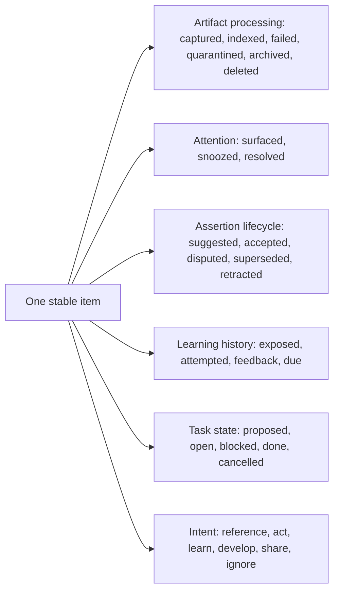
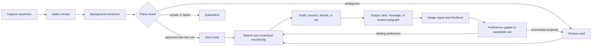
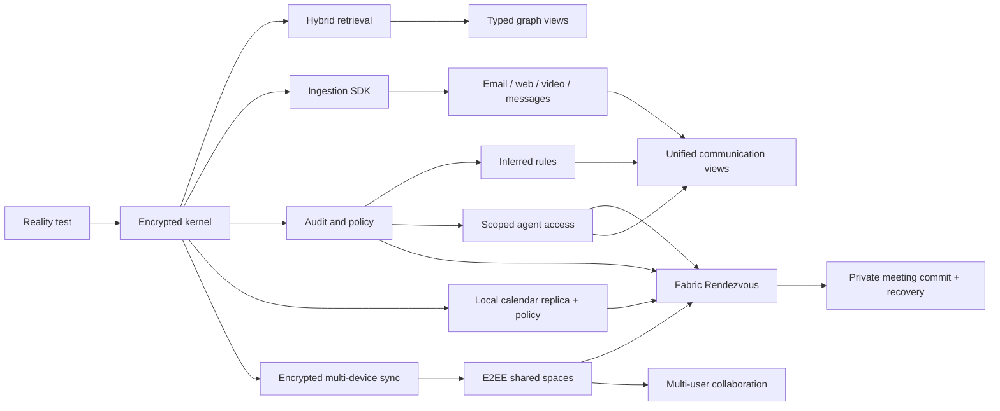

# Personal Knowledge Fabric — Product Requirements Document

**Status:** decision-ready baseline, version 1.2

**Prepared:** 2026-08-16

**Scope:** problem statement, market research, product experience, requirements, roadmap, and evaluation
**Related:** [Technical architecture](architecture.md) · [Calendar vertical](calendar.md)

---

## 1. Executive decision

The target should not be built as a larger note-taking application. It should be built as a **local-first personal knowledge fabric**: a fast, encrypted desktop system that captures heterogeneous source material, preserves the original evidence, derives structured knowledge locally, exposes several useful projections of that knowledge, and grants narrowly scoped access to people and agents.

The design has four distinct layers:

1. **Evidence vault** — immutable or versioned source material with full provenance.
2. **Knowledge kernel** — typed items, claims, relationships, tasks, people, projects, and temporal history.
3. **Cognitive workspace** — inbox, editor, search, graph, timelines, project views, and review/resurfacing.
4. **Capability boundary** — connectors, automations, sharing, and permissioned agent access.

No current product satisfies the complete requirement. The closest products each solve a different slice:

- **DEVONthink 4** is the closest immediately usable integrated document inbox on macOS: local databases, capture, search, smart rules, optional database/sync encryption, local-model integration, graph inspection, and MCP support. Its decisive limitation is the Apple-only client ecosystem. [DEVONthink product and security documentation](https://www.devontechnologies.com/apps/devonthink), [DEVONthink AI](https://www.devontechnologies.com/apps/devonthink/ai)
- **Obsidian** is the strongest portable, open-format synthesis surface and plugin ecosystem, but it is not an encrypted ingestion fabric and its Markdown link graph is much less expressive than the proposed typed, temporal, provenance-bearing graph. Obsidian Sync provides end-to-end encrypted synchronization, not automatic encryption of the local Markdown files. [Obsidian](https://obsidian.md/), [Obsidian Sync](https://obsidian.md/sync)
- **Joplin** is the strongest open, secure Evernote-replacement path: offline/local notebooks, E2EE synchronization and shared notebooks, a mature web clipper/API/plugin surface, and increasingly capable local semantic search. Its graph and multidimensional sensemaking are comparatively weak. [Joplin](https://github.com/laurent22/joplin), [Joplin E2EE](https://joplinapp.org/help/apps/sync/e2ee/), [Joplin semantic search](https://joplinapp.org/help/apps/ai_semantic_search/)
- **Anytype** is the closest privacy-and-sharing foundation: local-first, on-device encryption, CRDT-based synchronization, graph objects, an API, a headless CLI, and E2EE collaboration. Its capture and processing ecosystem is not yet a replacement for email, messaging, web archival, and task applications. [Anytype](https://anytype.io/), [Any-Sync protocol](https://tech.anytype.io/any-sync/overview), [Anytype API](https://developers.anytype.io/)
- **Karakeep** is an excellent self-hosted universal capture inbox for web pages, PDFs, images, RSS, and videos. It supports full-page archival, local Ollama models, AI tagging/summarization, a rules engine, clients, and a REST API. It is an intake component, not a durable knowledge model or complete encrypted PIM. [Karakeep documentation](https://docs.karakeep.app/)
- **Zotero** remains the strongest local research-source and citation subsystem. It saves local snapshots and attachments and exposes APIs, but its normal library sync is not end-to-end encrypted. [Zotero quick start](https://www.zotero.org/support/quick_start_guide), [Zotero security](https://www.zotero.org/support/security)
- **Khoj** is a useful local/self-hosted retrieval and conversational sidecar for an Obsidian or file corpus. It is not the canonical knowledge store. [Khoj features](https://docs.khoj.dev/features/all-features/)

The practical recommendation is therefore a staged strategy:

- **Start now with a composable stack** and make its boundaries explicit: a capture/archive application, a durable synthesis surface, a local AI runtime, and encrypted backups.
- **Build the product kernel separately** around stable IDs, immutable evidence, typed relationship assertions, hybrid retrieval, a permission engine, and event history.
- **Do not begin by replacing email and messaging clients.** Begin by importing selected information and extracting actionable objects. Add sending, deletion, and account-wide automation only after the trust and permission model is proven.
- **Do not begin with a graph database, an autonomous agent, or a giant ontology.** A single encrypted SQLite kernel, derived indexes, a small type system, and auditable suggestions are sufficient for the personal scale and offer a much faster path to an instant-feeling product.
- **Make the calendar the first Fabric application after the kernel.** Private scheduling is bounded enough to test local replicas, deterministic policy, consent, encrypted peer exchange, constrained agents, external writes, and recovery without first replacing mail or messaging. The protocol shares a handful of proposed intervals and signed decisions—not a calendar or free/busy map.

### 1.1 What success means

The system succeeds when the user can:

1. Send any supported source to one capture point in seconds and know that it is durably stored.
2. See *why* the source relates to existing knowledge across semantic, temporal, social, epistemic, project, and task dimensions.
3. Retrieve the source or a grounded synthesis without remembering where it was filed.
4. Share a selected subgraph without exposing the rest of the vault.
5. Allow an agent to use a precisely scoped portion of the system, with citations and a complete audit trail.
6. Ask another contact-listed Fabric user for a meeting, disclose only a bounded candidate set, approve exact options, and have both agents safely create the agreed event without exposing either calendar.

Capture volume, note count, link count, and graph density are not success metrics. Reuse, retrieval success, informed decisions, completed work, and trustworthy sharing are.

---

## 2. Confirmed requirements and unresolved decisions

This specification uses only the requirements confirmed in the discovery answers. Recommendations that still need a choice are labeled **proposed**, not silently treated as settled.

### 2.1 Confirmed

| Area | Confirmed direction |
|---|---|
| Users | Single-user first; later sharing and multi-user capability |
| Platforms | macOS first; cross-platform later |
| Privacy | Local-first, encrypted at rest, and end-to-end encrypted between Fabric endpoints |
| Models | Local models preferred |
| Existing ecosystem | Evernote, Obsidian, Notion, email, calendars, task managers, storage, messages, and browsers are all in use |
| Initial connectors | Email, messages, web pages, videos, and the first selected calendar provider/standard adapter |
| Automation | Automatic where safe, preferably using learned/inferred rules |
| Knowledge practice | Hybrid human-and-AI workflow |
| Product horizon | Eventually absorb major note, calendar, mail, message, and task workflows |
| Sharing | Notes and graph-based sharing; encryption required |
| Performance | Extremely responsive UI, startup, and processing; interaction should feel immediate |
| Initial artifact | Markdown report with Mermaid diagrams |
| Strategy | Long-term vision plus an immediately usable setup |
| Outcome | Universal capture, multidimensional relationships, and selective sharing |
| Market review | Commercial, open-source, self-hosted, and SaaS products may all be evaluated |
| First calendar adapter | Google Calendar on macOS; direct Google API is the provider synchronization boundary, with EventKit an optional later macOS integration |
| Scheduling contacts | Any entry in the user-selected Fabric contact list is authorized to initiate a bounded scheduling request; first-seen keys use TOFU and later key changes cannot be silent |
| First Fabric application | A private agentic calendar and synchronization subsystem: two or more contact-listed users exchange only bounded candidate times and decisions over an E2EE channel, then commit the exact approved meeting |

### 2.2 Decisions still required before installation or implementation

1. Exact Mac hardware, especially Apple Silicon generation and RAM.
2. Email providers and number of accounts.
3. Exact message platforms: iMessage, SMS/RCS, WhatsApp, Signal, Telegram, Slack, Teams, Matrix, or others.
4. Whether Docker or a small always-on home server is acceptable.
5. Whether a paid E2EE sync service is acceptable, or all relays must be self-hosted.
6. Recovery preference: memorized passphrase, printed recovery key, trusted contact recovery, or some combination.
7. Content-retention rules for email, conversations, web archives, and downloaded video/audio.
8. Whether the eventual product is personal software, an open-source project, or a commercial product.
9. The acceptable scope of automated actions: organize only, create tasks, draft replies, or send/modify external systems.
10. Google account type and initial calendar scope: personal versus Workspace, number of accounts, calendars that affect availability, and destination calendar for Fabric-created events.
11. Default Google representation after agreement: no Google event, an opaque private `Busy` block, selected local details without attendees, or a native Google invitation that discloses attendees.
12. Source of the authorized contact list—Fabric-native import, macOS Contacts, Google Contacts, or a combination—and duplicate/removed-contact behavior.
13. Relay deployment and metadata posture: local development relay, self-hosted internet relay, or operated ciphertext relay; retention and push-delivery requirements remain open.

The immediate setup in section 15 now treats macOS plus Google Calendar as primary. Other providers remain portability targets rather than hidden MVP dependencies.

---

## 3. Panel synthesis: what kind of system this is

### 3.1 Cognition theorist

The system is part of a coupled human-tool cognitive process, not a passive warehouse. The design goal is to preserve the user’s ability to orient, evaluate, and generate—not merely to outsource memory. Distributed-cognition research shows that representations and action can be distributed across people and artifacts, while cognitive-offloading research shows both improved task performance and weaker memory for some offloaded material. The implication is to make reference capture effortless, but to add deliberate generation and retrieval when the user intends to learn. The extended-mind thesis is a philosophical framework, not proof that every external store improves thinking. [Hollan, Hutchins, and Kirsh, 2000](https://doi.org/10.1145/353485.353487), [Clark and Chalmers, “The Extended Mind”](https://doi.org/10.1093/analys/58.1.7), [Risko and Gilbert, “Cognitive Offloading”](https://doi.org/10.1016/j.tics.2016.07.002)

### 3.2 Learning scientist and lifelong learner

Saved information is not learned information. Retrieval practice, distributed practice, generation, and self-explanation have substantially stronger empirical support than repeatedly rereading or decorating notes. The application should therefore turn selected knowledge into questions, explanations, comparisons, and resurfacing opportunities—but only for material the user elects to learn. [Roediger and Karpicke, 2006](https://doi.org/10.1111/j.1467-9280.2006.01693.x), [Rowland, 2014](https://doi.org/10.1037/a0037559), [Cepeda et al., 2006](https://doi.org/10.1037/0033-2909.132.3.354), [Chi et al., 1994](https://doi.org/10.1207/s15516709cog1803_3)

### 3.3 Mathematician

This is a queueing and ranking system operating over a temporal, attributed multigraph.

- Let exceptions that genuinely require attention arrive *after* automatic preservation/routing at rate \(\lambda_e\), and let useful review complete at rate \(\mu\). A sustainable attention queue requires \(\lambda_e < \mu\). A growing passive archive is principally a storage/retrieval issue; it becomes attention debt only when the product repeatedly asks the user to process it.
- A graph with \(n\) nodes has \(O(n^2)\) possible pairwise links. Exhaustive AI linking will become expensive and noisy. Candidate generation must be local: lexical blocking, nearest-neighbor search, shared entities, active-project context, and time windows.
- One hierarchy cannot preserve every useful relation. The canonical model must support several projections without duplicating the underlying item.

### 3.4 Physicist

The useful analogy is an open system with continuous inflow. Ingestion increases disorder; processing compresses and organizes it. Lossy summaries reduce volume but can destroy important information. The design must therefore preserve a reversible chain from synthesis to claim to source span to captured artifact. Stable identity, provenance, and checksums act like conservation constraints across transformations. This is an engineering analogy, not a cognitive-science claim.

### 3.5 Computer scientist

The core abstraction is not a file or page. It is a stable object with revisions and a set of independently sourced relationship assertions. Search indexes, embeddings, graph layouts, summaries, and recommendations are derived projections that can be deleted and rebuilt. Originals and human-authored content are canonical.

### 3.6 Software engineer

Perceived speed depends more on architecture than on model size. Capture must issue an immediate intake receipt and stream preservation progress; complete durability is signaled only when all source bytes are committed. Startup must never wait for connectors, indexing, synchronization, or a local model. A single local database should serve the interactive path; heavy work belongs in bounded background workers. The app needs performance budgets, migration tests, backup/restore tests, and fault isolation from the first prototype.

### 3.7 PIM practitioner

The workflow should practice **progressive commitment**:

- capture with almost no structure;
- classify only enough to route and retrieve;
- distill only material worth understanding or reusing;
- form explicit claims and relationships when they affect a project, decision, or durable model;
- archive or let low-value material decay.

“Atomic notes,” permanent notes, evergreen notes, and progressive summarization are useful practitioner techniques, not universal laws. The product should support them without forcing every email, message, or article through the same ritual.

The evidence is deliberately tiered: retrieval practice, spacing, generation, cognitive offloading, external representations, and small learner-constructed concept maps have empirical support; Zettelkasten, evergreen notes, atomic notes, and progressive summarization are historically grounded practitioner heuristics whose *whole-system* effectiveness has not been established by comparable controlled research. This system should test workflows against outcomes rather than encode a note-taking school as doctrine.

---

## 4. Cognitive design principles

| Principle | Product consequence | Failure it prevents |
|---|---|---|
| Capture and learning are different states | Store a source immediately; mark whether it has been read, distilled, connected, or used | Mistaking accumulation for knowledge |
| Preserve origin and provenance | Every derived object names its origin and processing run; claims link to exact evidence when such evidence exists | Fluent but ungrounded synthesis |
| Learning uses retrieval from memory; information retrieval stays effortless | For elected learning material, offer recall, comparison, application, corrective feedback, and spacing; keep corpus search fast | Passive rereading or confusing search friction with learning effort |
| Use cues in context | Rank by current project, people, time, task, and source—not semantic similarity alone | Cue overload and generic “related notes” |
| Attempt before revealing, when appropriate | After initial exposure, default to a brief recall/prediction attempt with skip and corrective feedback | Recognition mistaken for recall or premature testing of novices |
| Relationships need meaning | Every visible edge has a type, author, evidence, confidence/status, and “why shown” explanation | Decorative graph hairballs |
| AI proposes; policy decides | Models emit structured candidates; deterministic rules and user policy determine actions | Unpredictable automation |
| Friction must be placed deliberately | Near-zero friction for capture; more friction for destructive, external, or epistemically important actions | Either abandonment or unsafe automation |
| Forgetting can be functional | Expire reminders and suppress low-value attention demands; delete canonical sources only under explicit retention/privacy policy | Infinite exception queue without accidental evidence loss |
| The user’s synthesis is first-class | Distinguish source summaries from the user’s own interpretation and decisions | AI voice replacing personal understanding |

Every capture also has a user intent, independent of its format or workflow state:

| Intent | Default treatment |
|---|---|
| `reference` | Preserve and make retrievable; no learning ritual |
| `act` | Extract or create a reviewable task/decision; keep the source attached |
| `learn` | After adequate exposure, default to a skippable attempt before reveal, then corrective feedback, retrieval/spacing, and application where useful |
| `develop` | Support claims, hypotheses, counterevidence, and synthesis over time |
| `share` | Prepare a bounded, provenance-complete share manifest |
| `ignore` | Suppress, expire, or discard according to retention policy |

Intent may be inferred as a suggestion, but the user can change it at any time. This prevents one heavyweight “process everything” ritual from consuming the system.

### 4.1 Orthogonal state model

These axes are independently queryable facts, not one lifecycle or folder pipeline. A source may be archived while a derived claim remains current and disputed; a task may be complete while its evidence remains reference material.

### 4.2 Epistemic status

Do not mix source type, verification, lifecycle, and action commitment in one status field:

- **epistemic kind:** quotation/source-attested statement, report, identified person/instrument observation, inference, hypothesis, prediction, preference, or decision;
- **verification:** unverified, corroborated, refuted, or disputed;
- **lifecycle:** current, superseded, or retracted;
- **belief and timing:** human confidence, evidence strength, recorded time, valid time, and freshness remain separate.

A captured passage establishes that a source stated something; it does not make the statement an observation or verified fact. A decision is an action commitment, not a degree of knowledge. The system should never turn model confidence into truth. A numeric probability is meaningful only when calibrated against labeled outcomes. Before calibration, use action-policy labels such as `suggestion`, `review_required`, and `auto_eligible`, never probabilistic-sounding labels such as “likely.”

---

## 5. Market and system comparison

### 5.1 Comparison criteria

Products were assessed against the confirmed target, not against generic note-taking needs:

1. local operation and offline availability;
2. encryption at rest, in synchronization, and during sharing;
3. open export and resistance to lock-in;
4. capture breadth and connector/API quality;
5. expressive typed knowledge model and graph;
6. local-model and agent integration;
7. collaboration/sharing;
8. responsiveness and operational complexity;
9. licensing, platform scope, and maturity.

“Local-first,” “self-hosted,” “E2EE sync,” and “encrypted at rest” are different properties and are kept separate. Self-hosting gives operational control, but it does not automatically make data end-to-end encrypted or safe.

### 5.2 Product landscape

Legend: **Strong** = useful fit now; **Partial** = material limitations; **No/weak** = not a design center. Ratings describe fit for this project, not overall product quality.

| Product | Local/offline and encryption | Capture/connectors | Graph/AI | Sharing | Fit and principal gap |
|---|---|---|---|---|---|
| **Obsidian** | Strong local Markdown; E2EE optional Sync; local files remain plaintext unless OS/app-layer storage encrypts them | Strong plugin ecosystem and clipper; connectors vary in trust/quality | Link graph, Canvas, plugins, local-AI integrations | Shared vaults/Publish, but not fine-grained graph-native E2EE sharing | Best portable synthesis surface; weak as canonical typed ingestion kernel |
| **Joplin** | Strong offline/local notebooks; E2EE sync and encrypted shared notebooks | Mature web clipper, REST API, plugins, imports, self-hosted server | Local embeddings/semantic search and local OpenAI-compatible provider; weak graph | Shared notebooks with view/edit permissions | Strongest open secure Evernote replacement; weaker typed graph and visual sensemaking |
| **Anytype** | Strong local-first, on-device encryption, E2EE/CRDT protocol, self-host option; its terms note that some local retrieval/performance data may remain unencrypted, so disk encryption still matters | API, CLI, import/export; fewer mature ingestion connectors | Object graph and sets; MCP/API available; local AI remains experimental | Strong encrypted spaces and collaboration | Best privacy/sharing foundation; capture and processing breadth remains partial |
| **Logseq** | Local-first heritage; DB edition remains a transition with beta/alpha sync and mobile areas that require backups and current-build testing | Plugins and local files/DB; less universal capture | Excellent outlining/backlinks/queries; local AI possible | Evolving RTC/self-host story | Strong thinking tool; transition/maturity risk and not an ingestion fabric |
| **AFFiNE** | Local/offline workspaces and self-hosting; no current official, comprehensive E2EE threat-model guarantee was verified | API/imports less extensive than Obsidian/Karakeep | Docs, databases, whiteboard, AI | Stronger team collaboration than many PKM tools | Promising open workspace; treat a server as able to read content unless deployment evidence proves otherwise |
| **SiYuan** | Local-first, open source, self-host/sync options; supports E2EE sync | Web clipping and API/plugin ecosystem | Block references, graph, databases, AI integrations | Sharing/collaboration less mature than team suites | Capable all-in-one personal KB; smaller ecosystem and operational complexity |
| **TriliumNext** | Offline desktop, local DB, self-hosted sync; protected-note content is encrypted but structure, timestamps, and attributes can remain visible | Web clipper, scripting, ETAPI | Deep hierarchy, attributes, links, scripts; AI was removed from the core project | Primarily personal sync; limited collaborative model | Excellent hacker-oriented personal tree/graph; weaker whole-vault secrecy, multi-user model, and portable canonical format |
| **DEVONthink 4** | Strong local Mac DB; optional local DB and sync encryption | Excellent documents, web, feeds, mail archiving, OCR, automation | Local similarity/classification, graph, local LLMs, MCP | Server/web access and sync; Apple clients only | Closest immediate Mac experience; platform lock-in is decisive |
| **Capacities** | Explicitly not E2EE because server AI/API/MCP features need content; offline data does not change that trust model | Useful capture and integrations | Strong object-oriented UX and AI | Cloud collaboration/sharing | Excellent design reference; cloud dependency conflicts with target trust model |
| **Tana** | Cloud-centered; offline access is limited and shared workspaces remain service-dependent | Supertags, capture, integrations | Powerful typed graph and AI workflows | Collaboration | Excellent knowledge-model reference; local-first/encryption mismatch |
| **Heptabase** | Full local database and export, but current service-held encryption keys are not equivalent to user-only E2EE | Manual capture/import rather than broad connector platform | Excellent visual sensemaking and cards; CLI/MCP integration | Sharing/publishing | Best visual-workspace reference; not a universal zero-knowledge encrypted inbox |
| **Notion** | Cloud-first with offline features; not a local-first encrypted vault | Broad API/integrations | Databases, search, AI, relations | Excellent collaboration | Collaboration benchmark, not privacy architecture |
| **Evernote** | Local clients with cloud-centered service | Mature capture, email-in, scanning | Search/tasks/AI; limited expressive graph | Sharing | Capture benchmark; weak ownership, graph, and local-model fit |
| **Mem** | Cloud/AI-centered | Automated capture/integrations | AI retrieval and organization | Service sharing | AI UX reference; fails local-first requirement |
| **Readwise Reader** | Service-centered | Excellent reading inbox, RSS, email, highlights, video transcript workflows | AI reading features and exports | Sharing/export | Best reading-workflow reference; not canonical private store |
| **Recall** | Service/app-dependent; verify current local guarantees | Strong web/video summarization and capture | Automated knowledge graph | Sharing varies | Useful ingestion/graph UX reference; insufficient control for kernel |
| **Karakeep** | Self-hosted; local deployment is controllable but not inherently application-level E2EE | Excellent web/PDF/image/RSS/video intake, archive, extensions, REST API | Local Ollama tagging/summaries; rule engine; semantic search still evolving | Shared lists | Best immediate capture inbox; not a full knowledge workspace |
| **Linkwarden** | Open-source self-hosted | Excellent web preservation, reading, annotations, browser extension | Local Ollama tagging | Collaborative collections/public sharing | Strong alternative to Karakeep when preservation/annotation dominates |
| **Zotero** | Local desktop by default; normal metadata sync is server-readable; personal files can use WebDAV | Best scholarly metadata/PDF/browser capture | Full-text search, annotations, plugins; not a general graph | Group libraries use Zotero service | Keep as specialist source manager, not general kernel |
| **Khoj** | Local/self-hosted indexing and local models | Files, notes, PDFs, GitHub/Notion depending deployment | Strong semantic search/chat/agents | Not a collaboration system | Useful AI sidecar; derived index, not source of truth |
| **Reor** | Local and open source | Narrow file/note capture | Local embeddings/chat | Weak | Archived on 2026-03-07; useful historical prototype reference, not an adoption candidate |

Product capabilities change quickly. Before purchase or migration, rerun a short acceptance test against the current build: offline creation, full export, at-rest inspection, E2EE threat model, 10,000-item search, connector API, and restore from backup.

Specialists that are not full candidates still deserve explicit roles:

| Specialist | What it is good at | Important boundary |
|---|---|---|
| **Notesnook** | Strong encrypted notes/capture, offline clipper, encrypted backups, encrypted Inbox API | No expressive typed knowledge graph; self-hosted sync is still a higher-operations path |
| **Standard Notes** | Mature E2EE private writing and longevity-oriented format | Weak universal capture, typed relations, and connector layer |
| **Paperless-ngx** | Document/email ingestion, OCR, correspondent/document-type/tag learning, local Ollama metadata | Document archive rather than note/claim graph; secure the host and backups |
| **Zotero** | Research metadata, PDFs, annotations, citations | Specialist source manager; normal service metadata and groups are not zero-knowledge |
| **Karakeep / Linkwarden** | Web/media capture and preservation | Self-hosted does not mean E2EE; encrypt host storage and backups |

#### Sharing reality check

| Product | Encrypted collaboration today | Granularity and caveat |
|---|---|---|
| Anytype | E2EE shared spaces | Owner/editor/viewer roles; best current fit for testing encrypted object sharing |
| Joplin | E2EE shared notebooks | Notebook-level view/edit; not arbitrary graph slices |
| Obsidian Sync | E2EE shared vaults | Coarse vault permissions and no Google-Docs-style simultaneous same-file editing |
| DEVONthink | Encrypted sync plus server/web access options | Archive sharing, not CRDT collaboration or fine-grained graph sharing |
| Logseq DB | Encrypted sync/RTC direction | Current maturity must be tested; alpha/beta areas are not a production trust base |

No evaluated product combines fine-grained E2EE subgraph sharing, typed provenance, offline editing, and mature connectors. That remains a genuine kernel differentiator.

### 5.3 Build-versus-buy conclusion

| Capability | Buy/adopt now | Build as differentiating kernel |
|---|---|---|
| Browser capture and web preservation | Karakeep or Linkwarden | Normalized capture protocol and provenance bridge |
| Academic papers and citations | Zotero | Typed claim/evidence links into the knowledge graph |
| Local inference runtime | Ollama initially; llama.cpp/MLX as optimized backends | Model registry, policies, processing provenance, evals |
| Markdown synthesis and canvas | Obsidian initially | Unified editor and multidimensional views later |
| Mac document inbox | DEVONthink optional | Cross-platform evidence kernel |
| Workflow automation | n8n/OS shortcuts for prototype | Auditable inferred-rule engine and permission policy |
| Search | SQLite FTS5 plus local embeddings | Fusion, explanations, graph/context ranking, evaluation |
| Sharing | Anytype can validate UX; existing sync can bootstrap | Fine-grained encrypted subgraph sharing with revocation semantics |
| Agent interface | MCP SDKs | Vault-scoped resource/tool server, grants, audit, injection defenses |

The differentiated product is not another editor. It is the **canonical evidence-and-relationship kernel plus the trust boundary**. Commodity capture, inference, OCR, transcription, and transport should be adopted behind replaceable interfaces.

“Build” does not mean invent cryptography, a rich-text engine, a PDF renderer, or a CRDT algorithm. It means compose reviewed libraries and standards into a product-specific information model, permission system, provenance chain, rule workflow, and share experience. The immediate pilot should use a proven E2EE sync product; the long-term relay/protocol becomes custom only if fine-grained subgraph sharing cannot be achieved safely on that foundation.

### 5.4 Email, messaging, and task replacement landscape

These domains are asymmetric: email and consumer messaging depend on external identity, abuse prevention, counterparties, provider policy, and transport; personal tasks are a bounded application domain and can become native much earlier.

| System | Current data/integration reality | Recommended boundary |
|---|---|---|
| **Thunderbird + IMAP/Exchange/JMAP** | Cross-platform local profile and exports; OpenPGP is message-level, not whole-profile encryption. MailExtensions are an official connector surface. JMAP supplies batched/state-based JSON synchronization where a provider supports it, but is not E2EE. [Thunderbird profiles](https://support.mozilla.org/en-US/kb/profiles-where-thunderbird-stores-user-data), [MailExtensions](https://developer.thunderbird.net/add-ons/mailextensions/supported-webextension-api), [JMAP core](https://www.rfc-editor.org/rfc/rfc8620), [JMAP mail](https://www.rfc-editor.org/rfc/rfc8621) | Best cross-platform mail read/reference bridge. Preserve RFC 822 bytes, attachments, IDs, and provenance; leave identity, spam, and sending outside v1. Calendar is handled by the separate Fabric Calendar adapter boundary. |
| **Outlook / Microsoft Graph** | Microsoft 365 is cloud-canonical; Graph offers delegated mail permissions, delta synchronization, webhooks, and shared-mailbox support. [Graph mail API](https://learn.microsoft.com/en-us/graph/api/resources/mail-api-overview?view=graph-rest-1.0), [Graph permissions](https://learn.microsoft.com/en-us/graph/permissions-overview) | Read-only delegated connector first; never tenant-wide application access by default. Sending is a separate visible capability. |
| **Apple Mail / MailMate** | Mac-local caches rely on FileVault; Apple supports bounded MailKit extensions and mbox exchange, while MailMate offers power-user IMAP automation/deep links. [Apple Mail import/export](https://support.apple.com/guide/mail/import-or-export-mailboxes-mlhlp1030/mac), [MailKit](https://developer.apple.com/documentation/MailKit), [MailMate manual](https://manual.mailmate-app.com/preferences) | Useful Mac integration surface, not the canonical encrypted store; avoid unsupported live-database access. |
| **Beeper** | On-device connections can connect participating networks locally; its local Desktop API exposes search/list/send surfaces across multiple networks, including MCP. Completeness and platform limits vary, and bulk automation risks account suspension. [On-device connections](https://blog.beeper.com/2025/07/16/the-new-beeper/), [Desktop API](https://developers.beeper.com/desktop-api/) | Strong immediate unified-message ingress: localhost-only search/list/export first. Treat as an adapter, not the archive or an autonomous outbound agent. |
| **Matrix / Element** | Open federated protocol with encrypted rooms and self-hosting. Bridges/appservices can become trusted decryption or impersonation endpoints, so bridged rooms do not necessarily preserve the source network’s E2EE boundary. [Matrix client-server API](https://spec.matrix.org/v1.14/client-server-api/), [Matrix E2EE](https://matrix.org/docs/matrix-concepts/end-to-end-encryption/), [appservice architecture](https://matrix.org/docs/matrix-concepts/elements-of-matrix/) | Best later communication layer for new conversations whose participants can move; not a universal transparent bridge for existing private networks. |
| **Signal / Telegram / WhatsApp / iMessage** | Supported personal-history paths are uneven: Signal emphasizes encrypted backup/transfer; Telegram can export cloud chats; Apple documents iCloud protection but no general Messages history API. [Signal backup/transfer](https://support.signal.org/hc/en-us/articles/10074659364122-Backups-and-Device-Transfers-on-Signal), [Telegram export](https://telegram.org/blog/export-and-more), [Apple iCloud data security](https://support.apple.com/en-gb/102651) | User-triggered export/share or explicitly authorized on-device adapter only. Never claim completeness, scrape private databases as a supported feature, or retain disappearing messages by default. |
| **Things / OmniFocus** | Both are fast Apple-first local task clients. Things has no public API or E2EE claim for Things Cloud; OmniFocus offers client-side encrypted sync and excellent automation but no Windows client or collaboration. [Things automation boundary](https://culturedcode.com/things/support/articles/2967034/), [OmniFocus encryption](https://support.omnigroup.com/omnifocus-encryption-faq/) | Strong temporary Mac executors: Things for simplicity, OmniFocus for privacy/automation. Integrate through supported Shortcuts/AppleScript/export, never live DB writes. |
| **Todoist / Vikunja / Super Productivity** | Todoist has excellent collaborative APIs but cloud-canonical, server-readable storage. Vikunja is self-hosted/team-oriented without content E2EE. Super Productivity is cross-platform, no-account/local-first with optional client-encrypted sync, but plugin secrets need scrutiny. [Todoist developer portal](https://developer.todoist.com/), [Todoist security](https://www.todoist.com/help/articles/todoist-privacy-and-security-LYvNRupva), [Vikunja API](https://vikunja.io/docs/api-documentation/), [Super Productivity](https://github.com/super-productivity/super-productivity) | Todoist is a connector/collaboration benchmark; Super Productivity is the immediate Windows/cross-platform private executor; Vikunja fits self-hosted sharing. Native PIM tasks should replace this lane early. |

Replacement order:

1. integrate email and messages read-only, while replies/sends remain in native clients;
2. replace personal tasks first, preserving source links and optionally mirroring one executor;
3. add private drafts, exact destination/content preview, and explicit send approval;
4. use Matrix for new PIM-native group conversations when participants opt in;
5. never build SMTP/MTA delivery, spam/reputation infrastructure, Exchange, or reverse-engineered consumer-message bridges as early product scope.

Read and send credentials are separate grants. Agents receive filtered local projections, never unrestricted mailbox or messaging credentials.

## 6. Product vision and UX

### 6.1 The home model

The application should present six durable places rather than dozens of modules:

1. **Inbox** — newly captured, failed, ambiguous, or review-required items.
2. **Focus** — current projects, people, questions, tasks, and recently used knowledge.
3. **Explore** — universal search and multidimensional relationship views.
4. **Compose** — notes, synthesis, decisions, drafts, and canvases.
5. **Calendar** — encrypted agenda, time policies, private holds, and scheduling negotiations.
6. **Shared** — explicit spaces and subgraphs shared with people or agents.

Email, conversations, tasks, events, sources, and notes are saved views over the same kernel. The user may open a mail-like view, calendar, timeline, or graph without moving/copying the underlying object.

### 6.2 Main interaction loop

The immediate intake receipt contains only what is known: source, time, and queue ID. A distinct `content_preserved` state means the complete encrypted bytes and manifest are durable; it cannot honestly be promised in 100 ms for a large file. Summaries, tags, transcript progress, and links appear progressively. A slow model never blocks capture or navigation.

Navigation, acceptance, co-use, and “no action” are preference/context signals, not truth labels. They may mean familiar, urgent, deferred, already known, or simply convenient. Learning/ranking uses them with scope and decay, preserves exploration, and never treats popularity or centrality as evidence that a claim is true.

### 6.3 Multidimensional relationship explorer

The default is not an all-vault node cloud. The explorer begins from an item, query, person, project, or time range and shows a bounded neighborhood. Users can switch or combine dimensions:

- **meaning** — semantic/lexical similarity and shared concepts;
- **evidence** — citations, quotations, derivations, supports, contradictions;
- **time** — captured, occurred, discussed, revised, and due;
- **people** — authors, senders, recipients, participants, organizations;
- **work** — projects, goals, tasks, decisions, dependencies;
- **causality** — causes, effects, prerequisites, alternatives;
- **source** — channel, publication, conversation, device, connector;
- **learning** — prerequisite, example, question, explanation, review history, and uncertain estimates of retrievability or task-specific competence;
- **access** — private, shared space, recipient, and agent grant.

Every edge can answer:

1. What type of relationship is this?
2. Who or what asserted it?
3. What evidence supports it?
4. Is it human-accepted, inferred, disputed, or superseded?
5. Why is it visible in this view?

### 6.4 Inbox design

The inbox is an exception and decision surface, not a mandatory daily filing ritual. It groups work by action:

- needs one-click routing;
- duplicate or near-duplicate;
- possible project/task/person match;
- suggested claims or relationships;
- sensitive content requiring a storage decision;
- extraction/transcription failure;
- automation rule proposed from repeated behavior.

Bulk actions always preview effects. “No action” is valid, but its meaning is ambiguous. Where useful, offer `defer`, `already known`, `not relevant`, `low priority`, or `do not suggest again`; otherwise treat silence as no label rather than negative evidence.

### 6.5 Unified communication horizon

Replacing email and messaging should proceed in four trust stages:

1. **Reference:** import selected messages read-only and link them to people/projects.
2. **Assist:** extract tasks, decisions, and proposed replies; user acts in the original client.
3. **Draft:** create replies or actions in the source system, unsent.
4. **Act:** send, label, archive, or update through explicit policies and confirmations.

External deletion, sending, sharing, account changes, and financial/legal actions must never be enabled by a generic “autonomous” toggle.

### 6.6 Inquiry workspace

For `develop` work, the primary container is an evolving question rather than a folder or graph. It combines:

- the current query and decision/learning purpose;
- a source shoebox with exact selected evidence fragments;
- competing hypotheses, assumptions, predictions, and disconfirming tests;
- supporting, contradicting, ambiguous, and missing evidence columns;
- an emerging narrative clearly separated from quotations and model proposals;
- unresolved questions, next searches, and re-evaluation triggers such as a date or changed source.

The same content can project as an evidence matrix, outline, timeline, focused graph, or draft. This turns capture into sensemaking without requiring every source to become a permanent note.

## 7. Functional specification

Priority: **P0** is the first usable kernel, **P1** completes the personal product, **P2** adds sharing/replacement workflows.

### 7.1 Capture and ingestion

| ID | Priority | Requirement | Acceptance criterion |
|---|---:|---|---|
| CAP-001 | P0 | Accept URL, text, file, image, and clipboard capture through global shortcut, drag/drop, watched folder, browser extension, and local API | With the broker already running, URL/text/≤1 MB captures return a durable receipt ID p95 ≤100 ms after receipt, source descriptor, and job commit. Large files expose `received`, `copying`, and `preserved`; only `preserved` means encrypted bytes, manifest, and canonical operation are durable. A URL is not `archived` until its requested snapshot succeeds |
| CAP-002 | P0 | Preserve immutable raw source plus normalized representation | User can open original bytes/snapshot and see content hash, capture time, connector, and source URI |
| CAP-003 | P0 | Idempotent ingestion using source IDs and content fingerprints | Replaying a connector page does not create duplicate canonical artifacts |
| CAP-004 | P0 | Resumable background processing with visible state | Crash/restart resumes jobs without losing or double-committing results |
| CAP-005 | P1 | Email connectors for Gmail, Microsoft Graph, IMAP4rev2, and JMAP where available | Selected label/folder imports threads, message headers/body, attachments, and remote IDs incrementally |
| CAP-006 | P1 | Web preservation modes: bookmark, readable snapshot, full archive, screenshot, and metadata-only | Policy can choose storage mode per domain/content type |
| CAP-007 | P1 | Video intake stores URL/metadata/chapters and uses authorized captions or local transcription when permitted | Transcript segments retain timestamps and source linkage |
| CAP-008 | P1 | Message connector framework supports official APIs, exports, share actions, and user-controlled bots | Each platform adapter declares read/write/export capability and legal/technical limitations |
| CAP-009 | P1 | PDF, office document, image OCR, and audio transcription | Extracted spans map back to page, bounding box, or timestamp where possible |
| CAP-010 | P2 | Cloud drive, social bookmark, RSS, and external task connectors | Connector conformance suite passes incremental sync, deletion, revocation, and rate-limit tests; calendar requirements live in [Calendar §7.6](calendar.md#76-calendar-and-agentic-scheduling) |

### 7.2 Knowledge and composition

| ID | Priority | Requirement | Acceptance criterion |
|---|---:|---|---|
| KNO-001 | P0 | Stable items, immutable revisions, source artifacts, typed relations, and evidence spans | IDs survive rename, move, export, and re-import |
| KNO-002 | P0 | Notes support Markdown-compatible text plus block/rich-text structure | Lossless internal round-trip; useful Markdown export without proprietary IDs in prose |
| KNO-003 | P0 | Human content and AI-derived content are visibly distinct | Every derived field names model/rule, run, time, and evidence |
| KNO-004 | P0 | Accept/reject/edit suggested entities, claims, and links | Feedback changes assertion state without overwriting the original suggestion |
| KNO-005 | P1 | First-class people, organizations, projects, goals, tasks, events, concepts, claims, questions, decisions, and sources | Each type has minimal schema and can be extended without migration-heavy custom columns |
| KNO-006 | P1 | Contradiction, support, refinement, prerequisite, cause, and alternative relations | Graph and item view expose evidence and epistemic state |
| KNO-007 | P1 | Reusable templates and saved views | Views are queries, not duplicated folders |
| KNO-008 | P1 | History, diff, restore, merge/fork, and tombstones | User can restore any human-authored revision and inspect automated changes |
| KNO-009 | P0 | Independent intent field: reference, act, learn, develop, share, or ignore | Changing intent alters workflow without moving or duplicating the item |
| KNO-010 | P1 | After initial exposure, learning mode supports skippable attempts before reveal, corrective feedback, user-authored explanations, retrieval prompts, spacing, transfer/application, and confidence judgments | Delayed retrieval/transfer outcomes and confidence calibration are recorded separately from capture/activity counts |
| KNO-011 | P1 | Development mode supports claims, hypotheses, assumptions, counterevidence, and belief revision | A synthesis can show its supporting, contradicting, stale, and superseded evidence over time |

### 7.3 Retrieval and exploration

| ID | Priority | Requirement | Acceptance criterion |
|---|---:|---|---|
| RET-001 | P0 | Instant lexical search with phrase, prefix, field, date, source, type, and boolean filtering | First useful results p95 under 50 ms on the reference corpus |
| RET-002 | P0 | Hybrid retrieval fuses lexical, semantic, graph, recency, and active-context signals | Result card explains which signals caused the match |
| RET-003 | P0 | Search never requires an LLM | Lexical/structured search works while models are absent or stopped |
| RET-004 | P1 | Bounded graph explorer with dimension filters and semantic zoom | Maintains 60 fps for the agreed visible-node budget; never renders the entire vault by default |
| RET-005 | P1 | Timeline, conversation, map when geodata exists, and project/person projections | Same item appears without duplication across projections |
| RET-006 | P1 | Grounded answer mode cites exact source spans and exposes retrieval set | User can open each cited page/timestamp/message |
| RET-007 | P1 | Duplicate and contradiction discovery | Suggestions include evidence and can be dismissed permanently or temporarily |

### 7.4 Automation and AI

| ID | Priority | Requirement | Acceptance criterion |
|---|---:|---|---|
| AIA-001 | P0 | Local model provider abstraction supporting Ollama and OpenAI-compatible localhost runtimes | Models can be changed without reformatting canonical data |
| AIA-002 | P0 | JSON-schema-constrained extraction and validation | Invalid output is rejected/retried/quarantined, never partially committed |
| AIA-003 | P0 | Processing provenance stores model digest, prompt/template version, parameters, inputs, outputs, and evaluator result | Every derived object is reproducible where practical and always attributable to its origin |
| AIA-004 | P0 | Rules are deterministic objects separate from model inference | User can inspect, test, disable, and roll back each rule |
| AIA-005 | P1 | Infer candidate rules from repeated user actions | Proposal explains pattern statistics and previews affected historical items |
| AIA-006 | P1 | Three action tiers: auto, suggest, confirm | Destructive/external actions cannot be assigned to auto tier |
| AIA-007 | P1 | Local evaluation set for tagging, entity resolution, links, summaries, and retrieval | Model/prompt upgrade is blocked when agreed quality regresses |
| AIA-008 | P1 | Agent access through current MCP plus local typed API | Read/write scopes, purpose, expiry, and audit are enforced outside the model |

### 7.5 Sharing and communication

| ID | Priority | Requirement | Acceptance criterion |
|---|---:|---|---|
| SHR-001 | P1 | Export selected items/subgraphs as Markdown plus JSON-LD and attachments | Export uses package-local pseudonymous IDs by default plus user-selected provenance; reusable public IDs are explicit, and private vault UUIDs are never reused across recipients as correlation handles |
| SHR-002 | P2 | E2EE spaces with per-space keys and device membership | Relay cannot decrypt content; independent security review completed |
| SHR-003 | P2 | Share a note, collection, query snapshot, or bounded subgraph | Preview proves which nodes, edges, attachments, and metadata leave the private vault |
| SHR-004 | P2 | Revocation rotates future keys and explains limits of revoking already received plaintext | Removed device cannot decrypt new epochs |
| SHR-005 | P2 | Comments, mentions, tasks, and collaborative editing in shared spaces | Offline concurrent edits converge; membership changes are audited |

A relation may leave the private vault only when both endpoints and its selected evidence are in the share manifest. Otherwise it is omitted or replaced by a deliberately approved redacted stub. Cross-space relations remain a private local overlay by default; a query or graph view never expands the share transitively.

## 8. Non-functional specification

### 8.1 Performance budgets

Performance targets need a reference device and corpus. The following are **proposed targets** pending the hardware choice:

- reference device: 8 modern CPU cores, 32 GB RAM, NVMe SSD; Apple Silicon GPU or a Windows GPU is optional for the UI and required only for larger-model targets;
- reference corpus: 100,000 items, 1,000,000 text chunks, 100 GB attachments, 2,000,000 accepted/inferred edges;
- cold start to interactive shell: p50 ≤ 400 ms, p95 ≤ 900 ms;
- warm window activation: p95 ≤ 100 ms;
- local mutation acknowledgement: p95 ≤ 16 ms after validation;
- warm-broker durable receipt: p95 ≤100 ms after receipt, source descriptor, and processing job commit for URL/text/≤1 MB inputs; cold launch and large-file byte-copy/preservation time are measured separately;
- lexical query: p95 ≤ 50 ms;
- indexed local availability query over a 90-day horizon: p95 ≤ 75 ms for ten selected calendars and 10,000 cached occurrences; candidate cards remain interactive in ≤100 ms after local results exist;
- hybrid query excluding first-time model download: p95 ≤ 250 ms, with lexical results streamed first;
- scrolling/editor/graph interaction: 60 fps at the agreed visible complexity, 120 fps where display and hardware permit;
- no startup dependency on network, sync, connector, index rebuild, or model runtime;
- background workers yield CPU/I/O under active interaction and obey thermal/battery modes.

Model latency must be reported separately. “Instant UI” cannot honestly imply instant generation on every local model and device. The product should stream progress and let deterministic results appear before model-derived results.

### 8.2 Reliability and durability

- Canonical database mutations are transactional. Blob files use staged write → hash/authenticate → flush → atomic rename → manifest/operation commit, with startup reconciliation of orphaned staging files and manifests. External effects use a transactional outbox and reconciliation; the product never claims one ACID transaction across SQLite, the filesystem, and a remote service.
- Cross-provider calendar finalization is a prepare-and-saga workflow, not an atomic distributed transaction. Local consent and holds commit transactionally; provider writes are idempotent, retried, reconciled, and visibly recoverable.
- Raw captures are append-only until an explicit retention action.
- Derived indexes can be rebuilt from canonical content and event history.
- Schema migrations are forward-tested, resumable, and preceded by a verified snapshot.
- Daily encrypted incremental backup and periodic full restore test are first-class product functions.
- Sync is not backup; deletion and corruption can synchronize.
- No active SQLite database is stored in OneDrive, Dropbox, iCloud Drive, or a generic file-sync folder. SQLite WAL improves local concurrency but is explicitly unsuitable across network filesystems. [SQLite WAL documentation](https://www.sqlite.org/wal.html)

### 8.3 Privacy and security

- No telemetry by default.
- No cloud model fallback without a per-request or explicit standing policy.
- All embeddings, thumbnails, OCR text, transcripts, logs, and search indexes are treated as sensitive data.
- Connector credentials are stored in the OS credential store and never in the knowledge database or logs.
- Localhost services bind only to loopback by default and require authentication for any non-loopback exposure.
- Imported content has no authority and is structurally separated from control instructions, but a model may still be influenced by it; every retrieval scope, tool call, and external effect is independently authorized outside the model.
- Plugins/connectors declare and receive only needed filesystem, network, vault, account, and action capabilities.
- Calendar peers and relays never receive a calendar projection or a free/busy grid in private mode. Candidate and response disclosures are previewed, rate-limited, encrypted, signed, expiring, and independently authorized; external calendar providers still see whatever is stored with them.

### 8.4 Portability

- Canonical export: Markdown for human-authored text; JSON-LD or documented JSON for typed objects/relations; original attachments; checksums; and an export manifest.
- No user-visible concept may exist only as an opaque vector or model-specific representation.
- A complete export must be usable without the original application.
- Import/export conformance and round-trip loss reports are release gates.

---

## 16. Delivery roadmap

### Phase 0 — one-week reality test

Goal: validate capture, local processing, retrieval, relationship usefulness, and restore using the practical stack.

Deliverables:

- chosen front door installed on one encrypted desktop;
- 100 representative captures across the four priority channels where technically permitted;
- one stable source-note schema and provenance bridge prototype;
- local AI profile benchmarked;
- independent encrypted backup and successful restore;
- diary of friction, false links, retrieval failures, and security concerns.

Exit gate: at least 80% of test sources capture reliably; a known item can be found in under 15 seconds in 9 of 10 trials; no content lacks a return path to its source.

### Phase 1 — kernel MVP, approximately 6–10 engineering weeks

Goal: one fast local application with universal manual capture and hybrid retrieval.

Build:

- encrypted SQLite schema, blob store, operation/audit log;
- global shortcut, watched folder, browser/local API capture;
- HTML/PDF/text extraction and provenance spans;
- local lexical search, embeddings, bounded relation suggestions;
- inbox, item view, editor, search, and focused graph;
- Ollama provider plus processing registry/validation;
- Markdown/JSON-LD export and restic-compatible snapshot;
- performance, crash-recovery, migration, and restore harnesses.

Do not build collaborative sync, autonomous agents, or mail sending in this phase.

### Phase 2 — trusted personal automation, approximately 8–12 weeks

Goal: selected email/video/message imports and useful rules.

Build:

- Gmail/Microsoft/IMAP/JMAP framework and one production adapter;
- video metadata/transcript pipeline;
- one named message-platform adapter or share workflow;
- rule DSL, simulation, rollback, and candidate-rule learner;
- people/project/task/claim/decision types;
- calendar/time model, Fabric-native events, one read-only provider adapter, deterministic availability policies, and recurrence/DST conformance fixtures;
- local retrieval evaluation and AI processing evals;
- read-only MCP resources/tools, then proposal-only write tools.

Exit gate: ≥95% precision for auto-routed low-risk rules on a labeled personal set; 100% provenance for AI suggestions; zero silent external mutations.

### Phase 3 — first Fabric application plus encrypted sharing, approximately 3–5 months

Goal: E2EE personal sync and bounded shared spaces, proven end-to-end by the private calendar synchronization application.

Build:

- device enrollment/revocation and recovery;
- encrypted operation transport and snapshot compaction;
- CRDT collaborative text/shared state;
- per-space group epochs, share manifest, recipient preview;
- Fabric Rendezvous contact-list authorization, TOFU key binding, opaque relay, bounded candidate negotiation, signed yes/no decisions, privacy budgets, and multi-party coordinator-private responses;
- encrypted local calendar replicas, soft holds, revalidation, exact-event authority grants, idempotent provider projections, and reconciliation UI;
- comments, mentions, collaborative tasks;
- security review, fuzzing, metadata-leak documentation, restore/recovery exercises.

### Phase 4 — communication and task replacement

Goal: progressively absorb source-client workflows.

Build in order:

1. cross-source unified inbox;
2. task extraction and bidirectional task state;
3. reply/action drafts in source systems;
4. explicit send/archive/label actions;
5. policy-scoped automations for proven patterns;
6. only then, optional standalone mail/message UI.

Replacement is earned through reliability and trust; it is not an MVP checkbox.

### 16.1 Roadmap dependency graph

---

## 17. Verification and evaluation plan

### 17.1 Product metrics

| Outcome | Metric | Initial target |
|---|---|---:|
| Universal capture | Successful durable captures / attempted supported captures | ≥99.5% after retries |
| Deduplication | Duplicate canonical artifacts | <1% on replay tests |
| Origin traceability | Derived claims/answers with exact source spans where applicable, otherwise explicit author/model origin, inputs, and rationale | 100% |
| Findability | Known-item retrieval within 15 seconds | ≥90% in monthly task set |
| Grounding | Answers whose cited fragment exactly supports the presented claim | ≥95% on judged set; 100% citation availability |
| Link quality | Blinded correctness, user usefulness, novelty, labeled-set coverage/recall, and later correction rate | Track separately; acceptance rate alone is not a quality target |
| Link quality by predicate | Those measures tracked separately for `mentions`, `same_as`, `supports`, `contradicts`, etc. | No aggregate score may hide a weak consequential predicate |
| Rule safety | Precision of auto rules on labeled history | ≥95%; higher for sensitive channels |
| Cognitive value by intent | `reference`: findability/grounding; `act`: completion/reminder errors; `develop`: time-to-synthesis and counterevidence; `share`: traceability | Track trends by intent; a rarely reopened reference may still be valuable |
| Learning | Delayed retrieval and application/transfer success plus Brier/calibration score, stratified by material and delay | Improve against the user’s baseline; never optimize card count |
| Attention operations | Exception-queue age, missed/false/excessive reminders, and completion latency | Keep the actionable queue stable; do not target total archive size |
| Sensemaking | Time from question to evidence-backed synthesis; unsupported-claim and unexamined-counterevidence rates | Improve baseline while keeping unsupported/counterevidence omissions near zero |
| AI correction | Accepted AI suggestions later corrected or retracted | Track by model, task, predicate, and time; regression blocks rollout |
| Sharing | Shared assertions with traceable evidence and no unintended transitive item | 100% traceability; 0 out-of-manifest disclosures |
| Private scheduling disclosure | Fields/bytes learned by relay and each participant per negotiation versus documented disclosure contract | 0 calendar objects, busy ranges, rejection reasons, or provider IDs; no budget bypass |
| Scheduling correctness | Agreement with deterministic recurrence/time-zone/availability oracle; stale-slot detection | 100% on conformance/adversarial fixtures; 0 silent double bookings |
| Scheduling authority | Commits without a valid, exact, unexpired approval from every required participant | 0 |
| Scheduling reliability | Duplicate logical meetings, partial commits, orphan holds, reconciliation latency | 0 duplicates; all partial states visible and eventually reconciled or explicitly abandoned |
| Scheduling usability/fairness | Completion rate, rounds, elapsed time, corrections/regret, worst-participant and repeated time-zone burden | Establish baseline; improve without increasing disclosure or unauthorized action |
| Trust | External/destructive actions without explicit applicable grant/policy | 0 |
| Durability | Successful restore drills | 100% quarterly and before major migration |
| Responsiveness | Performance budgets in section 8.1 | Meet p95 on reference corpus/device |

### 17.2 Evaluation sets

Create a private, encrypted benchmark sampled from the user’s real corpus:

- 100 known-item queries;
- 100 exploratory questions with judged useful results;
- 200 entity-match/non-match pairs;
- 200 relationship candidates across key predicates;
- 100 extraction documents across channels and formats;
- 100 rule examples including adversarial/edge cases;
- prompt-injection documents and connector permission tests;
- calendar fixtures covering recurrence exceptions, all-day boundaries, floating/zoned times, DST gaps/overlaps, tentative/free/out-of-office projection, expired provider cursors, and deletes;
- scheduling traces covering replay/reordering, privacy-budget evasion, coordinator omission, membership/device changes, stale slots, partial provider writes, and cancellation;
- backup, crash, interrupted migration, partial sync, and device-revocation scenarios.

Model, prompt, parser, or ranker changes run against this set. Store judgments and compare by version. A model upgrade is not automatically a product upgrade.

### 17.3 Performance harness

- cold/warm startup traces;
- 10k/100k/1m item synthetic and anonymized corpora;
- search latency distributions, not averages;
- connector burst and backpressure tests;
- graph frame times at visible-node/edge budgets;
- index rebuild while editing/searching;
- low-memory, battery, offline, and model-unavailable behavior;
- encrypted DB/blob overhead;
- 90-day indexed availability calculation, recurrence-cache rebuild, candidate evaluation, and scheduling-envelope crypto/state transition latency;
- crash injection at every capture/commit/migration stage.

---

## 18. Major risks and mitigations

| Risk | Why it matters | Mitigation |
|---|---|---|
| Building “everything app” breadth first | Email, chat, tasks, notes, sync, and AI each contain years of edge cases | Build kernel and read-only ingestion; earn external actions later |
| Capture hoarding | Low friction can create an unbounded attention backlog | Queue metrics, expiry, auto-archive, selective subscriptions, project relevance |
| AI-generated epistemic pollution | Plausible summaries/links become indistinguishable from evidence | Separate suggestions, provenance, evidence spans, calibrated evals, human adoption |
| Graph hairball | More links reduce rather than improve orientation | Typed edges, focused neighborhoods, dimension filters, budgets, “why shown” |
| Local-first complexity | CRDT, encryption, recovery, and schema evolution interact | Single-user oplog first; CRDT only for shared state; formal invariants and security review |
| Metadata leakage | E2EE content can still reveal timing, sizes, membership, or graph structure | Encrypt manifests, random relay IDs, batch/pad where justified, document residual leakage |
| Plugin/connector compromise | Universal ingestion creates broad account and file access | Capability sandbox, signed packages, least privilege, separate processes, revocation |
| Platform API instability | Social/message services change pricing and permissions | Connector contracts, official APIs/exports first, graceful degradation, no canonical dependency |
| Model/hardware churn | “Best” local models change quickly | Provider abstraction, local benchmarks, model registry, evaluation gates |
| Database-in-sync-folder corruption | Generic file sync does not coordinate SQLite locks/WAL | Supported operation sync or snapshots only; never live DB file sync |
| Recovery failure | Strong encryption can turn a forgotten key into permanent loss | Recovery design and restore rehearsal before sensitive migration |
| Calendar topology leakage | “Details-hidden” free/busy still reveals exact rhythms and occupied periods | Exchange only a few approved candidates/responses; enforce per-contact privacy budgets and audit disclosure |
| Scheduling-agent overreach | A broad calendar grant can become silent surveillance or unauthorized booking | Separate read/propose/negotiate/hold/commit/cancel/invite capabilities; bind consent to one exact meeting digest |
| Cross-provider race/partial commit | No provider transaction spans all participants | Local holds, revalidation, idempotent writes, saga/reconciliation, never claim atomicity |
| Cryptographic overclaim | E2EE can be mistaken for anonymity, endpoint security, or provider secrecy | Publish actor-by-actor leakage table, non-goals, threat model, and independent review before production claims |

---

## 20. Recommended next decision session

macOS, Google Calendar, contact-list authorization, and E2EE peer transport are now confirmed. The highest-leverage remaining decisions are:

1. **Which Mac and Google account type?** Apple Silicon/RAM determines the local-model profile; Google personal versus Workspace determines OAuth administration and test setup.
2. **Which Google calendars affect availability and receive created events?** Read and write scopes remain separate; begin with a dedicated `Fabric Pilot` destination.
3. **What is the default final Google representation?** Fabric-only gives the strongest privacy; opaque `Busy` preserves conventional blocking; local details reveal selected fields to Google; a native invitation intentionally reveals participants and metadata.
4. **Which address book supplies authorized contacts, and where will the ciphertext relay run?** Contact-list membership authorizes requests; TOFU pins the first key and blocks unexpected changes.
5. **Which exact email/message services, and is Docker/an always-on server acceptable?** This determines what broader capture can legally and technically mean.

Once those are chosen, the next artifact should be a small repository containing:

- ADR-001 through ADR-003;
- the capture-envelope JSON Schema;
- the SQLite schema and migration harness;
- a browser/local capture endpoint;
- a corpus generator and performance test;
- a one-connector proof of concept;
- a calendar standards/provider spike plus a two-profile synthetic Fabric Rendezvous simulator;
- a threat-model test checklist.

---

## 21. Selected primary and official references

### Cognition and learning

- Hutchins, E. (1995). [How a Cockpit Remembers Its Speeds](https://doi.org/10.1207/s15516709cog1903_1).
- Hollan, J., Hutchins, E. & Kirsh, D. (2000). [Distributed Cognition: Toward a New Foundation for HCI Research](https://doi.org/10.1145/353485.353487).
- Clark, A. & Chalmers, D. (1998). [The Extended Mind](https://doi.org/10.1093/analys/58.1.7).
- Risko, E. F. & Gilbert, S. J. (2016). [Cognitive Offloading](https://doi.org/10.1016/j.tics.2016.07.002).
- Sparrow, B., Liu, J. & Wegner, D. M. (2011). [Google Effects on Memory](https://doi.org/10.1126/science.1207745).
- Tulving, E. & Thomson, D. M. (1973). [Encoding Specificity and Retrieval Processes](https://doi.org/10.1037/h0020071).
- Watkins, O. C. & Watkins, M. J. (1975). [Buildup of Proactive Inhibition as a Cue-Overload Effect](https://doi.org/10.1037/0278-7393.1.4.442).
- Slamecka, N. J. & Graf, P. (1978). [The Generation Effect](https://doi.org/10.1037/0278-7393.4.6.592).
- Chi, M. T. H. et al. (1994). [Eliciting Self-Explanations Improves Understanding](https://doi.org/10.1207/s15516709cog1803_3).
- Roediger, H. L. & Karpicke, J. D. (2006). [Test-Enhanced Learning](https://doi.org/10.1111/j.1467-9280.2006.01693.x).
- Rowland, C. A. (2014). [The Effect of Testing Versus Restudy on Retention](https://doi.org/10.1037/a0037559).
- Cepeda, N. J. et al. (2006). [Distributed Practice in Verbal Recall Tasks](https://doi.org/10.1037/0033-2909.132.3.354).
- Dunlosky, J. et al. (2013). [Improving Students’ Learning With Effective Learning Techniques](https://doi.org/10.1177/1529100612453266).
- Nesbit, J. C. & Adesope, O. O. (2006). [Learning With Concept and Knowledge Maps](https://doi.org/10.3102/00346543076003413).
- Schroeder, N. L. et al. (2018). [Studying and Constructing Concept Maps: a Meta-Analysis](https://doi.org/10.1007/s10648-017-9403-9).
- Johnson, M. K., Hashtroudi, S. & Lindsay, D. S. (1993). [Source Monitoring](https://doi.org/10.1037/0033-2909.114.1.3).
- Parasuraman, R. & Manzey, D. H. (2010). [Complacency and Bias in Human Use of Automation](https://doi.org/10.1177/0018720810376055).

### Products and connector platforms

- [Obsidian local data](https://obsidian.md/help/data-storage), [Sync security](https://obsidian.md/help/Obsidian%20Sync/Security%20and%20privacy), [Web Clipper](https://obsidian.md/help/web-clipper), and [collaboration](https://obsidian.md/help/sync/collaborate).
- [Joplin](https://github.com/laurent22/joplin), [E2EE](https://joplinapp.org/help/apps/sync/e2ee/), [API](https://joplinapp.org/help/api/), and [semantic search](https://joplinapp.org/help/apps/ai_semantic_search/).
- [Anytype](https://anytype.io/), [Anytype API](https://developers.anytype.io/).
- [Karakeep](https://docs.karakeep.app/), [Karakeep API](https://docs.karakeep.app/api/karakeep-api/).
- [Linkwarden](https://docs.linkwarden.app/), [Linkwarden local AI tagging](https://docs.linkwarden.app/self-hosting/ai-worker).
- [Zotero](https://www.zotero.org/support/quick_start_guide), [Zotero security](https://www.zotero.org/support/security).
- [Khoj](https://docs.khoj.dev/).
- [DEVONthink](https://www.devontechnologies.com/apps/devonthink), [DEVONthink security](https://www.devontechnologies.com/apps/devonthink/security).
- [Gmail incremental synchronization](https://developers.google.com/workspace/gmail/api/guides/sync).
- [YouTube captions API](https://developers.google.com/youtube/v3/docs/captions/download).
- [X bookmarks API](https://docs.x.com/x-api/posts/bookmarks/introduction) and [pricing](https://docs.x.com/x-api/getting-started/pricing).

---

## 22. Final panel verdict

The next-generation PIM is best understood as a **personal epistemic operating system** with three inviolable properties:

1. **Evidence remains recoverable.** Every compression, summary, claim, and decision can be traced back.
2. **Authority remains explicit.** A connector, rule, model, recipient, or agent can do only what a visible grant permits.
3. **Interaction remains local and immediate.** Network, sync, and AI improve the experience but do not gate basic capture, writing, or retrieval.

The most practical route is to validate the behavior now with existing specialist tools, while building a small, encrypted canonical kernel rather than attempting a monolithic replacement application. The kernel’s first proof is not a beautiful global graph or a clever agent. It is a 100-millisecond durable receipt with truthful preservation state, a 50-millisecond lexical result, a source-preserving relationship, and a successful restore.

The first application-level proof should be **Fabric Rendezvous**: two contact-listed, key-bound users disclose only a few proposed intervals and exact consent decisions, while their devices privately evaluate calendars and safely reconcile the final write. Calendar is an unusually good proving ground because one bounded flow exercises nearly every differentiator—local replicas, time-aware graph objects, deterministic policy, encrypted sharing, narrow agent authority, transparent disclosure, external side effects, and recovery—without pretending that the entire PIM must already replace email or messaging.

---
