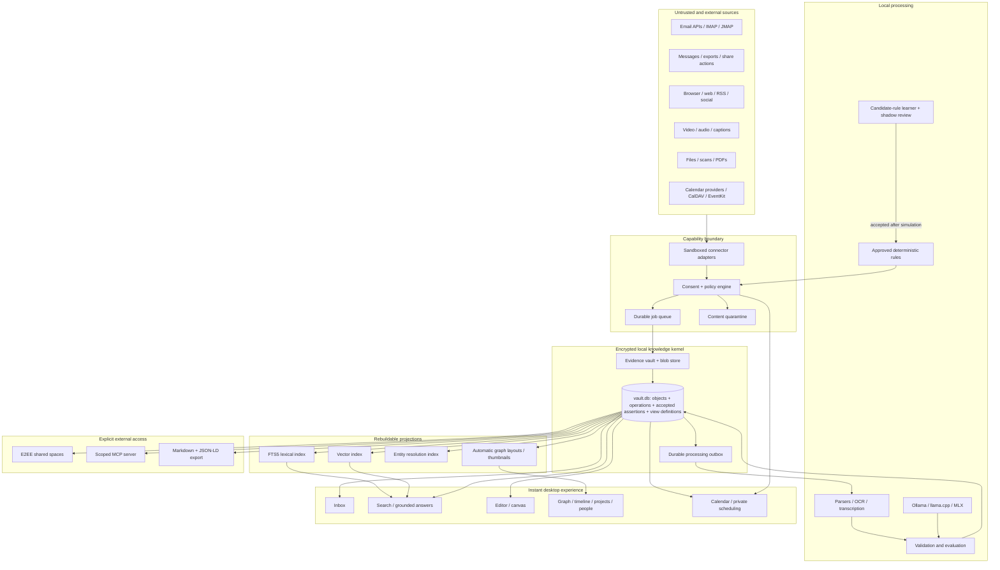
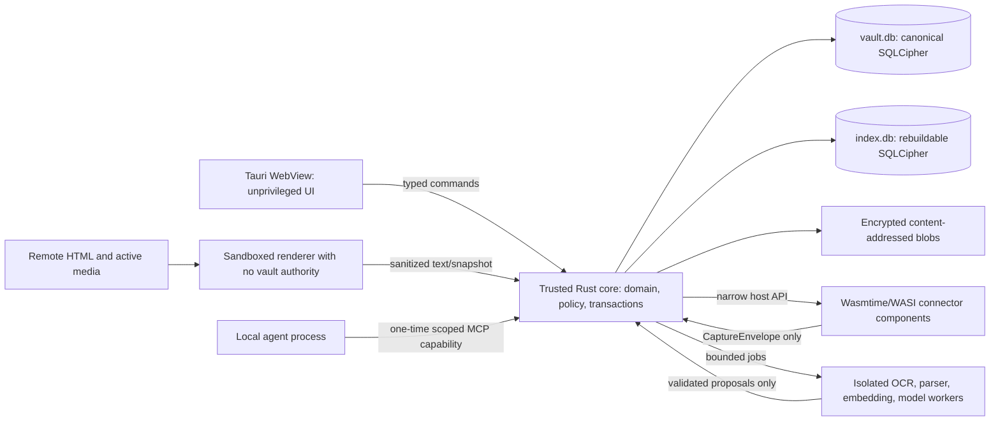
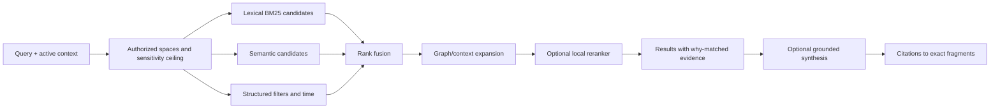
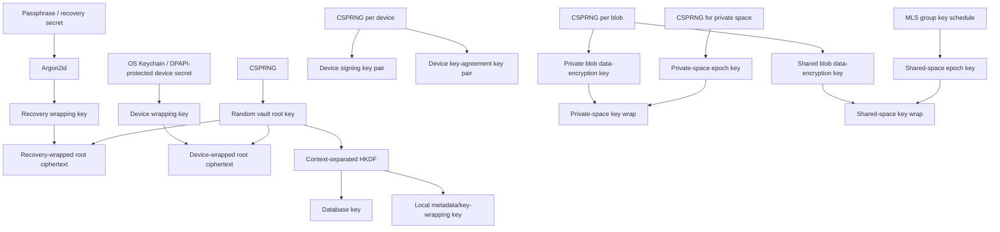

# Personal Knowledge Fabric — Technical Architecture

**Status:** decision-ready baseline, version 1.2  
**Prepared:** 2026-08-16  
**Scope:** platform architecture, canonical model, retrieval, agents, automation, security, and implementation setup  
**Related:** [Product requirements](PRD.md) · [Calendar vertical](calendar.md)

---

## 9. Architecture

The deployable should begin as an **encrypted local modular monolith**, not a miniature distributed system. One application owns transactions, migrations, policy, and the interactive read path. Isolation is used at trust and failure boundaries—untrusted connectors, parsers, model workers, and rendered remote content—not to turn every module into a service.

### 9.1 Logical architecture



#### Process and trust zones



The UI never receives vault keys or a general filesystem primitive. Remote HTML never renders in the application’s privileged origin. Third-party connector code never receives refresh or bearer tokens; it calls host-brokered `authorized_fetch(account_capability, request)`, plus bounded `scratch_read/write`, `cursor_get/set`, and `emit_capture`. The host validates method, path, origin, DNS/IP destination, redirects, response size, and rate before injecting credentials, and never forwards them across an origin change. WASI begins with no ambient network, filesystem, environment, clock, database, vault-key, shell, or process authority.

### 9.2 Architectural invariants

1. **Canonical versus derived:** raw artifacts, human content, accepted assertions, policy, and history are canonical; indexes, embeddings, AI summaries, layouts, and recommendations are derived.
2. **Local interactive path:** navigation, writing, lexical search, and capture use only local state.
3. **Truthful capture states:** issue an immediate transactional intake receipt; signal `content_preserved` only after complete encrypted bytes and manifest are durable; enrichment is always asynchronous.
4. **No direct agent storage access:** agents use a typed, scoped service boundary—not SQLite or unrestricted filesystem access.
5. **Every transformation is attributable:** output records input IDs, processor identity/version, time, and result status.
6. **One item, many views:** folders and dashboards are projections; they do not copy canonical objects.
7. **Policy outside the model:** a model can propose an action but cannot enlarge its own authority.
8. **Space is a security invariant:** every canonical and derived record belongs to an explicit space, including the initial private space. Authorization is a precondition to retrieval and traversal; graph assertions such as `visible_to` may explain policy but never enforce it.
9. **Calendar topology stays local:** private peer scheduling exchanges only an approved bounded candidate set and signed decisions. Standards/provider free-busy outputs are local adapter inputs or explicit compatibility exports, never the default peer protocol.

### 9.3 Proposed implementation stack

| Layer | Proposed starting choice | Why | Exit/scale path |
|---|---|---|---|
| Desktop shell | Tauri 2 with Rust core and TypeScript UI | Cross-platform, small distributable, explicit command/capability boundary | Native Swift/WinUI components only if measured bottlenecks justify them; Electron is a fallback only if ecosystem needs outweigh footprint |
| UI framework | Svelte or React selected by team skill; virtualized lists mandatory | Mature ecosystem and fast iteration | Keep domain/core outside UI framework |
| Editor | ProseMirror/Tiptap or CodeMirror-backed portable AST | Mature editing, Markdown interoperability, collaboration ecosystem | Custom native editor only after profiling |
| Canonical DB | `vault.db`: SQLite in WAL mode, encrypted using SQLCipher or equivalent reviewed VFS | Transactions across canonical objects, assertions, jobs, policy, audit, and projections of current state | Partition cold history only after measurement; never introduce a distributed DB early |
| Derived index DB | `index.db`: separate disposable SQLCipher database for FTS5, vector metadata/indexes, thumbnails/layout state | Reduces lock, migration, and failure coupling while protecting derived data; it does not eliminate disk/CPU contention or provide cross-database atomicity | Tantivy/LanceDB/Qdrant only after a benchmark and explicit encryption design |
| Blob store | Encrypted content-addressed blobs: BLAKE3 internally, keyed identifiers externally, random per-blob data key, authenticated encryption | Integrity, deduplication inside the vault, immutable evidence, and no cross-space equality leak at relay | Object store behind the same manifest/interface for relay/backup |
| Lexical search | SQLite FTS5 with BM25, snippets, field filters | Embedded and fast; no service startup | Tantivy shard when corpus/benchmark proves need |
| Vector search | Rebuildable embedded index; benchmark `sqlite-vec`/USearch and pin the chosen pre-1.0 interface | Avoid sidecar and duplicate authority; vectors never become canonical | Qdrant/LanceDB only for very large corpora or server deployment with an encryption story |
| Graph | Relational `relation_assertion` table plus in-process graph algorithms | Personal scale, transactional provenance, simple backup | Derived analytics graph; JSON-LD/RDF export; not Neo4j as P0 dependency |
| Local models | Ollama for setup; llama.cpp for packaged cross-platform backend; MLX optional on Apple Silicon | Broad model support and local APIs | Provider abstraction prevents lock-in |
| Structured inference | JSON Schema constrained generation plus deterministic validation | Prevents malformed partial state | Model-specific optimized grammar backend |
| OCR/transcription | Native OS services where private/available; Tesseract/PaddleOCR and whisper.cpp as portable workers | Local and replaceable | Hardware-specific accelerators |
| Connectors | Wasmtime components using the stable WASI component model behind a narrow host API | Portable sandbox and capability mediation without shipping account-wide authority to plugins | Native signed connector worker only where an SDK cannot run in WASM |
| Rules | Versioned constrained JSON AST or CEL-like expression language | Deterministic simulation, explanation, and replay | Learned candidate generator proposes rule AST; it never executes model prose |
| Calendar | Fabric-native encrypted calendar plus adapters for iCalendar/CalDAV, Google Calendar, Microsoft Graph, and platform SDKs | Open interchange at the edge; deterministic local recurrence/availability core; capability-detected provider writes | Provider-specific sync and projection remain replaceable; peer negotiation never depends on provider-to-provider sharing |
| Sync | Signed, encrypted operation feeds; Automerge per mutable note/shared document in P2, never one CRDT for the whole vault | Avoid premature distributed complexity and pathological whole-vault merge state | MLS-backed group epochs for E2EE sharing |
| Agent interface | App-spawned MCP stdio process for specification version 2026-07-28, plus typed internal API | No unauthenticated localhost port; one-time scoped capability and clean process lifetime | Version negotiation and compatibility tests |
| Observability | Local structured logs and OpenTelemetry-compatible traces, opt-in export | Diagnosable without surveillance | User-authorized support bundle |
| Backup | Encrypted snapshots with restic or equivalent plus restore verifier | Mature deduplicated encrypted backup | Multiple repositories and removable media |

SQLite FTS5 supports phrase, prefix, NEAR, boolean, column-filtered queries, BM25 ranking, snippets, and extension points. WAL permits concurrent readers and a writer on one host. Pin a SQLite build containing the WAL-reset corruption fix—3.51.3 or the official 3.50.7/3.44.6 backports—and disable runtime extension loading; do not silently rely on an OS SQLite. Use one serialized canonical writer, `synchronous=FULL` for canonical commits, `NORMAL` only for disposable indexes, and checkpoint during idle time. [SQLite FTS5](https://www.sqlite.org/fts5.html), [SQLite WAL](https://www.sqlite.org/wal.html). `llama.cpp` provides local quantized inference across Apple Silicon, CPU, CUDA, HIP, Vulkan and other backends, along with OpenAI-compatible serving, embeddings, reranking, tool use, and schema-constrained output. [llama.cpp](https://github.com/ggml-org/llama.cpp)

Every canonical mutation that affects retrieval commits an `index_outbox` record in `vault.db`. The indexer consumes it independently and records the last applied operation sequence, schema version, and model/index generation. Queries overlay recent canonical changes or visibly report index lag. No design assumes a dual write to `vault.db` and `index.db` is atomic. FTS/vector extensions are statically linked and pinned.

Before P2, choose one proven editing/collaboration path through an ADR and prototype: Markdown/CodeMirror with Automerge text, or ProseMirror/Tiptap with a demonstrated CRDT binding such as Yjs. Automerge is not assumed to be a drop-in collaboration provider for an arbitrary rich ProseMirror schema. Store the portable document AST/schema version separately from transport-specific CRDT state and test schema migration plus Markdown loss reports.

### 9.4 Why not a graph database first

A personal corpus can reach millions of relations without requiring a separate graph server. SQLite gives:

- atomic updates across content, provenance, edge state, and audit;
- simple encrypted backup and restore;
- recursive neighborhood queries and materialized adjacency data;
- no service process on startup;
- a clean path to export into NetworkX/petgraph, RDF, or an analytical graph engine.

A graph database becomes justified only after measured queries cannot meet budgets or multi-user server analytics becomes primary. It should never be the only copy of source text or human knowledge.

---

## 10. Canonical information model

### 10.1 Temporal attributed multigraph

At time \(t\), the useful knowledge projection is:

\[
G_t = (V, E, A, P)
\]

where \(V\) are stable items, \(E\) are typed relationship assertions, \(A\) are agents (people, connectors, models, rules), and \(P\) is provenance/evidence. Multiple edges of the same type may connect the same nodes because different sources can disagree. An edge is therefore not a bare fact; it is an assertion with status, evidence, author, and temporal validity.

N-ary facts are represented as first-class assertion/event nodes rather than lossy pairwise links. For example, “Alice decided on Friday to use design X for project Y because of source Z” is one decision object connected to the person, time, design, project, and evidence.

### 10.2 Core object types

| Type | Purpose | Examples |
|---|---|---|
| `artifact` | Captured evidence container | email, web snapshot, PDF, message, video, image |
| `fragment` | Addressable span in an artifact | paragraph, page region, transcript interval, message part |
| `note` | Human-authored or explicitly adopted synthesis | daily note, explanation, meeting note |
| `claim` | A proposition with epistemic state and evidence | “X causes Y under condition Z” |
| `concept` | Reusable idea/category | local-first software, retrieval practice |
| `entity` | Identified thing | person, organization, product, place |
| `event` | Time-bounded occurrence | meeting, publication, decision, incident |
| `calendar_event` | Calendar semantics and event/series identity | recurring meeting, all-day absence, private hold, focus block |
| `availability_policy` | Versioned deterministic constraints/preferences | working hours, buffers, notice, time-zone fairness |
| `meeting_negotiation` | Bounded multi-party scheduling state and consent | candidate round, responses, prepare/commit saga |
| `project` | Goal-directed collection of state and work | build PIM prototype |
| `task` | Action with state/ownership/time | test restore, reply to Alice |
| `question` | Open inquiry or learning prompt | “What evidence would falsify X?” |
| `collection` | Curated or query-defined grouping | reading list, shared research space |
| `conversation` | Thread/container across messages | email thread, chat channel, meeting |
| `decision` | Chosen option, rationale, constraints | select SQLite for P0 |
| `view` | Saved projection/query/layout | project evidence map |

Types may be composed. A single object may be both an artifact and an event representation, but its source evidence and interpreted object remain separately addressable.

### 10.3 Core relation vocabulary

Start small and extensible:

- provenance: `derived_from`, `quotes`, `cites`, `captured_from`, `generated_by`, `revision_of`;
- semantic: `about`, `defines`, `example_of`, `specializes`, `part_of`, `same_as`, `possible_duplicate`;
- epistemic: `supports`, `contradicts`, `qualifies`, `refines`, `assumes`, `evidence_for`;
- causal/structural: `causes`, `enables`, `prevents`, `depends_on`, `prerequisite_for`, `alternative_to`;
- work: `related_to_project`, `implements`, `blocks`, `next_action_for`, `decided_by`;
- social/communication: `authored_by`, `sent_by`, `sent_to`, `mentions`, `discussed_with`, `member_of_conversation`;
- temporal/calendar: `occurred_before`, `overlaps`, `supersedes`, `valid_during`, `occurrence_of`, `blocks_time_for`, `scheduled_with`, `committed_as`;
- access: `shared_in`, `visible_to`, `granted_to_agent`.

Map provenance export to W3C PROV-O where practical; use Schema.org vocabulary for common web objects; serialize interoperable exports as JSON-LD. Internally, use product-friendly names and documented mappings rather than forcing users to edit RDF. [W3C PROV-O](https://www.w3.org/TR/prov-o/), [Schema.org data model](https://schema.org/docs/datamodel.html), [JSON-LD 1.1](https://www.w3.org/TR/json-ld11/)

### 10.4 Illustrative core schema, not production DDL

This sketch communicates identities and boundaries. Production migrations must add complete enum/registry constraints, `CHECK(json_valid(...))`, timestamp normalization, foreign-key indexes, explicit delete behavior, triggers/composite keys for same-item current revisions, and migration/upcaster tests. The application enables and asserts `PRAGMA foreign_keys=ON` on every connection; SQLite does not guarantee that default. [SQLite foreign keys](https://www.sqlite.org/foreignkeys.html)

```sql
PRAGMA foreign_keys = ON;

CREATE TABLE space (
  id TEXT PRIMARY KEY,
  name TEXT NOT NULL,
  kind TEXT NOT NULL,                  -- private/shared
  current_key_epoch INTEGER NOT NULL,
  created_at TEXT NOT NULL
);

CREATE TABLE item (
  id TEXT PRIMARY KEY,                 -- UUIDv7
  space_id TEXT NOT NULL REFERENCES space(id),
  primary_kind TEXT NOT NULL,
  created_at TEXT NOT NULL,
  updated_at TEXT NOT NULL,
  current_revision_id TEXT,
  sensitivity TEXT NOT NULL DEFAULT 'private',
  deleted_at TEXT,
  extension_json TEXT NOT NULL DEFAULT '{}'
);

CREATE TABLE item_facet (
  item_id TEXT NOT NULL REFERENCES item(id),
  facet TEXT NOT NULL,
  PRIMARY KEY(item_id, facet)
);

CREATE TABLE revision (
  id TEXT PRIMARY KEY,
  item_id TEXT NOT NULL REFERENCES item(id),
  author_agent_id TEXT NOT NULL,
  content_format TEXT NOT NULL,
  content_blob_id TEXT NOT NULL,
  created_at TEXT NOT NULL,
  change_reason TEXT,
  processing_run_id TEXT
);

CREATE TABLE revision_parent (
  child_revision_id TEXT NOT NULL REFERENCES revision(id),
  parent_revision_id TEXT NOT NULL REFERENCES revision(id),
  PRIMARY KEY(child_revision_id, parent_revision_id)
);

CREATE TABLE artifact (
  item_id TEXT PRIMARY KEY REFERENCES item(id)
);

CREATE TABLE source_locator (
  id TEXT PRIMARY KEY,
  artifact_item_id TEXT NOT NULL REFERENCES artifact(item_id),
  connector_id TEXT NOT NULL,
  remote_namespace TEXT NOT NULL,
  remote_account_id TEXT NOT NULL,
  remote_object_id TEXT,
  source_uri TEXT,
  first_observed_at TEXT NOT NULL
);

CREATE UNIQUE INDEX source_locator_remote_identity
  ON source_locator(connector_id, remote_namespace, remote_account_id, remote_object_id)
  WHERE remote_object_id IS NOT NULL;

CREATE TABLE artifact_version (
  id TEXT PRIMARY KEY,
  artifact_item_id TEXT NOT NULL REFERENCES artifact(item_id),
  source_locator_id TEXT REFERENCES source_locator(id),
  remote_revision TEXT,
  deletion_state TEXT NOT NULL,
  source_created_at TEXT,
  captured_at TEXT NOT NULL,
  source_fingerprint TEXT NOT NULL
);

CREATE TABLE artifact_payload (
  id TEXT PRIMARY KEY,
  artifact_version_id TEXT NOT NULL REFERENCES artifact_version(id),
  role TEXT NOT NULL,                  -- raw/normalized/rendering/transcript
  blob_id TEXT NOT NULL,
  plaintext_digest TEXT NOT NULL,
  byte_length INTEGER NOT NULL,
  mime_type TEXT NOT NULL,
  sanitizer_or_extractor_version TEXT
);

CREATE TABLE fragment (
  id TEXT PRIMARY KEY,
  artifact_version_id TEXT NOT NULL REFERENCES artifact_version(id),
  payload_id TEXT NOT NULL REFERENCES artifact_payload(id),
  selector_scheme TEXT NOT NULL,
  selector_version TEXT NOT NULL,
  selector_json TEXT NOT NULL,          -- page, offsets, bounding box, timestamp
  quote_or_context_hash TEXT,
  text_blob_id TEXT,
  ordinal INTEGER NOT NULL
);

CREATE TABLE relation_assertion (
  id TEXT PRIMARY KEY,
  space_id TEXT NOT NULL REFERENCES space(id),
  subject_item_id TEXT NOT NULL REFERENCES item(id),
  predicate TEXT NOT NULL,
  object_item_id TEXT NOT NULL REFERENCES item(id),
  asserted_by_agent_id TEXT NOT NULL,
  adoption_status TEXT NOT NULL,        -- suggested/accepted/rejected
  epistemic_kind TEXT,                  -- quotation/report/observation/inference/hypothesis/...
  verification_status TEXT,             -- unverified/corroborated/refuted/disputed
  lifecycle_status TEXT NOT NULL,       -- current/superseded/retracted
  valid_from TEXT,
  valid_to TEXT,
  created_at TEXT NOT NULL,
  processing_run_id TEXT,
  extension_json TEXT NOT NULL DEFAULT '{}'
);

CREATE TABLE assertion_assessment (
  id TEXT PRIMARY KEY,
  assertion_id TEXT NOT NULL REFERENCES relation_assertion(id),
  assessor_agent_id TEXT NOT NULL,
  assessment_kind TEXT NOT NULL,        -- human_belief/evidence_strength/model_score/...
  value_json TEXT NOT NULL,
  created_at TEXT NOT NULL,
  supersedes_assessment_id TEXT REFERENCES assertion_assessment(id),
  processing_run_id TEXT
);

CREATE TABLE assertion_evidence (
  assertion_id TEXT NOT NULL REFERENCES relation_assertion(id),
  fragment_id TEXT NOT NULL REFERENCES fragment(id),
  role TEXT NOT NULL DEFAULT 'support',
  PRIMARY KEY(assertion_id, fragment_id, role)
);

CREATE TABLE processing_run (
  id TEXT PRIMARY KEY,
  space_id TEXT NOT NULL REFERENCES space(id),
  processor_agent_id TEXT NOT NULL,
  processor_version TEXT NOT NULL,
  model_digest TEXT,
  prompt_or_rule_digest TEXT,
  started_at TEXT NOT NULL,
  finished_at TEXT,
  status TEXT NOT NULL,
  input_manifest_blob_id TEXT NOT NULL,
  output_manifest_blob_id TEXT,
  metrics_json TEXT NOT NULL DEFAULT '{}'
);

CREATE TABLE operation_log (
  sequence INTEGER PRIMARY KEY AUTOINCREMENT,
  operation_id TEXT NOT NULL UNIQUE,
  space_id TEXT NOT NULL REFERENCES space(id),
  entity_id TEXT,
  device_id TEXT NOT NULL,
  device_sequence INTEGER NOT NULL,
  actor_agent_id TEXT NOT NULL,
  occurred_at TEXT NOT NULL,
  recorded_at TEXT NOT NULL,
  hybrid_logical_clock TEXT NOT NULL,
  operation_type TEXT NOT NULL,
  schema_version TEXT NOT NULL,
  previous_device_hash BLOB,
  causation_id TEXT,
  correlation_id TEXT,
  idempotency_scope TEXT NOT NULL,
  idempotency_key TEXT NOT NULL,
  payload_blob_id TEXT NOT NULL,
  payload_hash BLOB NOT NULL,
  signature BLOB,
  UNIQUE(device_id, device_sequence),
  UNIQUE(space_id, idempotency_scope, idempotency_key)
);
```

Additional tables cover tasks, views, rule versions, connector cursors, job leases, model registry, access grants, devices, shared-space epochs, and audit events. Production design gives claim items and relation assertions a common assertion identity so evidence and assessments attach to either. Extension JSON is for forward-compatible uncommon fields, not a substitute for indexed core columns.

Use one ordered sensitivity vocabulary—proposed `public < normal < private < restricted`—across items, rules, grants, indexes, and exports. Unknown values fail closed. Space and sensitivity fields propagate to artifact versions, payloads, fragments, processing jobs, index rows, grants, and audit records; cross-space relations live in an explicitly private overlay space.

Operations use UUIDv7 identifiers, deterministic CBOR payloads, a per-device monotonic sequence and hash chain, a hybrid logical clock, and scoped idempotency keys. A synchronized signature covers a domain-separation tag, schema version, space/epoch, device identity and sequence, previous-envelope hash, HLC, operation type, payload hash or ciphertext, and causation identifiers. The CBOR profile defines map order, numeric normalization, and timestamp representation. HLC helps order events; it never grants authority or silently resolves semantic conflict. A mutation appends the operation and updates the current-state projection in one transaction; event sourcing is selective rather than imposed on large immutable blobs or every derived index. Domain mutations are separate from the sensitive, higher-volume access/security audit log. [RFC 9562: UUIDs](https://www.rfc-editor.org/rfc/rfc9562.html), [RFC 8949: CBOR](https://www.rfc-editor.org/rfc/rfc8949.html)

For every claim or relation, keep epistemic origin/kind, verification, lifecycle, append-only human belief assessment, evidence assessment, processor score/calibration record, recorded time, and valid time independent. A source-attested statement is not automatically an observation; a decision is an action commitment rather than a confidence level.

Collapsing these to one “confidence” number makes a fresh weak source look equivalent to old strong evidence and lets model fluency masquerade as belief.

### 10.5 Source envelope

Every connector emits a versioned envelope before source-specific interpretation:

```json
{
  "schema": "pim.capture-envelope/1",
  "capture_id": "019...uuidv7",
  "space_id": "private-space-id",
  "idempotency_key": "connector-scope:provider-stable-id:revision",
  "connector": {
    "id": "gmail", "version": "1.3.0", "package_digest": "sha256:...",
    "config_version": "...", "account_capability_ref": "acct-local-id"
  },
  "remote": {
    "namespace": "gmail-message", "object_id": "provider-stable-id",
    "thread_id": "optional", "revision": "history-id", "deletion_state": "present"
  },
  "source": {"uri": "...", "created_at": "...", "observed_at": "..."},
  "payloads": [
    {
      "role": "raw", "mime": "message/rfc822", "blob_id": "...",
      "plaintext_digest": "blake3:...", "bytes": 12345
    },
    {
      "role": "normalized", "mime": "text/markdown", "blob_id": "...",
      "plaintext_digest": "blake3:...", "bytes": 10240,
      "sanitizer_or_extractor_version": "html2md/4", "active_content_removed": true
    }
  ],
  "policy": {"retention_policy_id": "personal-default", "sensitivity": "private"},
  "rights": {"license": "unknown", "redistribution": "unknown"},
  "trust": {"source_class": "external-untrusted"}
}
```

The trusted host—not connector-supplied data—stamps connector package digest, sandbox profile, account-capability reference, receipt time, and sanitizer/extractor version. Connector payloads remain untrusted. `active_content_removed` describes one normalized rendering, never the preserved raw artifact. HTML is sanitized for display and active content is never executed in the application origin.

Every derived chunk/index row also records its source revision plus chunker version, embedding/reranker model digest, tokenizer, vector dimension, task prefix, and creation time. Indexes never mix spaces with different access policies, and an embedding-neighbor relation never becomes a canonical graph edge.

## 11. Retrieval, linking, and knowledge graph generation

### 11.1 Retrieval pipeline



Resolve the authorized space set before candidate generation. Enforce it in lexical/vector lookup, every graph hop, snippets, reranker input, and model context. Sensitivity may affect rank only *inside* the authorized set; access is never a ranking signal. If a vector backend cannot prefilter by security domain, keep separate indexes per domain rather than retrieve broadly and post-filter.

Lexical retrieval is mandatory because identifiers, names, quotations, numbers, and exact phrases are often poorly served by embeddings. Semantic retrieval finds paraphrases and conceptual neighbors. Graph expansion adds accepted relationships, current projects, people, and conversation context. A reranker is optional and must not hide the underlying evidence set.

A robust starting fusion is reciprocal-rank fusion:

\[
RRF(d) = \sum_{m \in M} \frac{w_m}{k + rank_m(d)}
\]

Then apply bounded, interpretable adjustments for accepted graph distance, active-project membership, user pinning, and sensitivity *within the already authorized candidates*. Do not use an opaque LLM to assign the final search rank. Store the rank components so the UI can explain them.

### 11.2 Link generation

Link candidates should come from several independent generators:

1. explicit links and citations in source content;
2. exact entity/identifier matches;
3. shared rare terms and lexical neighborhoods;
4. semantic nearest neighbors;
5. temporal/conversation/project co-occurrence;
6. claim-support/contradiction classifier over a small candidate set;
7. repeated user navigation or co-use, stored as a private behavioral signal.

The model sees candidates, not the entire vault. Accepted and rejected links tune per-user thresholds, but feedback is scoped to predicate, context, model/version, and time. A rejection becomes reversible suppression preference—not evidence about the world—and exploration reserves prevent the system from reinforcing only familiar projects and central nodes.

### 11.3 Graph generation rules

- Embedding similarity is a retrieval signal, not a canonical edge.
- Mere co-occurrence does not become `causes`, `supports`, or `same_as`.
- Entity resolution never merges objects destructively; it creates `possible_duplicate` followed by an auditable merge or `same_as` assertion.
- AI edges begin in `suggested` state unless a tested rule explicitly permits auto-accept for a low-risk predicate such as `mentions`.
- Every epistemic edge has origin traceability: exact source spans where applicable, otherwise explicit user/model origin, inputs, and rationale. A hypothesis may legitimately begin without supporting evidence; that absence must be visible rather than filled with invented support.
- Layout coordinates are derived view state and never define meaning.

### 11.4 Multidimensional view construction

For a focus set \(F\), construct a visible neighborhood under a node/edge budget:

1. include pinned and directly selected nodes;
2. add top accepted edges by selected dimensions;
3. add inferred candidates only when toggled or clearly styled;
4. preserve at least one evidence path for each visible derived claim;
5. cluster or aggregate beyond the budget;
6. use semantic zoom to replace clusters with nodes as the user drills down.

This makes the graph an instrument for answering a question, not a poster of the database.

Research supports studying and constructing purposeful concept maps, with stronger effects in the cited meta-analysis for construction than study; comparable outcome evidence for automatically generated whole-corpus PIM graphs was not found in this review. Graph readability also faces known complexity factors such as density, crossings, and weak grouping. The default views should therefore be a focused neighborhood, table, timeline, outline, evidence matrix, or user-editable project map; the global graph is an optional diagnostic to evaluate, not an evidence-backed default. [Nesbit and Adesope, 2006](https://doi.org/10.3102/00346543076003413), [Schroeder et al., 2018](https://doi.org/10.1007/s10648-017-9403-9), [Yoghourdjian et al., 2018](https://doi.org/10.1016/j.visinf.2018.12.006)

---

## 12. Local AI and agent design

AI has four named product roles, each with different authority:

- **clerk** — normalize, deduplicate, extract, route, and prepare reversible suggestions;
- **scout** — retrieve sources, surface comparisons, and show why a result matched;
- **tutor** — prompt recall, explanation, comparison, and spacing for `learn` items;
- **critic** — seek counterevidence, ambiguity, contradiction, stale claims, and missing provenance;
- **scheduler** — translate an owner’s intent into a typed meeting draft, while deterministic calendar/policy code computes, validates, negotiates, and commits exact times.

It is never an invisible editor or an epistemic oracle. Any AI-authored text remains distinguishable until explicitly adopted. Automation-bias research and task-specific cognitive-forcing results support *testing* independent-response-first and structured-review interventions for consequential choices, while measuring correct reliance, rejection of bad advice, time, and user burden; they do not justify forcing the same review friction everywhere. [Parasuraman and Manzey, 2010](https://doi.org/10.1177/0018720810376055), [Buçinca, Malaya, and Gajos, 2021](https://doi.org/10.1145/3449287)

### 12.1 Processing ladder

Use the least expensive deterministic or local capability that solves each stage:

1. **Deterministic:** MIME parsing, metadata, hashes, language detection, boilerplate removal, timestamps, known identifiers.
2. **Specialized local model:** OCR, speech-to-text, embeddings, reranking, named-entity candidates.
3. **Small local LLM:** structured classification, title cleanup, short summaries, routing candidate, claim/link proposal.
4. **Larger local LLM on demand:** cross-source synthesis, contradiction analysis, long-form drafting.
5. **Optional remote model:** only through an explicit redaction and consent policy; never an invisible fallback.

Model downloads are pinned by digest and recorded in a registry with license, origin, quantization, context limit, benchmark results, and allowed data sensitivity.

### 12.2 Hardware tiers, not a single assumed model

| Available memory/accelerator | Practical role | Guidance |
|---|---|---|
| 16 GB system memory, no discrete GPU | embeddings, OCR, transcription, 1B–4B structured tasks, light chat | Keep context/chunk batches small; UI must remain isolated |
| 32 GB unified/system memory or 12–16 GB VRAM | 4B–14B quantized models, better synthesis/reranking | Proposed reference tier |
| 64 GB+ unified memory or 24 GB+ VRAM | larger 20B–40B quantized models and long synthesis | Optional workstation tier, never P0 minimum |

Actual model fit depends on architecture, quantization, context length, KV cache, and backend. The installer should run a local benchmark and recommend a profile; the specification should not hard-code a fashionable model name.

### 12.3 Agent access boundary

The embedded agent gateway should implement MCP **2026-07-28** resources and tools with version negotiation. MCP standardizes context and tool integration but does not supply the application’s permission model; its specification explicitly requires user consent, privacy controls, and caution around arbitrary tool execution. [MCP 2026-07-28 specification](https://modelcontextprotocol.io/specification/2026-07-28)

Proposed resources:

- `pim://space/{id}/item/{id}`
- `pim://space/{id}/view/{id}`
- `pim://space/{id}/schema`
- `pim://space/{id}/audit/{grant-id}`
- `pim://calendar/policy/{id}`
- `pim://schedule/negotiation/{id}` and its redacted audit projection

Proposed tools:

- `search_items` — read-only, structured filters and purpose;
- `read_item` / `read_fragments` — read-only, returns provenance;
- `get_neighborhood` — bounded typed graph;
- `capture` — creates an unprocessed source artifact;
- `propose_note`, `propose_relations`, `propose_tasks` — writes suggestions only;
- `commit_proposal` — explicit transaction under grant and policy;
- `create_share_preview` — produces a manifest, never sends;
- `calendar_compute_candidates` — local deterministic availability calculation; no raw events returned unless separately authorized;
- `schedule_start` / `schedule_respond` — proposal-only encrypted negotiation under per-contact and privacy-budget grants;
- `schedule_prepare` / `schedule_commit` — exact-slot hold and commit requiring a short-lived consent capability;
- `schedule_cancel` — separate cancellation authority; never implied by commit access;
- `execute_external_action` — separate high-risk tool, disabled by default.

Each grant specifies vault/space, item types, predicates, sensitivity ceiling, read/write actions, purpose, expiry, rate/volume bounds, and whether human confirmation is required. The agent receives only the minimum retrieved fragments, not the whole vault.

Calendar scopes are independent: `calendar:availability.compute`, `calendar:event.read`, `schedule:negotiate`, `calendar:hold.write`, `calendar:event.commit`, `calendar:event.cancel`, and `calendar:external_invite.send`. A commit capability binds negotiation, candidate, participant-set digest, event-template digest, projection fields, destination calendar, idempotency key, and expiry. The scheduler cannot widen those arguments. Natural-language parsing can fail safely into a draft; authoritative time arithmetic, recurrence, policy, state transitions, signatures, and provider writes are model-free.

### 12.4 Prompt-injection defenses

Indirect prompt injection is an architectural threat whenever web pages, email, or messages are supplied to a tool-using model. OWASP lists prompt injection and excessive agency among the main risks for LLM/agent systems. [OWASP Prompt Injection](https://genai.owasp.org/llmrisk/llm01-prompt-injection/), [OWASP Excessive Agency](https://genai.owasp.org/llmrisk/llm062025-excessive-agency/)

Required controls:

- label source text as untrusted data in a separate channel/structure;
- never allow retrieved content to alter system policy, tool definitions, or grants;
- use deterministic allowlists and typed arguments for tools;
- prevent the model from selecting broader search scopes or sensitivity levels than its grant;
- require confirmation for data egress, external writes, sends, deletes, or sharing;
- cap retrieved volume and detect secret-like content before egress;
- log stable item/fragment IDs and hashes, grant, model/template version, tool arguments, policy decision, and result by default; store plaintext prompts/retrieved content only in an explicitly enabled, encrypted, retention-bounded replay capsule;
- provide a non-agent preview for any external action.

Local execution improves confidentiality but does not remove injection or excessive-agency risk.

---

## 13. Inferred rules and automation

### 13.1 Separation of concerns

An automation consists of four separately versioned elements:

1. **Trigger** — capture, connector update, timer, user action, model completion.
2. **Condition** — deterministic predicate over source, metadata, prior behavior, and validated model fields.
3. **Action** — route, tag, summarize, link, create suggestion/task/draft, or external operation.
4. **Policy** — auto, suggest, or confirm; scope; sensitivity; rate bound; rollback behavior.

The model may populate fields used by a condition. It does not decide its own policy tier.

### 13.2 Example rule

```yaml
id: rule.newsletters.read-later.v3
when:
  all:
    - source.type == "email"
    - sender.domain in user_set.newsletter_domains
    - classifier.intent == "newsletter"
    - classifier.validation == "passed"
then:
  - add_to_view: "Reading inbox"
  - set_review_after: "7d"
  - suppress_from_focus: true
policy:
  mode: auto
  allowed_sensitivity: [private, normal]
  max_actions_per_hour: 200
  never: [delete_source, send_external, share]
explanation:
  evidence_window: 30
  minimum_matching_actions: 8
  minimum_precision_on_feedback: 0.95
```

### 13.3 Candidate-rule learning

The learner observes repeated manual transitions and proposes the simplest stable rule. A proposal should say, for example: “You moved 11 of the last 12 messages from these four senders to Reading and archived them after 14 days.” The user can simulate the rule on historical items, inspect false positives, edit it, and choose suggest/auto.

Never learn an external action from behavior alone. Sending, deleting, sharing, purchasing, account/security changes, and acceptance of legal/financial obligations require explicit rule authoring and confirmation policy.

Processing is a durable incremental job DAG, for example `receive → preserve → parse → fragment → OCR/transcribe → entities → embeddings → candidate links → summaries`. A URL/descriptor or small payload receives an intake ID immediately; `content_preserved` is committed only after the raw encrypted artifact, manifest, and minimal operation are durable. A large stream remains visibly incomplete and restart-resumable until then. Every worker is idempotent and records its input revision; a changed parser or model invalidates only its downstream products. Interactive/visible-item work outranks bulk indexing, and model absence never blocks capture, writing, or lexical search.

Any action that writes to an external system uses a transactional outbox: the local decision and outbox record commit together, a separately authorized dispatcher performs the remote call with an idempotency key, and the result becomes a new auditable operation. Rules run in shadow mode before suggestion mode, suggestion before automatic mode, and every organization action has a preview, explanation, simulation, and undo path.

---

## 14. Security, encryption, synchronization, and sharing

### 14.1 Threat model

| Threat | Main controls |
|---|---|
| Stolen or lost device | FileVault/BitLocker, application vault encryption, automatic lock, OS keychain, secure recovery |
| Cloud/relay compromise | E2EE per space; relay stores ciphertext; minimum metadata; authenticated devices |
| Connector credential theft | OS credential store, least-privilege OAuth scopes, short-lived tokens, per-connector revocation |
| Malicious imported content | Sanitization, quarantine, prompt-injection separation, no active HTML in app origin |
| Compromised plugin/connector | Capability manifest, sandbox/process isolation, signed packages, network/filesystem allowlists |
| Malicious or overpowered agent | Scope/purpose/expiry grants, deterministic policy, confirmations, audit and rate limits |
| Model supply-chain compromise | Signed/digested artifacts, source/license registry, sandbox, no model-initiated network |
| Accidental corruption/deletion | Transactions, revisions, tombstones, snapshots, independent backups, restore drills |
| Sharing the wrong context | Exact share manifest and recipient preview, sensitivity labels, no transitive expansion by default |
| Membership revocation | Epoch key rotation; explicit warning that already received plaintext cannot be revoked |
| Adaptive calendar probing | Small candidate sets, fixed granularity, short horizons, bounded rounds, per-contact capability/rate/privacy budgets, no rejection reasons |
| Stale slot or concurrent double booking | Replica-revision checks, encrypted local holds, revalidation before prepare and commit, deterministic reservation priority |
| Replay, equivocation, or identity/key substitution during scheduling | Contact-list authorization, TOFU key pinning, signed deterministic envelopes, session/round/sequence/expiry, previous-state digests, replay cache, and a hard warning/block on unexpected key changes |
| Partial cross-provider calendar commit | Idempotent per-owner writes, transactional outbox, prepare-and-saga state, retry/compensation, visible reconciliation |
| Calendar-provider disclosure | Fabric-only or opaque private projection by default; exact field preview; explicit warning that E2EE to a peer does not hide fields stored with Google, Microsoft, Apple, or a CalDAV server |

Application encryption protects data at rest while the vault is locked. It does not fully protect an unlocked vault from same-user malware, administrator/root compromise, keylogging, screen capture, injected code, crash dumps, or plaintext already supplied to a parser/model worker. Mitigations include OS sandboxing, no plaintext temporary files, exclusions from OS indexing/crash collection where possible, bounded worker lifetimes, automatic lock, and best-effort key zeroization; residual endpoint risk remains explicit.

### 14.2 Key hierarchy



Use a reviewed memory-hard password KDF such as Argon2id, reviewed cryptographic libraries, and authenticated encryption. Libsodium recommends XChaCha20-Poly1305 when interoperability constraints do not require another construction; its large nonce permits safe random nonces when used correctly. [Libsodium XChaCha20-Poly1305](https://doc.libsodium.org/secret-key_cryptography/aead/chacha20-poly1305/xchacha20-poly1305_construction)

Generate the vault root key randomly; do not derive the data-encryption root directly from the passphrase. Argon2id derives a key that wraps the random root. The OS keychain/Keychain Services or Windows DPAPI may store a device-wrapped copy for fast unlock, while an offline recovery kit wraps the same root independently. Each blob receives a random data-encryption key and authenticated metadata; the space key wraps that blob key. Key identifiers exposed to a relay are random or keyed hashes, not raw content hashes that reveal equality across spaces.

Device signing/key-agreement key pairs are independently generated, never derived from the shared vault root. Private-space epochs are random; shared-space epochs come from the group protocol. Root/passphrase rotation rewraps key material instead of re-encrypting every blob, while a space-epoch rotation governs future shared content.

The database may use SQLCipher or an equivalently reviewed encrypted SQLite VFS. SQLCipher encrypts individual SQLite pages and authenticates them; temporary/journal data must be included in testing. [SQLCipher design](https://www.zetetic.net/sqlcipher/design/)

Large blobs use fixed-size, independently authenticated chunks for bounded memory, resumable transfer, and random access. Nonces are unique per blob/chunk, and immutable manifest fields are authenticated as associated data. Keys and nonces are never derived from content hashes. Plaintext hashes remain inside encrypted local metadata; relay locators are space-scoped opaque identifiers.

### 14.3 Sync model

**P0 single user:** append operations locally, maintain device-independent stable IDs, and sync only through an approved encrypted channel or remain single-device. Do not place the live database itself in a generic synced folder.

**P1 multiple personal devices:** encrypted, signed, hash-chained per-device operation feeds; QR/device-code pairing; per-device cursors; snapshot compaction; deterministic conflict behavior; and user-visible fork/merge for non-CRDT binary or semantically conflicting changes. The relay can store and forward opaque ciphertext but can still withhold history, so clients verify sequence/hash continuity and expose incomplete synchronization.

A per-device hash chain detects modification or gaps relative to a previously trusted head; it does not alone detect a relay withholding an entire device feed, serving an old head, or equivocating between devices. Clients retain signed feed heads, exchange/witness them during pairing and synchronization, and warn on rollback, forks, unknown devices, epoch regression, and missing history. Compaction records a signed snapshot root, operation watermark, reducer/schema version, late-join history policy, and device acknowledgements before pruning.

**P2 shared spaces:** CRDT-backed shared document state and a group key protocol. Use one Automerge document per collaboratively mutable note or shared document, not one CRDT for the vault. Automerge is network-agnostic and merges concurrent changes without a central server. [Automerge](https://automerge.org/). Messaging Layer Security (MLS) is an IETF standard for asynchronous group key establishment with forward secrecy and post-compromise security; it is a candidate for shared-space group epochs, not a drop-in authorization system. [RFC 9420](https://datatracker.ietf.org/doc/html/rfc9420)

A scheduling negotiation uses a fresh two-party or small-group security context, independent of any long-lived shared knowledge space. The baseline is an ephemeral MLS group; participant responses in a meeting of three or more are signed and additionally HPKE-encrypted to the coordinator so other participants learn the final consensus, not each person’s rejection vector. HPKE base mode does not itself authenticate a sender, so the application signs the envelope and binds protocol version, pinned contact identity, capability, negotiation, participant set, and purpose into the context. The relay carries only opaque, expiring ciphertext addressed to rotating pseudonymous mailboxes. MLS protects content/authenticity but does not hide IP addresses, timing, group size, or traffic volume; use TLS/QUIC, size buckets, short retention, and explicit residual-metadata documentation. [HPKE RFC 9180](https://www.rfc-editor.org/rfc/rfc9180.html), [MLS architecture RFC 9750](https://www.rfc-editor.org/rfc/rfc9750.html)

Define a field-level merge matrix: immutable, multi-value register, observed-remove set, CRDT text, presentation-only last-writer-wins, or explicit manual conflict. Database replay order never silently resolves a semantic disagreement. Each shared space states whether a new member receives no history, a current snapshot, or full history; removal protects future epochs only and cannot revoke plaintext already received.

The delivery relay should know as little as practical but will still observe some metadata such as timing, sizes, and routing. This leakage must be documented.

### 14.4 Backups

Maintain at least:

1. working local encrypted vault;
2. daily encrypted incremental backup on a different device/media;
3. periodic encrypted offsite backup;
4. offline/exported recovery manifest and recovery key;
5. scheduled restore verification.

Restic is a practical immediate backup tool: repository content is encrypted and authenticated, uses content-defined data blobs/snapshots, and supports multiple storage backends. [restic design](https://restic.readthedocs.io/en/stable/100_references.html#design)

Take a canonical SQLCipher snapshot at a recorded operation watermark into an explicitly keyed destination, then include every immutable encrypted blob reachable from that watermark in a signed manifest. Exclude `index.db` by default after an automated rebuild test passes. Each daily job verifies snapshot integrity, operation-chain continuity, manifest signatures, and sampled blob decryption/authentication. Perform a full isolated restore quarterly and before a migration or cryptographic change; prove access to both vault recovery material and independent backup-repository credentials. Copying a live `.db`, `-wal`, and `-shm` set by ordinary file synchronization is not a backup protocol.

### 14.5 Archive, delete, and purge semantics

- **Archive** changes visibility/attention state only.
- **Delete** creates a recoverable tombstone for the configured retention period.
- **Purge** removes reachable local key wraps, derived indexes, caches, and temporary plaintext; backup copies expire under an explicit schedule, while a minimal non-content sync tombstone may remain.
- Deduplicated blobs are removed only when no retained object references them.
- Secure overwrite on SSDs is not promised; crypto-erasure is the primary mechanism. Exported or recipient-held plaintext cannot be revoked.

---

## 15. Practical setup to start now

This section is a concrete, reversible bridge—not the final architecture. It produces the experience of capture → local processing → retrieval → graph/synthesis while preserving exit paths.

The bridge stack does not uniformly provide application-level encryption for local Obsidian Markdown, Karakeep, Zotero, or DEVONthink plaintext while the operating system is unlocked. It validates workflow using full-disk encryption and encrypted backups; it is not equivalent to the target vault threat model. Keep the most sensitive corpus in an E2EE application or defer importing it.

### 15.1 Choose one of four front doors

| Front door | Choose when | Components | Tradeoff |
|---|---|---|---|
| **Portable path (recommended for cross-platform validation)** | Windows is first, or portability/open formats dominate | Obsidian + Karakeep + Zotero + Ollama + Khoj + encrypted backup | Several tools, but clean boundaries and open data |
| **Secure Evernote path** | Mature notes, clipping, E2EE sync, and fewer moving parts matter more than a visual graph | Joplin + Zotero + Ollama-compatible local AI + encrypted backup; add Karakeep only for full-page/video archival | Strong migration/capture base; weak graph and multidimensional visual UX |
| **Mac integrated path** | A Mac is first and the fastest “feel it now” result matters | DEVONthink 4 Pro + Ollama; Obsidian for durable synthesis; Zotero for papers | Most capable immediate inbox; Apple lock-in and paid license |
| **Privacy/sharing path** | E2EE objects/spaces and sharing dominate early tests | Anytype + Karakeep + Ollama + Zotero | Strong privacy model; less mature universal capture/synthesis ecosystem |

Do not run two canonical note stores. For the bridge:

- raw web/media inbox lives in Karakeep or DEVONthink;
- scholarly source metadata lives in Zotero;
- adopted personal synthesis lives in Obsidian **or** Anytype;
- on the secure Evernote path, Joplin replaces—not duplicates—the canonical synthesis notebook;
- the bridge records stable source IDs/URLs so every synthesis returns to evidence.

### 15.2 Portable stack

#### Components

1. **Obsidian** — synthesis, project notes, accepted links, Canvas, local graph.
2. **Karakeep** — self-hosted capture inbox for pages, images, PDFs, RSS, and video; local Ollama tagging/summaries; API and rule engine. Karakeep is under heavy development, so back up and pin releases. [Karakeep features](https://docs.karakeep.app/)
3. **Zotero** — academic/research sources, PDFs, snapshots, citations, and annotations.
4. **Ollama** — local model API for Karakeep and the retrieval sidecar. Its embedding API accepts single or batched inputs. [Ollama embeddings API](https://docs.ollama.com/api/embed)
5. **Khoj** — optional read/search/chat sidecar over selected Obsidian folders, using the local Ollama endpoint. Keep it read-only until trust is established.
6. **Obsidian Sync E2EE or a carefully configured peer sync** — choose one, never two services on the same live vault.
7. **restic** — encrypted independent backup, including Obsidian vault exports and Karakeep/Zotero backups made through supported snapshot procedures.

For the lightest initial trial, use Obsidian’s official Web Clipper first and configure its Interpreter only against a local Ollama model. Add Karakeep when full-page preservation, RSS, shared lists, API-driven rules, or video capture justify running a service. This makes the first afternoon useful without making Docker a hidden prerequisite. [Obsidian Web Clipper](https://obsidian.md/help/web-clipper), [Obsidian Interpreter](https://obsidian.md/help/web-clipper/interpreter)

Karakeep’s full installation uses Meilisearch, a browser for crawling, and an Ollama/OpenAI-compatible provider for AI features. Do not expose it directly to the public internet during the trial. [Karakeep installation](https://docs.karakeep.app/installation/minimal-install/), [Karakeep local AI configuration](https://docs.karakeep.app/configuration/different-ai-providers/)

#### Local folder layout

Create the vault in a normal local folder, not inside OneDrive/Dropbox/iCloud Drive if another sync engine will also operate on it:

```text
Knowledge/
├─ 00 Inbox/
│  ├─ Manual/
│  └─ Imports/
├─ 10 Sources/
│  ├─ Web/
│  ├─ Email/
│  ├─ Messages/
│  ├─ Video/
│  └─ Papers/
├─ 20 Notes/
│  ├─ Concepts/
│  ├─ Claims/
│  └─ Synthesis/
├─ 30 Projects/
├─ 40 People/
├─ 50 Decisions/
├─ 90 System/
│  ├─ Templates/
│  ├─ Rules/
│  └─ Schemas/
├─ Attachments/
└─ Exports/
```

Folders are coarse custody/workflow boundaries, not the ontology. Use types and queries for multidimensional views.

#### Minimal source-note template

```markdown
---
id: "019..."
type: source
status: captured
source_kind: web
source_uri: "https://example.com/article"
source_external_id: "karakeep:bookmark-id"
captured_at: "2026-08-16T12:00:00-05:00"
sensitivity: private
rights: unknown
ai_processing:
  provider: local
  model: "record-exact-model-and-digest"
  state: suggested
---

# Source title

## Why I saved this

## Highlights

## My interpretation

## Claims to evaluate

## Connections
```

“Why I saved this” and “My interpretation” are human fields. Do not let a summary silently fill them.

#### First-week workflow

1. Enable full-disk encryption (FileVault or BitLocker) before importing sensitive data.
2. Install the chosen front door, Zotero, and Ollama from official sources.
3. Run Karakeep on localhost only, set a strong secret, pin the container version, and point AI features to Ollama. LAN exposure requires an authenticated TLS reverse proxy, firewall rules, and an explicit threat-model decision.
4. Install the browser capture extension and capture 20 representative pages/videos/PDFs.
5. Create one dedicated email label/folder named `PIM` and import only messages explicitly placed there. Do not start with the whole mailbox.
6. Use share/export capture for messages until the exact platforms and authorized APIs are chosen.
7. Create 5–10 source notes that link back to Karakeep/Zotero IDs and write a short personal interpretation for the most valuable items.
8. Let Khoj index only `20 Notes`, `30 Projects`, and selected source exports; exclude raw mail/messages initially.
9. Re-find five known captures using memory-derived phrases rather than titles or folders; record misses and time-to-find.
10. Choose one `learn` item for a delayed recall *and application* check, including confidence before feedback.
11. Answer one real question with an evidence matrix containing supporting, contradicting, ambiguous, and missing evidence. Optionally create a question-centered Canvas/focused graph; do not score the trial by link count.
12. Configure encrypted backup and perform a restore into a different folder before considering the trial complete.

#### Bridge automations to implement next

- Karakeep REST cursor → normalized Markdown source note with stable external ID;
- Zotero API/export → citation key, annotations, PDF link, and source note;
- `PIM` email label/folder → raw `.eml` plus normalized Markdown and attachment hashes;
- video URL → metadata/chapters plus authorized caption or local transcription with timestamps;
- an audit CSV/JSONL recording every imported object, processor, destination, and result.

These bridges should write to an import staging folder first. Obsidian/Khoj indexes the committed export only after validation.

### 15.3 Mac integrated path

DEVONthink 4 Pro can immediately test much of the product hypothesis:

- local encrypted database;
- web and document capture, RSS, OCR, audio/video speech extraction, and email archiving;
- smart rules and local classification/similarity;
- optional generative AI through local Ollama/LM Studio;
- graph inspector and cross-document links;
- MCP access with controls for sensitive documents;
- encrypted synchronization choices.

Use DEVONthink as evidence/archive and Obsidian as synthesis, connected by stable item links and exports. Do not place the DEVONthink database itself in a cloud-synced folder; use its supported sync mechanism. [DEVONthink security](https://www.devontechnologies.com/apps/devonthink/security), [DEVONthink editions](https://www.devontechnologies.com/apps/devonthink/editions)

This path provides the quickest credible comparison baseline for the future custom product. Record where it excels and where the desired typed, temporal, cross-platform graph breaks down.

### 15.4 Email connector design

The bridge starts read-only:

- Gmail requires a restricted mailbox-reading OAuth scope to retrieve message bodies; selected-label ingestion is an application filter, not an OAuth label boundary. Disclose the token’s mailbox-wide blast radius, keep it only in the host credential broker, and account for Google verification requirements if the connector is distributed. After the initial selected-label scan, use `historyId` incremental synchronization; if history is unavailable/404, rescan the selected application scope. [Gmail scopes](https://developers.google.com/workspace/gmail/api/auth/scopes), [Gmail synchronization](https://developers.google.com/workspace/gmail/api/guides/sync)
- Microsoft Graph delegated `Mail.Read` reads the signed-in user’s mailbox; selected-folder ingestion is likewise an application filter. Use message/delta APIs and equivalent cursor/re-consent handling, and never request application-wide or tenant-wide mail access for the personal client. [Microsoft Graph permission reference](https://learn.microsoft.com/en-us/graph/permissions-reference)
- Generic providers: IMAP4rev2 with UIDVALIDITY/UID and QRESYNC where supported; JMAP Mail when offered.
- Preserve `Message-ID`, provider ID, thread ID, headers, MIME body, and attachments. Treat remote folders/labels as source facts, not canonical organization.
- Never mark read, archive, label, delete, or send during P0.

### 15.5 Messages connector design

“Messages” cannot be one generic connector. Personal messaging systems expose very different APIs and export rights. Use this order:

1. official user-authorized API with read-only scope;
2. official account export, incrementally re-imported;
3. user share action or forwarding bot in a chosen conversation;
4. local OS database only when the platform explicitly permits it and access is documented;
5. never scrape a consumer service in violation of terms or bypass E2EE/device protections.

The connector matrix must be completed after the exact services are named.

### 15.6 Video and social capture

- Save URL, channel/author, title, publish time, description, chapters, thumbnail, capture time, and rights/retention policy.
- Use captions through authorized platform paths or locally transcribe media the user is entitled to process. YouTube’s official captions download method requires OAuth and sufficient permission; public visibility alone does not grant caption-download API authority. [YouTube captions API](https://developers.google.com/youtube/v3/docs/captions/download)
- Keep timestamps on transcript fragments so answers deep-link to evidence.
- X currently exposes user bookmarks through OAuth and charges owned reads under pay-per-use pricing; a connector can therefore use the official bookmarks endpoint with a spending cap, or accept user share/export capture. [X bookmarks API](https://docs.x.com/x-api/posts/bookmarks/introduction), [X API pricing](https://docs.x.com/x-api/getting-started/pricing)

### 15.7 The first-afternoon success rehearsal

Do not judge the trial by installation completeness. Use five real pieces of information and pass this vertical slice:

1. Clip one web article and preserve a readable snapshot plus original URL.
2. Put one email in the dedicated `PIM` folder and preserve the `.eml`, attachments, and thread/source IDs.
3. Save one video and retain chapters or timestamped transcript fragments.
4. Share/export one important message into the inbox without granting account-wide access.
5. Write one synthesis in your own words, attach a claim to exact evidence from at least two sources, connect it to a person/project/task, retrieve it using a phrase you did not file under, and export only that bounded set.

The rehearsal passes when each result opens its original evidence, search works offline, no local model is required for navigation, and the exported package contains no neighboring private item. This is the smallest meaningful demonstration of “capture anything → see relationships → share selectively.”

## 19. Architecture decision records to create first

1. **ADR-001 Canonical data and export boundary** — SQLite/SQLCipher kernel versus Markdown-as-canonical.
2. **ADR-002 At-rest encryption and recovery** — key hierarchy, KDF, OS keychain, recovery workflow.
3. **ADR-003 Desktop framework and performance reference** — macOS/Windows first, device and corpus budgets.
4. **ADR-004 Editor document model** — portable AST, Markdown mapping, CRDT boundary.
5. **ADR-005 Search fusion and evaluation** — FTS/vector implementation, rank explanation, benchmark.
6. **ADR-006 Connector sandbox and capability manifest** — process/WASM boundary and credential access.
7. **ADR-007 Operation log and sync evolution** — single-user oplog, personal devices, shared CRDT spaces.
8. **ADR-008 Agent/MCP permission model** — resource/tool surface, grants, consent, injection controls.
9. **ADR-009 Sharing crypto and metadata model** — envelope encryption versus MLS, relay leakage, revocation.
10. **ADR-010 Licensing/product posture** — personal, open-source, or commercial distribution.
11. **ADR-011 Calendar authority and time model** — Fabric-native versus provider-authoritative events, recurrence/zone semantics, and provider bindings.
12. **ADR-012 Fabric Rendezvous protocol** — identity pairing, MLS/HPKE profile, disclosure budget, transcript/state machine, metadata leakage, and recovery.
13. **ADR-013 Calendar projection and commit saga** — Fabric-only/private-busy/native-invite modes, idempotency, holds, compensation, and reconciliation.

---

## Selected primary and official references

### Local-first, collaboration, and security

- Kleppmann, M. et al. (2019). [Local-First Software: You Own Your Data, in Spite of the Cloud](https://doi.org/10.1145/3359591.3359737).
- [Automerge documentation](https://automerge.org/).
- [Any-Sync protocol overview](https://tech.anytype.io/any-sync/overview).
- IETF [RFC 9420: Messaging Layer Security](https://datatracker.ietf.org/doc/html/rfc9420).
- [Libsodium authenticated encryption documentation](https://doc.libsodium.org/secret-key_cryptography/aead/chacha20-poly1305).
- [SQLCipher design](https://www.zetetic.net/sqlcipher/design/).
- [OWASP LLM Prompt Injection](https://genai.owasp.org/llmrisk/llm01-prompt-injection/).

### Storage, retrieval, agents, and interoperability

- [SQLite FTS5](https://www.sqlite.org/fts5.html), [WAL](https://www.sqlite.org/wal.html), and [JSON functions](https://www.sqlite.org/json1.html).
- [Tauri 2 architecture](https://v2.tauri.app/concept/architecture/), [Tauri capabilities](https://v2.tauri.app/security/capabilities/), and [Wasmtime security](https://docs.wasmtime.dev/security.html).
- [llama.cpp](https://github.com/ggml-org/llama.cpp), [Ollama embeddings](https://docs.ollama.com/api/embed), and [MLX-LM](https://github.com/ml-explore/mlx-lm).
- [Model Context Protocol 2026-07-28](https://modelcontextprotocol.io/specification/2026-07-28).
- W3C [PROV-O](https://www.w3.org/TR/prov-o/), [JSON-LD 1.1](https://www.w3.org/TR/json-ld11/), and [Schema.org data model](https://schema.org/docs/datamodel.html).
- [restic repository design](https://restic.readthedocs.io/en/stable/100_references.html#design).
