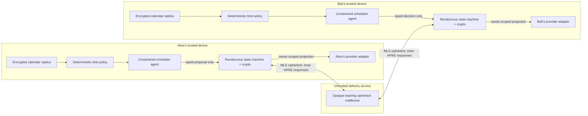
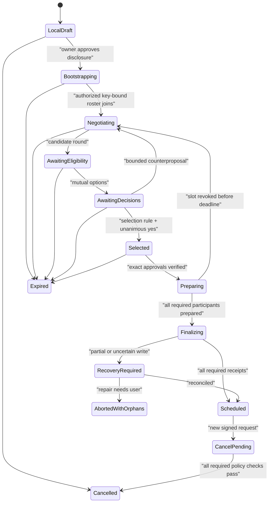

# Fabric Calendar — First Vertical Application

**Status:** implementation-ready vertical specification, version 1.2

**Prepared:** 2026-08-16

**Scope:** Google Calendar-first product test, private scheduling protocol, consent model, provider projection, and release gates
**Related:** [Product requirements](PRD.md) · [Technical architecture](architecture.md)

---

## 5.5 Calendar and scheduling landscape

Calendar products solve three different problems that must not be conflated: storing a personal calendar, synchronizing it with a provider, and negotiating time with another person. Fabric should use existing standards and provider APIs at the local edge while owning the minimal-disclosure negotiation between Fabric agents.

| System | Useful capabilities | Privacy/interoperability boundary | Recommended Fabric role |
|---|---|---|---|
| **Google Calendar** | Mature events API, incremental sync, push triggers, ACLs, and free/busy queries | A free/busy response omits event details but reveals exact occupied intervals. Ordinary Calendar encryption is in transit/at rest, not endpoint-only E2EE; Workspace client-side encryption is limited and does not encrypt every event field. [Free/busy](https://developers.google.com/workspace/calendar/api/v3/reference/freebusy/query), [sync](https://developers.google.com/workspace/calendar/api/guides/sync), [privacy](https://support.google.com/calendar/answer/10366125), [client-side-encryption limits](https://support.google.com/calendar/answer/12928168) | Strong first cloud adapter; never the Fabric peer-negotiation service |
| **Microsoft Outlook / Graph** | Calendar view, delta synchronization, `getSchedule`, event creation, and enterprise resources | `findMeetingTimes` is delegated work/school-only and its algorithm may change; it sends scheduling inputs to Microsoft. Creating an event with attendees sends invitations. [getSchedule](https://learn.microsoft.com/en-us/graph/api/calendar-getschedule?view=graph-rest-1.0), [findMeetingTimes](https://learn.microsoft.com/en-us/graph/api/user-findmeetingtimes?view=graph-rest-1.0), [delta sync](https://learn.microsoft.com/en-us/graph/delta-query-events), [create event](https://learn.microsoft.com/en-us/graph/api/user-post-events?view=graph-rest-1.0) | Strong enterprise adapter; calculate Fabric candidates locally and use Graph only for the owner’s replica/projection |
| **Apple Calendar / EventKit / iCloud** | Fast local aggregation and native event access on Apple platforms | Reading availability requires full EventKit event access; write-only access cannot read existing events. Apple lists iCloud Calendars as server-accessible encryption even with Advanced Data Protection. [EventKit access](https://developer.apple.com/documentation/eventkit/accessing-the-event-store), [iCloud data security](https://support.apple.com/en-gb/102651) | Best macOS-native adapter; a platform specialization, not the portable protocol |
| **Thunderbird + CalDAV** | Cross-platform local/network calendars, tasks, ICS, and open CalDAV interoperability | Privacy inherits the provider. CalDAV is an access/sync protocol, not E2EE between scheduling peers. [Thunderbird calendar architecture](https://source-docs.thunderbird.net/en/latest/calendar/calendars.html), [CalDAV RFC 4791](https://www.rfc-editor.org/rfc/rfc4791.html) | Open reference implementation and generic adapter boundary; never edit Thunderbird’s live profile database |
| **Proton Calendar** | End-to-end encryption for important event fields and encrypted sharing among Proton users | Proton documents that some timing/recurrence/status metadata remains available for service operation, and it does not offer general two-way CalDAV synchronization. [Security](https://proton.me/calendar/security), [privacy](https://proton.me/calendar/privacy-policy), [external-calendar limits](https://proton.me/support/subscribe-to-external-calendar) | Privacy benchmark and possible future official adapter; not a current universal connector |
| **Calendly / Cal.com** | Excellent booking, reservation, reminder, and recovery UX; Cal.com is open/self-hostable | These are server-mediated schedulers, not endpoint-only encrypted peer negotiation. Self-hosting changes the server operator; it does not itself make schedule data zero-knowledge. [Calendly security](https://calendly.com/help/calendly-platform-security-and-compliance), [Cal.com documentation](https://cal.com/docs) | UX and failure-flow benchmarks, not the confidentiality kernel |
| **EteSync / Etebase** | Open-source E2EE calendar/contact/task synchronization and an encrypted change journal | Useful encrypted-sync precedent, but sync alone does not prevent a peer from learning a shared calendar’s topology. [EteSync](https://www.etesync.com/), [Etebase](https://www.etebase.com/) | Architectural reference for a future Fabric-native encrypted calendar |

The standards boundary is equally important. iCalendar models events, tasks, journals, alarms, recurrence, and free/busy; CalDAV synchronizes calendar resources; iTIP/iMIP carry conventional invitations; and `VAVAILABILITY` can describe working availability. None supplies the requested endpoint-only, minimal-disclosure consensus protocol. `VFREEBUSY` and provider free/busy endpoints conceal titles and descriptions but still reveal an occupancy pattern, so they are adapter inputs or explicit compatibility exports—not Fabric peer messages. [iCalendar RFC 5545](https://www.rfc-editor.org/rfc/rfc5545.html), [iTIP RFC 5546](https://www.rfc-editor.org/rfc/rfc5546.html), [iMIP RFC 6047](https://www.rfc-editor.org/rfc/rfc6047.html), [calendar availability RFC 7953](https://www.rfc-editor.org/rfc/rfc7953.html)

There is no deployable IETF polling standard to adopt: the VPOLL draft expired, while JMAP Calendars remains an Internet-Draft and omits tasks and journals. Treat JMAP Calendar as an experimental adapter only, not a foundation. [VPOLL draft status](https://datatracker.ietf.org/doc/draft-ietf-calext-vpoll/), [JMAP Calendars draft](https://datatracker.ietf.org/doc/draft-ietf-jmap-calendars/)

---

## 6.7 Calendar and private-scheduling experience

The calendar is both a familiar day/week/agenda application and a projection of the Fabric graph. A meeting connects to its people, project, originating message, agenda, notes, decisions, tasks, recording, and follow-up; external-provider records remain separately attributable source/projection objects.

Four surfaces make agentic scheduling understandable:

1. **Calendar and agenda** — instant offline aggregation of selected calendars, Fabric-native events, private holds, task blocks, and “now/next.”
2. **Schedule with Fabric** — a typed request composer for participants, duration, date window, modality, required/optional roles, and local preference policy.
3. **Decision cards** — two to five exact options with `Yes` and `No`, plus an optional bounded counterproposal. Conflict details and reasons remain local. A card states exactly what an approval authorizes and when it expires.
4. **Negotiation inbox** — pending requests, responses, expiry, pairing/key status, commit/recovery state, and an auditable “what left this device” view.

Before sending, the user sees a disclosure preview containing the approved meeting context, exact proposed intervals, intended recipients, expiry, and projection mode. It must also list categories that will **not** leave the device: event titles, other participants, calendar names, neighboring busy intervals, rejection reasons, local scores, tasks, and source/provider identifiers. The default finalization is a private local event or opaque provider block; native provider invitations require a separate disclosure preview.

The model may translate “find 30 minutes with Sam next week” into a typed draft. Deterministic code—not the LLM—expands recurrences, resolves time zones, computes conflicts, checks policy, selects the final slot under a precommitted rule, and validates every write.

---

## 7.6 Calendar and agentic scheduling

This is the first Fabric application after the kernel. Its local calendar capabilities are P0/P1; encrypted peer negotiation builds on the P2 sharing substrate but is delivered as the first end-to-end multi-user vertical in section 23.

| ID | Priority | Requirement | Acceptance criterion |
|---|---:|---|---|
| CAL-001 | P0 | Maintain an encrypted local mirror of user-selected calendar accounts/collections | Initial and incremental sync preserve external IDs, revisions, tombstones, raw provider payload, and last successful cursor without making a provider the Fabric source of truth |
| CAL-002 | P0 | Normalize events without losing calendar semantics | Recurrence masters/overrides, all-day values, floating/zoned/instant times, IANA zones, DST cases, transparency, tentative/out-of-office states, and inclusive-start/exclusive-end behavior pass a standards fixture suite |
| CAL-003 | P0 | Compute availability and preferences locally with a deterministic, versioned policy engine | A model-free oracle produces the same candidate set for the same replica, policy revision, time-zone database, and request |
| CAL-004 | P1 | Negotiate by exchanging a small candidate set rather than a free/busy grid | A protocol trace contains at most the configured candidate intervals and approved meeting envelope; it contains no event, calendar, provider, or surrounding-occupancy data |
| CAL-005 | P1 | Capture exact human decisions as signed, expiring grants | `Yes` is cryptographically bound to the negotiation, event-template digest, candidate, participant set, projection profile, and expiry; no other event can use it |
| CAL-006 | P1 | Bound counterproposals and availability probing | Candidate count, horizon, granularity, rounds, contact/session rate, and expiry are policy-enforced before any network send |
| CAL-007 | P1 | Revalidate and create encrypted local soft holds before commit | A stale slot is revoked, not silently forced; holds expire automatically and block competing local negotiations according to deterministic priority |
| CAL-008 | P1 | Commit across participant providers through idempotent per-owner writes and a recoverable saga | Duplicate/reordered messages or timeout retries produce one logical meeting; partial commits enter visible reconciliation rather than being reported as success |
| CAL-009 | P2 | Cancel or reschedule through new consented state transitions | Historical approvals remain immutable; required participant rules and provider recovery behavior are explicit |
| CAL-010 | P1 | Keep provider invitations out of private mode by default | Each agent writes only its owner’s private event or opaque `Busy` block; attendee lists/iTIP/iMIP are sent only after a separate native-invitation confirmation |
| CAL-011 | P1 | Link meetings to the knowledge fabric | Event view can traverse to people, project, source request, agenda, notes, decisions, tasks, and follow-ups without exposing those private links to peers |
| CAL-012 | P1 | Give scheduling agents narrow capabilities and a complete audit | Availability read, proposal send, response, hold, exact commit, cancel, and native invite are distinct scopes; every read disclosure and external effect is inspectable |

---

## 10.6 Calendar, time, and negotiation model

Calendar data adds operational records that are private by default:

| Record | Canonical responsibility |
|---|---|
| `calendar_account` | Provider, local credential reference, capability bitmap, sync state; credentials never enter the knowledge database |
| `calendar_collection` | External or Fabric-native calendar, authority, visibility, busy-projection policy |
| `event_series` / `event_occurrence_override` | Recurrence master, `RRULE`/`RDATE`/`EXDATE`, exceptions, moves, cancellations, and stable series identity |
| `calendar_binding` | Private mapping among Fabric ID, provider object ID, iCalendar `UID`, series/occurrence identity, ETag/change key, and revision |
| `availability_policy` | Versioned deterministic policy AST scoped by owner, contact, meeting class, calendar set, and time range |
| `availability_hold` | Encrypted local reservation with negotiation ID, interval, priority, expiry, and state |
| `scheduling_contact` | Verified Fabric identity/device keys, trust state, pseudonymous routing handle, and relationship-scoped grants |
| `meeting_negotiation` | Request digest, participants, roles, round, candidate-set digest, authority grant, expiry, and protocol state |
| `meeting_candidate` / `participant_decision` | Random session-local candidate ID, exact interval, signed decision/grant, and expiry |
| `meeting_commit` | Prepare receipts, idempotency keys, provider write receipts, reconciliation state, and final event digest |

Time is not reduced to one timestamp. Preserve `time_kind` (`instant`, `zoned_local`, `floating_local`, or `all_day`), original wall-time value, IANA `TZID`, resolved UTC instant/offset when applicable, and the time-zone database version. Preserve the provider’s original zone identifier and map Windows zones through a pinned CLDR mapping without overwriting the source. The peer protocol permits only exact UTC instants plus duration and an IANA display zone—never floating time.

`DTSTART` is inclusive and `DTEND` is exclusive. Recurrence masters and exceptions remain canonical; a bounded expanded occurrence cache is derived and disposable. Expansion has explicit horizon, instance, CPU, and memory limits. Ambiguous/nonexistent DST times, all-day boundaries, transparent/tentative/out-of-office states, and a task’s optional time-blocking projection are tested rather than silently normalized. Preserve `UID`, `SEQUENCE`, and `DTSTAMP`, but do not misuse iCalendar `SEQUENCE` as database concurrency control. [iCalendar RFC 5545](https://www.rfc-editor.org/rfc/rfc5545.html), [JSCalendar RFC 8984](https://www.rfc-editor.org/rfc/rfc8984.html)

External events remain provider-authoritative unless explicitly imported as Fabric-native objects. Fabric-native events remain Fabric-authoritative. A `calendar_binding` projects one canonical Fabric meeting into each owner’s provider without sharing provider IDs with peers; raw ICS/provider JSON and revisions remain attached as evidence for synchronization and loss reporting.

---

## 15.8 Calendar pilot to start feeling the first Fabric application

The confirmed pilot target is a Mac with Google Calendar. Use the direct Google Calendar API as the durable provider boundary; EventKit is optional shell integration rather than a second source of truth. The pilot remains deliberately reversible:

1. Create a dedicated `Fabric Pilot` calendar or use a fixture-only ICS collection. Grant read access to only the calendars needed for availability; grant writes only to the dedicated destination after the read-only test passes.
2. Build a local encrypted replica through the Google Calendar API. Preserve raw responses, sync tokens/revisions, provider IDs, recurrence, and tombstones; never read Apple Calendar’s or another client’s live database.
3. Define one deterministic local policy: selected calendars, busy-state mapping, working hours, buffers, minimum notice, horizon, time zone, and maximum meetings. Test it on recurrence/DST fixtures before using personal history.
4. Authorize any user present in the selected Fabric contact list. On first encrypted exchange, bind the first-seen account/device key to that contact (TOFU); block and explain later unexpected key changes. No QR or safety-number ceremony is required in the MVP. Start with a local opaque relay and synthetic calendars; log only ciphertext/routing metadata at the relay.
5. Rehearse three candidates, one round, and two explicit users. Each peer evaluates those intervals locally and returns only yes/no. Inspect both devices’ disclosure receipts and the relay capture.
6. Run prepare/revalidation with Fabric-local expiring holds while provider writes remain disabled. Inject a conflicting event and verify that the stale slot is revoked.
7. Enable exact commit only to each user’s dedicated calendar, with no attendees and a provider-local title such as `Busy`. Force a timeout after one write and verify idempotent retry/reconciliation.
8. Export the meeting’s local graph neighborhood—people, request, meeting, agenda, note, task—while proving that other calendar events and private relations are absent.

Do not connect one participant’s Google/Outlook free-busy API to the other participant, and do not test privacy mode through email/iMIP invitations. Those paths disclose more than the Fabric protocol. The practical acceptance checklist in section 23 defines what must be measured before real calendars or autonomous commits are enabled.

---

## Selected primary and official references

### Calendar, scheduling, and privacy protocols

- IETF [RFC 5545: iCalendar](https://www.rfc-editor.org/rfc/rfc5545.html), [RFC 5546: iTIP](https://www.rfc-editor.org/rfc/rfc5546.html), [RFC 6047: iMIP](https://www.rfc-editor.org/rfc/rfc6047.html), and [RFC 7953: Calendar Availability](https://www.rfc-editor.org/rfc/rfc7953.html).
- IETF [RFC 4791: CalDAV](https://www.rfc-editor.org/rfc/rfc4791.html), [RFC 6638: CalDAV Scheduling](https://www.rfc-editor.org/rfc/rfc6638.html), [RFC 6578: WebDAV Sync](https://www.rfc-editor.org/rfc/rfc6578.html), and [RFC 8984: JSCalendar](https://www.rfc-editor.org/rfc/rfc8984.html).
- IETF [RFC 9180: HPKE](https://www.rfc-editor.org/rfc/rfc9180.html), [RFC 9420: MLS](https://www.rfc-editor.org/rfc/rfc9420.html), [RFC 9750: MLS Architecture](https://www.rfc-editor.org/rfc/rfc9750.html), [RFC 6973: Privacy Considerations](https://www.rfc-editor.org/rfc/rfc6973.html), and [RFC 9700: OAuth 2.0 Security BCP](https://www.rfc-editor.org/rfc/rfc9700.html).
- [Google Calendar API](https://developers.google.com/workspace/calendar/api/guides/overview), [Microsoft Graph calendar](https://learn.microsoft.com/en-us/graph/api/resources/calendar-overview?view=graph-rest-1.0), [Apple EventKit](https://developer.apple.com/documentation/eventkit), and [Thunderbird calendar architecture](https://source-docs.thunderbird.net/en/latest/calendar/calendars.html).
- [Proton Calendar security](https://proton.me/calendar/security), [EteSync](https://www.etesync.com/), [Cal.com documentation](https://cal.com/docs), and [Calendly security](https://calendly.com/help/calendly-platform-security-and-compliance).
- [Agent-based private scheduling](https://doi.org/10.1016/j.dss.2007.03.015), [secure multi-party meeting scheduling](https://encrypto.de/papers/KSS19.pdf), and [privacy-aware scheduling analysis](https://openreview.net/forum?id=H1x8VWq5KE).

## 23. First Fabric application: private agentic calendar synchronization

**Working product name (proposed):** Fabric Calendar

**Agent-to-agent protocol name (proposed):** Fabric Rendezvous

**Specification profile:** `fabric-schedule/1`
**First release shape:** macOS-first with Google Calendar; two people operationally; protocol/data structures support a small group from the start

## 23.1 Product decision and promise

Fabric Calendar is a complete local-first calendar surface and the first executable vertical on the knowledge kernel. It has five layers:

1. **Encrypted local replicas** of selected external calendars.
2. **Fabric-native calendar** for endpoint-encrypted events, private overlays, and local holds.
3. **Deterministic time-policy engine** for recurrence, availability, buffers, work limits, travel, and preferences.
4. **Fabric Rendezvous** for bounded, encrypted agent-to-agent scheduling.
5. **Provider projections** that first target Google Calendar and write only the owner-approved representation; Microsoft, Apple/EventKit, CalDAV, and ICS remain replaceable follow-on adapters.

Its defining promise is precise:

> A Fabric peer receives a bounded scheduling computation about a few approved intervals—not the other person’s calendar, free/busy map, event details, or reasons.

This is **minimal disclosure**, not literal zero knowledge. The proposed intervals and final meeting are necessarily learned by participants; the coordinator learns bounded responses for those intervals; and a calendar provider sees the fields that its own user writes. The relay sees ciphertext plus transport metadata. Fabric cannot protect an unlocked compromised endpoint or make a recipient forget what they learned.

#### Actor-by-actor disclosure contract

| Actor | May learn in the baseline | Must not receive in private mode |
|---|---|---|
| Delivery relay | Random mailbox/group identifier, MLS epoch, ciphertext size, timing/frequency, network metadata | Names, email addresses, message type, calendar fields, meeting purpose, candidates, responses, final event |
| Coordinator | Verified negotiation participants, approved request envelope, candidate intervals, each participant’s eligibility/decision for those candidates, final approval | Calendar/event objects, calendar names, surrounding occupancy, reasons, preference scores, tasks, provider identifiers |
| Non-coordinator participant | Participant roster, approved request envelope, candidate/mutual options, final consensus and event | Other participants’ individual negative vectors, event details, reasons, local policy/scores, provider identifiers |
| Calendar provider | Whatever its owner projects—at minimum final time in an opaque-busy mode | Fabric must not imply that peer E2EE conceals provider-stored fields from that provider |
| Local scheduling core | Policy-reduced calendar projection and exact source revisions needed for correctness | Event titles/bodies are not required for ordinary conflict calculation and are withheld from the LLM by default |

The application displays a disclosure receipt after every round: for example, “Your device evaluated 3 exact intervals and sent 3 yes/no eligibility bits to the coordinator; no event details or rejection reasons were sent.” This makes privacy measurable rather than rhetorical. The design follows data-minimization guidance in [RFC 6973](https://www.rfc-editor.org/rfc/rfc6973.html).

## 23.2 Scope and explicit non-goals

#### MVP includes

- instant offline day, week, month, agenda, search, and now/next views;
- encrypted Fabric-native events and a normalized local replica of Google Calendar plus ICS import/export;
- deterministic recurrence, time-zone, busy-projection, availability, buffer, and hold logic;
- contact-list authorization, TOFU account/device-key binding, and an opaque E2EE ciphertext relay;
- two-person sessions with three proposed candidates, a maximum of three rounds, yes/no decisions, and one bounded counterproposal path;
- all-required-participant group structures, so three-or-more-person tests do not require a protocol redesign;
- exact consent grants, local soft holds, revalidation, idempotent commit saga, cancellation request, audit, and recovery UI;
- `fabric_only`, `opaque_busy`, and `local_details` final projections; native invitations remain an explicit compatibility mode.

#### MVP excludes

- raw free/busy exchange, calendar sharing, public booking pages, email/iMIP fallback in private mode, or provider-mediated cross-user scheduling;
- recurring-meeting negotiation, rooms/resources, paid appointments, travel booking, or automatic rescheduling/cancellation;
- unknown-sender auto-negotiation, a public identity directory, or a global “manage my calendar” permission;
- LLM time arithmetic, conflict decisions, policy enforcement, state transitions, cryptographic decisions, or provider writes;
- custom cryptography, custom PSI, FHE, PIR, or MPC. A later audited secure-intersection protocol may reduce coordinator leakage, but repeated low-entropy time queries still require privacy budgets.

The protocol does not prove that a peer honestly consulted a calendar, guarantee delivery/fairness when a participant aborts, make provider writes atomic, or hide a final meeting from its attendees.

Private-scheduling and secure-computation research shows that stronger intersections are possible, but output leakage, repeated low-entropy time queries, non-collusion or malicious-security assumptions, recovery, and implementation cost remain. The reviewable v1 therefore discloses a very small candidate computation and measures it; PSI/MPC is a research track that requires an audited malicious-secure design and must return only bounded top-k output. An OPRF is merely a building block—[RFC 9497](https://www.rfc-editor.org/rfc/rfc9497.html) does not standardize PSI. [Agent-based private scheduling](https://doi.org/10.1016/j.dss.2007.03.015), [secure multi-party meeting scheduling](https://encrypto.de/papers/KSS19.pdf), [privacy-aware scheduling analysis](https://openreview.net/forum?id=H1x8VWq5KE)

## 23.3 Primary user journey

Example request: “Find 30 minutes with Bob next week about Atlas. Prefer afternoons and keep 15 minutes around it.”

1. Alice’s local model optionally converts the sentence into a typed draft. Alice reviews participants, duration, horizon, disclosed purpose/mode, candidate limit, and projection profile.
2. Deterministic code expands Alice’s selected calendar replicas and local holds, applies hard constraints and policies, and proposes three diverse slots.
3. Alice sees exactly what will leave her device and approves the negotiation send.
4. Bob is authorized because he is in Alice’s selected Fabric contact list; his agent receives the E2EE candidate round and checks only those exact intervals locally.
5. The coordinator derives at most two or three mutually eligible options. Bob and Alice each see locally contextualized cards and click `Yes` or `No`; a local conflict explanation never enters the wire message.
6. If more than one option has unanimous yes, the protocol uses the selection rule committed in the request—proposed default: the first unanimously accepted option in the original displayed order. No LLM or coordinator improvises after seeing responses.
7. Each device automatically converts its owner’s still-valid yes token into an approval for the identical meeting digest, revalidates, and creates an expiring encrypted local hold.
8. After all required devices report prepared, each writes its own private/Fabric/provider event idempotently. A second click is not needed because the user’s yes was the narrow, exact commit grant.
9. Both users receive “Scheduled,” or a truthful partial/recovery state. The event links locally to people, project, request, agenda, notes, tasks, and follow-up.

If no option receives unanimous yes, the protocol emits only `NO_MATCH`. It does not announce who declined what. One bounded counterproposal round may follow; otherwise the negotiation expires.

## 23.4 Component and trust architecture



The relay never receives provider tokens. Calendar adapters never receive peer keys or messages. The LLM never receives a relay/network capability or direct provider credential. Only the trusted core may convert a validated state transition and exact capability into an external write.

## 23.5 Contact authorization, TOFU key binding, and scheduling capabilities

Use three identity layers:

1. **Contact-list authorization identity** — an entry in the user-selected Fabric contact list is allowed to initiate a bounded scheduling request. Unknown contacts are rejected or quarantined before any calendar evaluation.
2. **TOFU cryptographic binding** — the first valid E2EE exchange pins the contact’s account signing key and independent device keys to that contact record. A later unexpected key change blocks scheduling until the user explicitly accepts the replacement.
3. **Stable pairwise contact pseudonym** — known only to the two contacts; anchors rate limits and capability revocation across fresh sessions.
4. **Fresh negotiation identity** — random member identifier, signing context, random 256-bit negotiation ID, random MLS group ID, one-time KeyPackages, and rotating relay mailbox tokens.

Contact-list membership is the MVP authorization decision; it is not itself cryptographic proof. An email address or contact identifier locates the first exchange, then TOFU pins the received key. This deliberately removes QR/safety-number ceremony but accepts first-contact key-substitution risk. Every key change is conspicuous and invalidates active responses/approvals. Optional manual fingerprint/QR verification remains a later hardening feature, not an MVP requirement. Removing a contact revokes future negotiation capability but cannot retract earlier disclosure.

The owner’s Fabric automatically issues a short-lived, non-transferable `schedule.negotiate` capability only for a contact-list entry with a current pinned key. It permits bounded requests—not reading availability or creating events:

```text
ScheduleCapability {
  version, capability_id, issuer_pairwise_id, subject_pairwise_id,
  subject_key_thumbprint, audience: "fabric-schedule",
  actions: ["create-negotiation"],
  constraints: {
    max_horizon_days, max_duration_seconds,
    max_candidates_per_round, max_rounds, max_participants,
    allowed_purpose_classes?
  },
  not_before, expires_at, revocation_epoch, signature
}
```

Encode capabilities with deterministic CBOR and COSE signatures; keep them inside the encrypted bootstrap/session. [CBOR RFC 8949](https://www.rfc-editor.org/rfc/rfc8949.html), [CDDL RFC 8610](https://www.rfc-editor.org/rfc/rfc8610.html), [COSE RFC 9052](https://www.rfc-editor.org/rfc/rfc9052.html)

## 23.6 Cryptographic and transport profile

- Use a current, reviewed MLS implementation and one ephemeral MLS group per negotiation, including two-person sessions. MLS supplies asynchronous group encryption, authentication, forward secrecy, and post-compromise recovery; it does not supply product authorization or hide traffic metadata. [MLS RFC 9420](https://www.rfc-editor.org/rfc/rfc9420.html), [MLS architecture RFC 9750](https://www.rfc-editor.org/rfc/rfc9750.html)
- Broadcast candidate rounds and final state with MLS private application messages. In groups of three or more, sign and HPKE-seal individual eligibility/decision vectors to the coordinator inside MLS so peers learn only mutual options/final consensus. HPKE base mode alone does not authenticate the sender, so the signed body binds the key-bound member, capability, negotiation, roster, round, policy, and purpose. [HPKE RFC 9180](https://www.rfc-editor.org/rfc/rfc9180.html)
- Use deterministic CBOR for signed/transcript-hashed bodies. Do not place identity, message type, purpose, or calendar data in relay headers or sensitive MLS authenticated-but-visible metadata.
- Use TLS/QUIC to the relay, random mailboxes/group IDs, short ciphertext retention, generic notifications, fixed size buckets, and batching where latency permits. Document that the relay can still see IP/connection data, timing, size, frequency, group ID, and epoch.
- Pin the minimum protocol version and allowed MLS cipher suites; bind the version, privacy profile, capability/policy digests, roster digest, and feature set into the session context. Never silently downgrade to TLS-only, plaintext free/busy, group-readable personal responses, email, or a more revealing projection.
- Persist MLS state, replay windows, feed heads, and protocol state transactionally with rollback detection. After cryptographic state loss, rejoin as a new member and restart active negotiations rather than replaying stale approval authority.

An optional later metadata-reduction profile can partition relay and gateway roles with Oblivious HTTP, but the baseline must not claim anonymity. [Oblivious HTTP RFC 9458](https://www.rfc-editor.org/rfc/rfc9458.html)

## 23.7 Wire messages, disclosure budget, and state machine

The relay envelope contains only a mailbox token, size-bucket/padding information, expiry, and ciphertext. The encrypted MLS application body uses this conceptual schema:

```text
FabricScheduleMessage {
  protocol: "fabric-schedule/1"
  type: MessageType
  negotiation_id: random_bytes[32]
  message_id: random_bytes[16]
  sender_member_id: negotiation_scoped_bytes[16]
  sender_sequence: uint
  state_version: uint
  round: uint
  created_at_ms: int
  expires_at_ms: int
  membership_digest: bytes[32]
  previous_state_digest: bytes[32]
  capability_digest: bytes[32]
  policy_profile_digest: bytes[32]
  body: typed_map
}
```

Required message types are:

```text
NEGOTIATION_CREATE       JOIN_ACK
CANDIDATE_ROUND          AVAILABILITY_RESPONSE_SEALED
MUTUAL_OPTIONS           DECISION_COMMIT
DECISION_REVEAL_SEALED   SELECTED_OPTION
APPROVE_SELECTED         NO_MATCH
PREPARE                  PREPARED
FINALIZE_REQUEST         FINALIZED
SLOT_REVOKED             ABORT
CANCEL_REQUEST           CANCELLED
```

A candidate is intentionally austere:

```text
Candidate {
  candidate_id: random_bytes[16]
  start_utc_ms: int
  duration_seconds: uint
}
```

The approved request envelope may contain only: participant pseudonyms/roles; duration; UTC horizon; required/optional status; meeting mode; an optional user-approved purpose label; candidate/round limits; public selection rule; expiry; privacy profile; and final projection profile. Local time-zone rendering is local. Calendar IDs, event IDs, existing attendees, titles, locations, busy intervals, rejection reasons, raw scores, source revisions, and provider names never enter a peer message.

Each responder enforces a privacy budget across all negotiation IDs associated with the same key-bound pairwise contact. Proposed MVP defaults—configurable but never silently expanded—are:

| Limit | Proposed default | Purpose |
|---|---:|---|
| Candidate intervals per round | 3 | Bound the availability question |
| Rounds per negotiation | 3 | Bound adaptive narrowing |
| Horizon | 14 days | Avoid mapping long-term routines |
| Minimum granularity | 15 minutes | Avoid fine-grained probes |
| Concurrent sessions per contact | 3 | Limit parallel reconstruction |
| Equivalent/overlapping requests | Rate-limited and deduplicated | Prevent new IDs from bypassing the budget |
| Candidate and consent lifetime | 24 hours maximum; shorter near the event | Limit stale authority |
| Local hold lifetime | 5 minutes, renewable only through the state machine | Avoid abandoned reservations |

The responder rejects horizon subdivision, repeated equivalent probes, overlapping candidate sweeps, excess participants, stale capabilities, and malformed state **before** consulting the calendar. Rate limits are keyed to the contact record plus pinned pairwise key, not an ephemeral session ID.



Every transition has allowed message types, sender roles, required digests, grant checks, expiry, and idempotent effects. The state machine rejects free-form model output. Membership changes or material changes to time, duration, required participants, purpose label, mode, or projection profile create a new meeting digest and invalidate all earlier decisions.

## 23.8 Deterministic availability and selection algorithm

For participant `i`, let the local feasible set over the requested horizon be:

\[
F_i = W_i \setminus (B_i \cup H_i \cup U_i)
\]

where `W_i` is locally allowed working/preference time, `B_i` is the busy projection of selected calendars, `H_i` is the local reservation/hold ledger, and `U_i` is other hard policy such as buffers, notice, travel impossibility, or daily limits. None of these sets leaves device `i`.

The proposer chooses a diverse bounded set `C_r` contained in `F_proposer` for round `r`. “Diverse” means spreading choices across days and configured time bands rather than disclosing three adjacent variants. Every participant evaluates only `C_r`:

\[
e_i(c) = \mathbf{1}[c \subseteq F_i]
\]

and sends the fixed-length vector sealed to the coordinator. The coordinator publishes only:

\[
M_r = \{c \in C_r \mid e_i(c)=1\ \text{for every required }i\}
\]

Each user then supplies `d_i(c) ∈ {yes,no}` for the displayed subset of `M_r`. The selectable set is:

\[
A_r = \{c \in M_r \mid d_i(c)=yes\ \text{for every required }i\}
\]

If `A_r` is non-empty, choose the first candidate under the selection order committed in `NEGOTIATION_CREATE`. The strict-binary MVP shares no preference weight or rejection reason. A later opt-in profile may reveal a coarse `preferred | acceptable | costly` band and use maximin-before-sum fairness, but it must be a visibly more revealing privacy profile.

To prevent a participant from adapting an answer after seeing another’s, every participant first broadcasts a salted commitment to its decision vector, then HPKE-seals the vector and salt to the coordinator. Candidate times and yes/no values are enumerable; the commitment requires a fresh 32-byte random salt. The coordinator can still omit an option and harm liveness, so every device verifies the candidate/options transcript and no product claim promises Byzantine fairness.

The exact meeting digest is:

```text
meeting_digest = SHA-256(
  "fabric-schedule-meeting-v1" || deterministic_CBOR({
    negotiation_id, membership_digest, selected_candidate_id,
    selected_utc_start, duration_seconds,
    approved_purpose_digest, meeting_mode,
    finalization_profile, privacy_profile_digest,
    candidate_set_digest, selection_rule,
    consent_expiry
  })
)
```

An agent-produced `APPROVE_SELECTED` is valid only when a still-valid human yes token on that device binds the same candidate and event-template digest. Thus the agents can finalize autonomously after clicks without converting “yes to Tuesday at 2” into permission for Wednesday, a longer meeting, a new attendee, or a more revealing provider invitation.

## 23.9 Consent and authority ladder

Keep these meanings distinct:

- `JOIN_ACK` — consent to join a negotiation, not to book;
- agent eligibility — current deterministic local feasibility, not human preference or consent;
- user yes/no — exact consent to candidate, participants, duration, disclosed purpose/mode, and finalization profile;
- `PREPARED` — the calendar remains eligible and a local hold exists immediately before writing;
- `FINALIZE_REQUEST` — deterministic permission to execute only the previously approved local write.

| Level | Capability | Default |
|---|---|---|
| L0 Observe | Sync/display selected calendars; no peer or provider writes | Allowed after account consent |
| L1 Draft | Parse intent, compute local candidates, explain policy | Allowed locally |
| L2 Negotiate | Send bounded encrypted proposals/responses after disclosure approval | Per-meeting approval |
| L3 Hold | Create expiring Fabric-local hold; provider-visible tentative hold is separate | Enabled inside approved session |
| L4 Exact commit | Commit the exact unanimously approved event after revalidation | Recommended operational default |
| L5 Bounded autonomy | Negotiate/commit for contact-listed, key-bound peers and meeting classes under duration, hours, horizon, frequency, sensitivity, and projection limits | Disabled until post-MVP security/behavior review |

Recurring meetings, unknown contacts, attendee changes, travel, paid appointments, medical/legal-sensitive context, provider-visible participants, and deletion/cancellation of existing commitments always step down to explicit approval unless covered by a separately reviewed narrow policy. Revoking a capability prevents future responses but cannot erase candidates already disclosed.

## 23.10 End-to-end protocol and commit saga

```mermaid
sequenceDiagram
    actor Alice
    participant AF as "Alice Fabric"
    participant Relay as "Opaque relay"
    participant BF as "Bob Fabric"
    actor Bob
    participant AC as "Alice adapter"
    participant BC as "Bob adapter"

    Alice->>AF: "Find 30 minutes with Bob"
    AF->>AF: Parse draft; compute 3 local candidates
    AF->>Alice: Preview exact disclosure
    Alice->>AF: Approve negotiation
    AF->>Relay: MLS-encrypted candidate round
    Relay->>BF: Deliver ciphertext
    BF->>BF: Evaluate exact candidates locally
    BF->>Relay: MLS + coordinator-only sealed eligibility
    Relay->>AF: Deliver ciphertext
    AF->>Relay: Publish encrypted mutual options
    Relay->>BF: Deliver mutual options
    AF->>Alice: Yes / No cards with local context
    BF->>Bob: Yes / No cards with local context
    Alice->>AF: Exact decisions
    Bob->>BF: Exact decisions
    AF->>Relay: Decision commitment
    BF->>Relay: Decision commitment
    Relay-->>AF: All commitments observed
    Relay-->>BF: All commitments observed
    AF->>Relay: Coordinator-sealed decisions + salt
    BF->>Relay: Coordinator-sealed decisions + salt
    Relay->>AF: Coordinator receives sealed decisions
    AF->>Relay: Selected option + exact meeting digest
    Relay->>BF: Deliver selected option
    AF->>AC: Refresh and revalidate owner replica
    AC-->>AF: Current revision
    BF->>BC: Refresh and revalidate owner replica
    BC-->>BF: Current revision
    AF->>AF: Create encrypted local hold
    BF->>BF: Create encrypted local hold
    AF->>Relay: Prepared
    BF->>Relay: Prepared
    Relay->>AF: All required participants prepared
    AF->>Relay: Finalize request
    Relay->>BF: Finalize request
    AF->>AC: Idempotent owner-scoped event write
    BF->>BC: Idempotent owner-scoped event write
    AF->>Relay: Finalized receipt hash
    BF->>Relay: Finalized receipt hash
    Relay->>AF: Coordinator receives receipt hashes
    AF->>Relay: Signed final or recovery status
    Relay->>BF: Deliver final or recovery status
    AF->>Alice: Scheduled or recovery required
    BF->>Bob: Scheduled or recovery required
```

This is prepare plus a **saga**, not database two-phase commit. Before `PREPARED`, each device verifies the identical roster/event digest, valid affirmative grants, latest replica cursor/revision, local policy revision, and reservation ledger; it then creates a five-minute Fabric-local hold. A negative recheck returns generic `not_ready`, never a provider error or conflict reason.

After all required participants prepare, each agent writes only its owner’s event. Provider markers are independently derived per owner; never place one common Fabric negotiation ID or iCalendar UID into two cloud accounts in private mode, because the same provider could correlate them. The encrypted Fabric meeting links the local bindings.

Duplicate, delayed, and reordered messages return the prior logical result. Receivers enforce unique message ID, increasing per-sender sequence, expected state/message type, round/state version, prior-state digest, roster/policy/candidate digests, expiry, single-use consent/finalization nonces, and a replay cache retained through negotiation expiry. A stale round can never commit.

If only some provider writes succeed, state becomes `recovery_required`; the outbox retries idempotently. If policy permits, it can compensate by removing an already-created projection. If outcome is uncertain, notify users and preserve the provider receipts for repair—never report “scheduled.” Cancellation and rescheduling are new signed transitions with new authority, not mutation of historical consent.

## 23.11 Final projection profiles and provider adapters

Each owner chooses what their own calendar provider receives. Participants agree to the privacy class before deciding; their concrete local calendar/provider remains private.

| Profile | Provider-facing representation | Peer/relay disclosure | Use |
|---|---|---|---|
| `fabric_only` | No external write; full event lives in the Fabric-native encrypted calendar | Final meeting through Fabric only | Strongest privacy; viable when Fabric is the user’s active calendar |
| `opaque_busy` | Private event with time and a local generic title such as `Busy`/`Reserved`; no attendees, meeting link, shared UID, or sensitive extended property | No added peer disclosure | Proposed compatibility default when a provider must block time |
| `local_details` | Owner-selected title/location/reminder on that owner’s provider; no provider attendee list or invitation | No added peer disclosure, but that owner’s provider learns the fields | Familiar local calendar UX with an explicit field preview |
| `native_invite` | Conventional organizer/attendees and provider/iTIP/iMIP fields | Provider/email infrastructure learns final time, identities, and written details | Explicit interoperability escape hatch; never called private mode |

#### Representation decision: what information is needed

“Representation” means the Google Calendar event each agent creates **after** Fabric participants agree. It does not change the peer protocol; it determines what Google and anyone with access to that Google calendar can see. If no Google record is created, the event exists only in Fabric and will not block time in ordinary Google Calendar views.

For the privacy-preserving Google MVP, the proposed profile is:

| Google event field/behavior | Proposed minimal value | Decision needed |
|---|---|---|
| Create a Google event | Yes, independently in each owner’s account | Confirm that the meeting must block time in Google rather than remain Fabric-only |
| `start`, `end`, time zone | Exact agreed interval | Required for a Google event; Google necessarily learns this owner is blocked then |
| `summary` | `Busy` or `Reserved` | Choose the preferred generic label, or authorize the real meeting title |
| `visibility` | `private` | Confirm; this limits what calendar viewers see but does not hide the event from Google |
| `transparency` | `opaque` | Confirm that it should block availability |
| `attendees` | Omitted | Confirm no Google invitation/RSVP email in private mode |
| `description`, `location` | Omitted | Identify any field that should deliberately appear in Google |
| Google Meet / conference data | Omitted | Decide whether meeting links stay E2EE in Fabric or Google should create/see one |
| reminders | Use the owner’s default reminders without meeting metadata | Confirm default reminders versus none/custom reminders |
| destination calendar | Dedicated `Fabric Pilot` calendar initially | Later choose primary calendar or another owned calendar |
| provider identifier | Different random client ID per owner; encrypted Fabric mapping kept locally | Fixed for privacy/idempotency; never share one provider UID between peers |
| cancellation/update | Each agent updates/deletes only its owner’s projection through Fabric | Confirm whether cancellation requires another click in the MVP |

The minimal recommendation is therefore: **exact start/end + private opaque block + generic `Busy` title + default reminder; no attendees, description, location, Meet link, or shared provider ID.** Full title, participants, purpose, meeting link, notes, and graph relationships remain in the E2EE Fabric event. This protects those fields from Google and from the other person’s calendar provider, while accepting that Google learns the final occupied interval.

A meeting link can be created only after agreement and shared as encrypted Fabric meeting content. Provider conference APIs may disclose details and have separate permissions; never reuse conference data across meetings.

Every adapter exposes a capability manifest rather than pretending providers are equivalent:

```text
discover_calendars      initial_sync
incremental_sync        read_window
create_event            update_event_if_current
delete_event_if_current respond_to_invitation
watch_or_poll_changes   renew_subscription
create_conference       export_icalendar
```

Flags declare read/write, recurrence/exceptions, attendees/resources, free/busy, conditional update, notification, conference, time-zone, and private-projection behavior. The trusted host owns OAuth/credentials and presents a brokered narrow API to the adapter.

| Adapter | Synchronization and write rules |
|---|---|
| **Fabric-native / ICS** | Canonical endpoint-encrypted events first; standards-compliant iCalendar import/export with a conversion-loss report. ICS files are exchange snapshots, not a live multi-writer protocol. |
| **Google Calendar** | Use least-privilege delegated scopes and opaque `syncToken`; preserve deletes; a `410 Gone` triggers clean full resync of the selected application scope. Notifications only trigger sync because delivery is not fully reliable. Use a valid client-generated event ID for idempotent create, then ETag/`If-Match` for changes. In private mode omit attendees instead of using `sendUpdates=none`. [OAuth scopes](https://developers.google.com/workspace/calendar/api/auth), [incremental sync](https://developers.google.com/workspace/calendar/api/guides/sync), [event insert](https://developers.google.com/workspace/calendar/api/v3/reference/events/insert), [version resources](https://developers.google.com/workspace/calendar/api/guides/version-resources) |
| **Microsoft Graph** | Use delegated least privilege and calendar-view delta links bound to one calendar/range. Request immutable IDs consistently; set `transactionId` on create to suppress duplicate timeout retries. Because the documented event-update API does not promise Google/CalDAV-style conditional semantics across every operation, serialize, refetch, verify, and reconcile rather than asserting unsupported atomic concurrency. Including attendees sends invitations. [delta query](https://learn.microsoft.com/en-us/graph/delta-query-events), [immutable IDs](https://learn.microsoft.com/en-us/graph/outlook-immutable-id), [event resource](https://learn.microsoft.com/en-us/graph/api/resources/event?view=graph-rest-1.0) |
| **CalDAV** | Discover principal/home, supported components/reports, ACL/scheduling/free-busy, and WebDAV Sync capabilities. Create with `If-None-Match: *`; update/delete with last ETag and `If-Match`; refetch/merge on `412`. Treat changed and removed resources from `sync-collection` as significant. Keep scheduling Inbox/Outbox separate. [CalDAV RFC 4791](https://www.rfc-editor.org/rfc/rfc4791.html), [WebDAV Sync RFC 6578](https://www.rfc-editor.org/rfc/rfc6578.html), [CalDAV Scheduling RFC 6638](https://www.rfc-editor.org/rfc/rfc6638.html) |
| **macOS EventKit** | Reading conflicts requires full calendar access; write-only permission suffices only for projection. Retain one event store, observe changes, refetch, and use a compound binding because identifiers can change/multiply across moves, recurrences, and Exchange devices. [EventKit access](https://developer.apple.com/documentation/eventkit/accessing-the-event-store) |

Google free/busy, Graph `getSchedule`, CalDAV free-busy, `VFREEBUSY`, and `VAVAILABILITY` may be consumed locally when needed to construct the owner’s projection. Their outputs are never relayed as proof of “no calendar disclosure.” JMAP Calendars remains experimental, and Proton is not a two-way adapter without an official supported API/CalDAV path.

## 23.12 Calendar engine and canonical event semantics

The scheduler consumes an **availability projection**, not raw event prose. Each selected event is reduced locally to interval, busy classification, owner visibility, recurrence/exception identity, and freshness. Subject, description, attendees, location, attachments, conferencing, and linked knowledge are not needed for collision detection.

The deterministic engine must handle:

- half-open intervals `[start,end)` and separate all-day date ranges;
- instant, zoned-local, floating-local, and all-day time kinds;
- IANA zones, original provider zone, pinned CLDR Windows mapping, and recorded time-zone-database version;
- recurrence masters, `RRULE`, `RDATE`, `EXDATE`, `RECURRENCE-ID`, moved/cancelled exceptions, bounded expansion, and occurrence caching;
- tentative, free/transparent, busy, out-of-office, working-elsewhere, cancelled, private, and all-day busy-projection policies;
- task due dates versus explicitly created work blocks; a due date does not silently occupy time;
- local holds, buffers, minimum notice, travel feasibility, work hours, meeting-count/hour limits, focus protection, and contact/meeting-class exceptions;
- DST gaps/overlaps with visible diagnostics and deterministic standards-compatible import behavior; the peer protocol rejects unresolved floating or ambiguous candidate instants.

The source-of-authority matrix is explicit:

- external provider event → provider-authoritative replica plus preserved raw revision;
- Fabric-native event → Fabric-authoritative, optionally projected outward;
- scheduled Fabric meeting → encrypted shared meeting digest plus one private local binding/projection per owner;
- imported suggestion from email/message/web → provenance-bearing draft until a user or applicable policy commits it.

Canonical domain events include `calendar_event_upserted`, `calendar_event_deleted`, `policy_changed`, `schedule_opened`, `candidate_sent`, `eligibility_received`, `decision_recorded`, `hold_created`, `hold_expired`, `slot_revoked`, `commit_prepared`, `provider_write_requested`, `provider_write_succeeded`, `provider_write_failed`, `schedule_committed`, and `schedule_cancelled`. Sensitive reads and disclosures remain in the separate access/security audit log.

## 23.13 Multi-party and device behavior

The protocol structures support two or more participants; the first operational release requires all participants. Required/optional roles, quorums, and resource calendars are subsequent profiles because they change selection and consent semantics.

- Individual eligibility and decisions are coordinator-only inner ciphertext; other participants receive mutual options, a generic `NO_MATCH`, and the final affirmative proof—not per-person negative vectors.
- Candidate rounds are group broadcasts with one canonical digest. Every response binds that digest; every final approval binds the same roster and meeting digest.
- Adding/removing a participant advances MLS membership, invalidates candidates, decisions, and approvals, and restarts discovery with the new roster. Removed members cannot read future epochs but cannot be made to forget past candidates.
- MLS membership is per client, while consent is per logical person. Each user has one elected approval device or an explicit local device quorum; two devices cannot accidentally supply two participant votes.
- If the coordinator fails, elect a replacement deterministically from the roster digest, discard coordinator-sealed vectors, and collect a fresh round to a new coordinator key.
- A relay or coordinator can delay, omit, partition, or abort. Devices compare transcript/state digests and current MLS epoch authenticators; they can detect divergent finalization attempts but cannot force liveness.
- Notifications are generic (“Scheduling request”) and contain no participant, purpose, time, or response on the lock screen unless the user opts in.

## 23.14 Product surfaces

| Surface | Minimum behavior |
|---|---|
| Calendar | Offline day/week/month/agenda, multiple calendar toggles, Fabric-native and external provenance, event search, now/next, recurrence editing with scope preview |
| Event view | Separate private, participant-shared, and provider-projected fields; graph links to people/project/source/agenda/note/tasks; external authority and sync status |
| Time policy | Human-readable rules plus structured editor, scope, version history, simulation on past weeks, conflict explanation, rollback |
| Schedule composer | Contact/key status, duration/horizon/mode, required participants, optional purpose, candidate/privacy limits, selection rule, finalization profile |
| Disclosure preview | Exact fields, recipients, intervals, expiry, relay/provider caveats, and explicit “stays on this device” list |
| Candidate card | Local date/time/zone, user-local conflict or preference explanation, `Yes`/`No`, approval scope and expiry; no reason field sent |
| Negotiation inbox | Waiting-on state, round/budget consumed, expiry, roster/key changes, withdraw/counter controls, disclosure receipts |
| Commit/recovery | Prepared/write receipts by participant pseudonym, retries, uncertain provider state, repair/compensation choices, never false success |
| Audit | Timeline of local calendar access, disclosed candidates/bits, capability/policy decision, signed state digest, provider side effect, model involvement |

Every external effect has a plain-language preview independent of the agent. Accessibility includes keyboard operation, screen-reader descriptions, unambiguous local/remote time zones, and no color-only conflict or consent state.

## 23.15 Threat-control matrix

| Threat | Required controls | Residual fact shown to users |
|---|---|---|
| Curious relay / traffic analysis | MLS private messages, TLS/QUIC, rotating opaque mailboxes, padding buckets, short retention, generic notifications, no sensitive logs/AAD | Network, timing, size, frequency, group/epoch metadata remain observable |
| Malicious participant probing routines | Key-bound capabilities, bounded candidates/rounds/horizon/granularity, cross-session pairwise budgets, overlap detection, quarantine/rate limits | A legitimate peer still learns the proposed slots and bounded answers |
| Coordinator learns/omits responses | Coordinator-only HPKE, decision commitments, transcript digests, deterministic precommitted selection | Coordinator learns bounded per-candidate bits and can harm liveness by omission |
| Replay/reorder/equivocation/downgrade | Message IDs, sequence, state/round, previous digest, expiry, replay cache, signed roster/policy/candidate digests, pinned protocol/suites | A malicious delivery service can still delay or partition participants |
| First-contact key substitution | Contact-list authorization, TOFU key pinning, E2EE thereafter, hard block/warning on unexpected key changes, optional later fingerprint verification | Without out-of-band verification, the first key binding can be impersonated; this is the conscious simplicity tradeoff |
| Compromised connector/imported event prompt injection | Adapter sandbox, brokered credentials, reduced availability records, event text treated as untrusted, no model/tool authority from content | A compromised trusted endpoint can lie or leak; crypto cannot repair it |
| Stale calendar / double booking | Incremental sync freshness, local reservation ledger, prepare revalidation, expiring holds, state preconditions | A provider change after final recheck can still race; recovery is required |
| Partial or uncertain provider write | Transactional outbox, provider idempotency, receipt verification, retry/compensation, recovery UI | Cross-provider atomicity is impossible |
| Provider correlation/disclosure | Fabric-only or per-owner opaque projection; independently derived provider markers; no attendee list/shared UID | Provider sees every field its owner stores and may infer a busy block |
| Device/key compromise or removal | Independent device keys, short grants, MLS remove/update, capability revocation, secret deletion, fresh negotiation after recovery | Forward secrecy/recovery depend on correct implementation; past disclosure is not revoked |
| Collusion or dishonest availability | Minimize per-party output and audit it | Protocol authenticates messages, not truthfulness; participants can share what they know |

Do not market the baseline as anonymous scheduling, zero-knowledge calendars, atomic scheduling, or “no metadata.” Do not claim production E2EE until a protocol/implementation review, dependency audit, fuzzing, and recovery exercise pass.

## 23.16 Implementation slices

| Slice | Indicative effort | Deliverable and exit gate |
|---|---:|---|
| C0 Standards/Google spike | 2 weeks | Canonical time/recurrence model; ICS and Google fixtures; Google personal/Workspace permission test; DST oracle; capability/loss matrix; no real writes |
| C1 Personal calendar | 4–6 weeks | macOS app, SQLCipher schema, direct Google replica, Fabric-native events, agenda/week UI, policy engine, occurrence cache, ICS; deterministic conformance passes |
| C2 Two-agent Rendezvous | 4–6 weeks | Contact-list authorization, TOFU key pinning, MLS, opaque relay, bounded candidate/eligibility exchange, yes/no commitments, disclosure audit, synthetic calendars; independent protocol review begins |
| C3 Safe commit | 3–4 weeks | Local holds, revalidation, exact grants, per-owner provider projection, idempotent saga, fault-injection/recovery UI; zero silent success on partial write |
| C4 Small groups/platform expansion | 4–8 weeks | All-required multi-party sessions, membership/device changes, second provider plus CalDAV/EventKit as chosen, cancellation request, notifications |
| C5 Bounded autonomy | After security and longitudinal UX review | Named-contact/meeting-class L5 grants, recurring/reschedule/resource profiles, fairness ledger; one-click revocation |
| Research track | Non-blocking | Audited top-k private intersection/secure computation and stronger traffic-analysis resistance; never substitute novelty for a reviewable v1 |

Calendar implementation targets macOS and Google immediately, but C0 still confirms personal/Workspace permission behavior with a disposable account. C2 can run entirely on synthetic calendars and a local relay in parallel with C1; C3 must not touch real calendars until protocol/state/adversarial tests pass.

## 23.17 Release gates and evaluation

| Area | Release gate |
|---|---|
| Calendar correctness | 100% agreement with the deterministic oracle for the committed fixture set: recurrence/exceptions, all-day boundaries, transparency/tentative/out-of-office, floating/zoned times, Windows/IANA mapping, and DST gaps/overlaps |
| Conflict safety | Zero silent double bookings; 100% stale-slot rejection in adversarial race tests; orphan holds always expire |
| Idempotency/state | Duplicate, lost, delayed, and arbitrarily reordered protocol/provider operations produce one logical event or an explicit recovery state |
| Privacy disclosure | Relay inspection finds no identities, message types, calendar/provider fields, purpose, candidates, or responses in plaintext; participant output never exceeds the documented field/round budget |
| Probe resistance | Limits cannot be bypassed with new session IDs, overlapping windows, malformed messages, prompt injection, multiple devices, or coordinator changes |
| Authority | Zero sends, holds, commits, cancellations, attendee disclosures, or conference creates outside the exact applicable capability and valid state |
| Performance | Indexed 90-day availability p95 ≤75 ms on the reference device/corpus; candidate-card interaction ≤100 ms after local results; crypto/state overhead does not block UI |
| Sync/recovery | Cursor expiry, deletes, provider conflicts, offline queues, partial writes, crash at every transition, device removal, and MLS state-loss exercises all converge or stop visibly |
| Human trust | Measure completion time, rounds, declined requests, manual corrections, regret/cancellation, disclosure understanding, false sense of privacy, and hidden-automation incidents |
| Repeated fairness | Track worst-participant inconvenience and time-zone burden over repeated meetings; do not optimize only organizer convenience or aggregate acceptance |
| Security | Property tests for every transition, CBOR/adapter/protocol fuzzing, dependency/SBOM review, compromised-relay simulation, key-rotation/recovery drills, and independent cryptographic/application review |

The privacy conformance test records exactly what each actor can infer. In the strict binary profile, each participant learns the approved request and at most `K` candidate intervals; the coordinator additionally learns at most one eligibility and one yes/no bit per participant per candidate. No rejection reason or neighboring interval is transmitted.

## 23.18 Confirmed implementation profile and decisions still required

The following are now confirmed:

| Decision | Confirmed profile |
|---|---|
| Desktop | macOS first; cross-platform later |
| Calendar provider | Google Calendar through its direct API; EventKit is optional integration, not the canonical adapter |
| Peer transport | End-to-end encrypted Fabric Rendezvous sessions |
| Contact authorization | Any entry in the selected Fabric contact list may initiate a bounded request |
| Key establishment | TOFU in MVP; pin the first key and block/ask on change; no mandatory QR/safety-number ceremony |
| User consent | Exact yes/no decisions on displayed candidates; autonomous commit only for an unchanged unanimously approved meeting digest |

These implementation-changing details remain open:

1. **Mac hardware and Google account type:** Apple Silicon/RAM plus Google personal versus Workspace.
2. **Calendar scope:** calendars included in conflict calculation and the owned destination calendar for Fabric projections.
3. **Google representation:** confirm the minimal recommendation in section 23.11 or specify title, visibility, reminders, attendees, location, Meet link, and cancellation behavior.
4. **Contact-list source:** Fabric-native contacts, macOS Contacts, Google Contacts, or a merged view; define duplicate and deletion semantics.
5. **Relay deployment:** local development, self-hosted internet, or operated ciphertext relay; define retention, availability, push delivery, and IP-log policy.
6. **Initial group boundary:** two-person production with multi-party test fixtures, or all-required small groups at launch.

Once those remaining decisions are answered, the implementation package should begin with ADR-011 through ADR-013, CDDL schemas/test vectors for `fabric-schedule/1`, the deterministic time oracle, a Google capability/loss matrix, a two-profile simulator, the disclosure auditor, and a fault-injected commit-saga harness.
